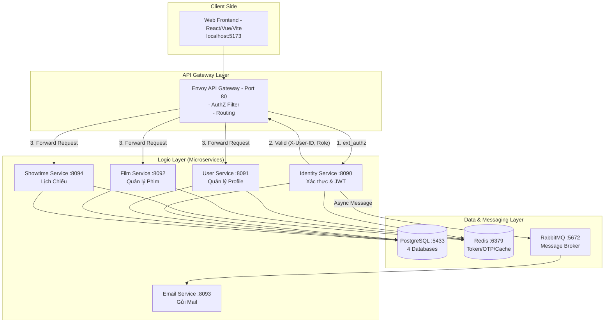

# 🎬 CinemaStar — Hệ Thống Đặt Vé Rạp Phim (Microservices)

> **Khóa luận tốt nghiệp** — Hệ thống đặt vé xem phim trực tuyến hiện đại, xây dựng trên kiến trúc Microservices tinh gọn, bảo mật và hiệu suất cao.

---

## ⚡ Chạy Nhanh (Dev/Prod)

- **Dev (service chạy local VS Code, Envoy chạy Docker):**
```bash
docker compose -f compose.yaml -f compose.dev.yaml up -d
```
- **Prod (tất cả chạy trong Docker):**
```bash
docker compose up -d
```

## 📋 Mục Lục

1. [🚀 Giới Thiệu](#-giới-thiệu)
2. [🏗️ Kiến Trúc Hệ Thống (Architecture)](#️-kiến-trúc-hệ-thống)
3. [🛠️ Công Nghệ Sử Dụng (Tech Stack)](#️-công-nghệ-sử-dụng)
4. [📁 Cấu Trúc Dự Án (Project Structure)](#-cấu-trúc-dự-án)
5. [📦 Chi Tiết Từng Service (Services Deep-Dive)](#-chi-tiết-từng-service)
6. [🌐 API Endpoints](#-api-endpoints)
7. [🐘 Cơ Sở Dữ Liệu & Caching (DB & Cache)](#-cơ-sở-dữ-liệu--caching)
8. [🚀 Hướng Dẫn Cài Đặt (Setup)](#-hướng-dẫn-cài-đặt)
9. [▶️ Hướng Dẫn Chạy (Run)](#️-hướng-dẫn-chạy)
10. [⚙️ Cấu Hình Môi Trường (Environment)](#️-cấu-hình-môi-trường)
11. [🗺️ Lịch Sử & Lộ Trình Phát Triển (Roadmap)](#️-lịch-sử-phát-triển)

---

## 🎯 Giới Thiệu

**CinemaStar** là hệ thống quản lý và đặt vé xem phim trực tuyến, được xây dựng theo kiến trúc **Microservices**. Hệ thống không chỉ là một ứng dụng đặt vé, mà là một hệ sinh thái hoàn chỉnh được thiết kế để giải quyết các bài toán về:

- 🔐 **Đăng ký / Đăng nhập** bằng email + OTP. Quản lý xác thực tập trung tại API Gateway.
- 👤 **Quản lý thông tin người dùng** với các roles: Customer, Manager, Staff, Admin.
- 🎬 **Quản lý phim** (Kho phim, tìm kiếm, phân loại) hỗ trợ phân trang hiệu suất cao (Cursor Pagination).
- 📅 **Quản lý lịch chiếu** (Tạo suất chiếu, bảo vệ chống xung đột thời gian, tự động cập nhật trạng thái).
- 📧 **Gửi email thông báo** (Xử lý bất đồng bộ).

---

## 🏗️ Kiến Trúc Hệ Thống

### Sơ đồ tổng quát (System Overview)



### Luồng xác thực qua Envoy (Gateway Pattern)

Envoy đóng vai trò là "người gác cổng" thông minh qua cơ chế **ext_authz**:

1. **Client** gửi request kèm header `Authorization: Bearer <token>` đến Envoy.
2. Envoy chặn request và gọi **ext_authz** nội bộ đến `identity-service/internal/auth/check`.
3. **Identity Service** sẽ:
   - Giải mã và xác thực JWT token (đảm bảo hạn dùng hợp lệ).
   - Kiểm tra trong **Redis** xem token có bị blacklist hay không (người dùng đã logout chưa).
4. Nếu hợp lệ, Identity Service trả về HTTP 200 kèm các header `X-User-ID` và `X-User-Role`.
5. Envoy lấy các header này từ kết quả ext_authz, gắn vào request gốc và truyền (forward) xuống service đích (User, Film, hoặc Showtime). Lớp bảo vệ này giúp các service con không cần tự quan tâm đến logic JWT phức tạp.

### Giao tiếp nội bộ giữa các Service (gRPC)

Từ bản cập nhật hiện tại, hệ thống tách rõ 2 lớp giao tiếp:

- **HTTP/REST** chỉ còn dành cho phía ngoài: Frontend -> Envoy Gateway -> Public API.
- **gRPC nội bộ** dùng cho các lệnh gọi service-to-service nhằm giảm overhead serialization, giảm độ trễ và gom contract tập trung bằng `.proto`.
- Lớp wiring gRPC hiện được chuẩn hóa theo **Spring gRPC official starter** để giảm bớt `ManagedChannel` / `ServerBuilder` config thủ công ở từng service.

Các luồng đã được chuyển sang **gRPC**:

- `identity-service` -> `user-service`: tạo profile Customer / Manager / Staff.
- `identity-service` -> `email-service`: gửi OTP / mail chào mừng nội bộ.
- `showtime-service` -> `film-service`: lấy chi tiết phim theo `filmId`.
- `showtime-service` -> `booking-service`: chuẩn hóa contract kiểm tra showtime đã được đặt vé hay chưa.

Contract gRPC được đặt tập trung trong `common-lib/src/main/proto` để mọi service dùng chung một chuẩn message/stub nội bộ. Việc bind server/client hiện đi qua cấu hình `spring.grpc.*` trong `application.yaml`.

---

## 🛠️ Công Nghệ Sử Dụng

| Công nghệ | Version | Vai trò / Lý do lựa chọn |
|---|---|---|
| **Java** | 17 | Ngôn ngữ lập trình chính, ổn định, mạnh mẽ. |
| **Spring Boot** | 4.0.1 | Framework chính tạo Microservices nhanh chóng. |
| **Spring Security** | Tích hợp | Xử lý JWT Authentication + Authorization. |
| **Spring Data JPA** | Tích hợp | ORM (Hibernate) truy vấn cơ sở dữ liệu chuyên sâu. |
| **Spring Data Redis** | Tích hợp | Giao tiếp với Redis qua Lettuce client. |
| **Spring AMQP** | 4.0.1 | Quản lý kết nối Message Broker (RabbitMQ). |
| **Spring Mail** | 4.0.1 | Hỗ trợ gửi template HTML qua JavaMailSender. |
| **Spring gRPC + Protocol Buffers** | Spring gRPC 1.0.2 / protoc 3.25.8 | Giao tiếp nội bộ service-to-service hiệu năng cao, dùng starter/autoconfig chính thức của Spring thay cho wiring thủ công. |
| **PostgreSQL** | 16 | RDBMS chính, ACID, hỗ trợ tốt UUID và JSON. |
| **Redis** | 7 | In-memory cache cực nhanh cho token, OTP, session, API cache. |
| **RabbitMQ** | 3.x | Hệ thống Queue xử lý các luồng bất đồng bộ (giảm latency). |
| **Envoy Proxy** | 1.31.x | API Gateway chuẩn microservices, ext_authz và routing linh hoạt. |
| **Docker Compose** | Mới nhất | Container hóa đồng bộ 100% môi trường dev/prod. |
| **Maven** | 3.9+ | Build tool mạnh mẽ quản lý dự án multi-module. |
| **jjwt** | 0.12.6 | Xử lý thế hệ Token ECDSA và RSA an toàn. |
| **MapStruct** | 1.6.3 | Tự động sinh code mapping DTO ↔ Entity siêu tốc. |
| **Lombok** | 1.18.30 | Giảm thiểu mã lặp (Getter, Setter, Builder). |
| **UUID Creator** | 5.3.7 | Tạo UUID v7 (Time-ordered) để tối ưu index B-Tree trong DB. |
| **SpringDoc** | 2.5.0 | Tự động trích xuất Swagger UI/OpenAPI document. |

---

## 📁 Cấu Trúc Dự Án

Dự án được phân tách thành các module Maven riêng biệt theo chuẩn thiết kế Domain-Driven Design (DDD).

```text
cinema-microservices/
├── common-lib/                    # 📚 Thư viện dùng chung (core standard)
│   └── src/main/java/com/cinema/
│       ├── Enum/                  # Enums: UserRole, UserStatus, FilmStatus, ShowTimeStatus
│       ├── controller/            # BaseController chuẩn hóa response REST (ok, created)
│       ├── dto/                   # APIResponse, CursorPageRequest/Response
│       ├── exception/             # GlobalExceptionHandler, ErrorCode tập trung 68 mã lỗi, BusinessException
│       ├── grpc/                  # Shared gRPC contracts, generated stubs, error utils
│       └── service/               # Service helpers dùng chung
│
├── identity-service/              # 🔐 Service xác thực và ủy quyền
│   └── src/main/java/.../
│       ├── config/                # JwtAuthenticationFilter, WebSecurityConfig, RedisConfig
│       ├── controller/            # UserController xử lý các API (/api/auth/*)
│       ├── dto/                   # Request/Response cho Account & Auth
│       ├── entity/                # Entity danh tính gốc (User, OtpData lưu memory/DB)
│       ├── mapper/                # Chuyển đổi qua MapStruct
│       ├── repository/            # Giao tiếp bảng accounts
│       ├── services/              # Logic Authentication (JWT cấp phát, verify, refresh)
│       └── utils/                 # Trình sinh mã OTP (OTPGenerator)
│
├── user-service/                  # 👤 Service quản lý hồ sơ người dùng
│   └── src/main/java/.../
│       ├── config/                # RedisConfig (Cache)
│       ├── controller/            # API hồ sơ (/api/users/*)
│       ├── entity/                # Hồ sơ chi tiết (Thông tin cá nhân, Ngân hàng)
│       └── services/              # Xử lý CRUD hồ sơ với Role tương ứng
│
├── film-service/                  # 🎬 Service quản lý kho phim
│   └── src/main/java/.../
│       ├── controller/            # API Phim (/api/films/*)
│       ├── entity/                # Film entity chứa metadata (Trailer, poster, duration...)
│       ├── repository/            # FilmRepository kèm Custom Method để Cursor Pagination
│       └── services/              # Xử lý tìm kiếm phức tạp và chuẩn hóa đầu vào phim
│
├── showtime-service/              # 📅 Service xếp lịch chiếu phim
│   └── src/main/java/.../
│       ├── controller/            # API Lịch chiếu (/api/showtimes/*)
│       ├── entity/                # ShowTime liên kết Film ID và thông tin phòng chiếu
│       └── services/              # Giải quyết bài toán xung đột lịch chiếu (Collision Detection)
│
├── email-service/                 # 📧 Service gửi thông báo
│   └── src/main/java/.../
│       └── services/              # Xử lý gửi email bất đồng bộ qua Gmail SMTP (@EnableAsync)
│
├── envoy/
│   └── envoy.yaml                 # 🔀 Cấu hình Envoy Gateway (routing, ext_authz)
│
├── postgres-init/
│   └── create-databases.sql       # 🐘 Script tự khởi động 4 DB độc lập cho microservices
│
├── compose.yaml                   # 🐳 Toàn bộ kiến trúc Docker
└── pom.xml                        # 📦 Parent POM quản lý versions tập trung
```

---

## 📦 Chi Tiết Từng Service

### 1. `common-lib` (Thư viện dùng chung - Trái tim hệ thống)
Mọi service đều import thư viện này. Nó giải quyết triệt để sự lặp lại mã (DRY):
- **Dynamic API Response**: Class `APIResponse<T>` chuẩn hóa mọi payload gửi về Frontend (success, code, data, timestamp).
- **Global Error Handling**: Bắt lỗi toàn cục qua `@RestControllerAdvice`. Sử dụng Enum `ErrorCode` để quản lý tập trung mã lỗi logic (vd: 4001: USER_NOT_FOUND, 4002: FILM_TITLE_EXISTED).
- **Pagination Optimization**: Áp dụng **Cursor Pagination** (`CursorPageRequest`, `CursorPageResponse`) dựa trên Base64 token mã hóa (Sort fields + Offset IDs), giúp vượt qua giới hạn chậm chạp của cấu trúc `LIMIT/OFFSET`.

### 2. `identity-service` & Bảo mật (Security Model)
Đảm nhận trọng trách cổng kiểm tra chứng minh thư của hệ thống.
- **Mã hóa**: BCrypt (độ khó 10) chống brute-force bảng rainbow.
- **OTP System**: Xác minh email thực thụ. Mã sinh 6 số tự động được Redis giám sát, hết hạn sau 5 phút. Tích hợp giới hạn chỉ cho nhập sai 3 lần, nếu tái phạm sẽ lock tài khoản tạm thời.
- **Dual JWT Flow**: Khách hàng được cấp Access Token gắn trong Body (dùng trong RAM Frontend) và Refresh Token được cấp vào cấu hình chặt. 
- **Token Blacklist**: Logout là triệt để. Redis sẽ lưu vào sổ đen các JTI (Token ID) để khóa mọi Token bị hủy dù nó còn hạn sống.

### 3. `user-service`
Đóng gói chuyên biệt cho thông tin cá nhân.
- Cô lập riêng `Identity` và `Profile` để hạn chế vector tấn công lộ mật khẩu.
- Hỗ trợ lưu cấu hình Ngân hàng (`bankCode`, `accountNumber`) dành riêng cho chức năng hoàn tiền/đối soát trong tương lai.

### 4. `film-service`
Kho báu nội dung hệ thống.
- **Index Constraining**: Kiểm soát tính duy nhất qua hàm ràng buộc DB, tự động báo lỗi nếu có phim trùng `Title` + `Release_Date`.
- **Soft Delete**: Mọi hành vi `DELETE` chỉ đổi cờ status DB `IsDeleted` sang True. Toàn vẹn dữ liệu cho các truy vấn báo cáo bán hàng lịch sử vẫn được bảo đảm tuyệt đối.
- **Complex Querying**: Tìm phim bằng từ khóa, lọc theo độ tuổi `AgeRating`, hoặc tình trạng hiện hành phim `FilmStatus`.

### 5. `showtime-service` 
Bộ não hệ thống lập lịch chiếu phim hằng ngày.
- **Collision Rules Engine**: Không cho phép tạo đè suất chiếu. Bộ máy sẽ phân tích lịch của phòng chiếu mục tiêu, cảnh báo và từ chối nếu thời lượng bị lố giờ sang suất chiếu khác.
- Theo dõi sát vòng đời thực tiễn của suất (Pending -> Screening -> Ended).

### 6. `email-service` 
Làm việc trong thầm lặng phía sau luồng gọi chính `@EnableAsync`.
- Tách luồng IO với SMTP Google chậm chạp ra khỏi Response HTTP nhằm bảo vệ tính trải nghiệm thời gian thực của người dùng khi yêu cầu OTP hoặc vé điện tử.

---

## 🌐 API Endpoints

### 1. Identity Service (`/api/auth`)

| Method | Endpoint | Auth | Mô tả (Chi Tiết) |
|---|---|---|---|
| `POST` | `/api/auth/register` | ❌ | Đăng ký tài khoản Customer mới, hệ thống gửi OTP. |
| `POST` | `/api/auth/verify-otp` | ❌ | Xác thực mã OTP nhận từ email (Bị khóa sau 3 lần sai). |
| `POST` | `/api/auth/login` | ❌ | Đăng nhập tài khoản, trả về cụm Access & Refresh Token. |
| `POST` | `/api/auth/logout` | ❌ | Đăng xuất, đưa token hiện hành vào danh sách Blacklist Redis. |
| `POST` | `/api/auth/refresh_token` | ❌ | Trao đổi Refresh Token lấy Access Token mới. |
| `POST` | `/api/auth/forgot-password` | ❌ | Báo quên mật khẩu, đẩy một email mang OTP reset. |
| `POST` | `/api/auth/resend-otp` | ❌ | Yêu cầu gửi lại OTP cho các hành động trên. |
| `POST` | `/api/auth/change-password` | ✅ | Người dùng đổi mật khẩu mới (Cần Auth hợp lệ). |
| `POST` | `/api/auth/manager` | ✅ ADMIN | Cấp tài khoản cấp độ Manager. |
| `POST` | `/api/auth/staff` | ✅ ADMIN/MANAGER | Cấp tài khoản nhân sự Staff. |
| `GET` | `/internal/auth/check` | ✅ | Internal API. Trạm kiểm soát của Envoy. |

### 2. User Service (`/api/users`)

| Method | Endpoint | Auth | Mô tả |
|---|---|---|---|
| `POST` | `/api/users/customers` | Internal | Khởi tạo Profile KH sau khi Verify Identity. |
| `PUT` | `/api/users/customers` | ✅ CUST | Cập nhật hồ sơ cá nhân. |
| `GET` | `/api/users/exists/{userId}` | Internal | Kiểm tra nhanh chéo Service xem User tồn tại không. |
| `GET/PUT/POST` | `/api/users/staffs|managers`| ✅ ADMIN | Các nghiệp vụ CRUD quản lý nhân sự chuyên quản. |

### 3. Film Service (`/api/films`)

| Method | Endpoint | Auth | Mô tả |
|---|---|---|---|
| `POST` | `/api/films/search` | ❌ Public | Tìm kiếm danh mục phim kết hợp Cursor Pagination + Filters. |
| `GET` | `/api/films/{id}` | ❌ Public | Lấy nguyên mẫu thông tin phim chi tiết (có đánh Cache Redis). |
| `POST` | `/api/films` | ✅ ADMIN | Đăng tải thông tin Phim mới. |
| `PUT` | `/api/films/{id}` | ✅ ADMIN | Chỉnh sửa cập nhật nội dung Phim. |
| `DELETE` | `/api/films/{id}` | ✅ ADMIN | Xóa mềm bộ phim khỏi hệ thống kinh doanh. |

### 4. Showtime Service (`/api/showtimes`)

| Method | Endpoint | Auth | Mô tả |
|---|---|---|---|
| `POST` | `/api/showtimes/search` | ❌ Public | Khách xem bảng lịch chiếu tương tác tìm suất phù hợp. |
| `POST` | `/api/showtimes/search-with-film` | ❌ Public | Tìm suất chiếu và kèm thông tin phim (batch gRPC). |
| `POST` | `/api/showtimes` | ✅ MGMT | Tạo lịch chiếu hệ thống tự quét va chạm Collision thời gian. |
| `PATCH` | `/api/showtimes/{id}` | ✅ MGMT | Tinh chỉnh thông tin nhanh. |
| `DELETE` | `/api/showtimes/{id}` | ✅ ADMIN | Bỏ lịch chiếu hệ thống (Cũng dùng Xóa Mềm). |
| `GET` | `/api/showtimes/{id}/with-film` | ❌ Public | Lấy chi tiết suất chiếu kèm thông tin phim. |

---

## 🐘 Cơ Sở Dữ Liệu & Caching

### Chiến Lược "Database per Service"
Tránh điểm chết thắt cổ chai của dạng cơ sở dữ liệu liền khối (Monolithic Database) truyền thống. Khóa liên kết ngoài (Foreign Key Constraints) bị loại bỏ có tính toán, các ID liên kết bằng chuẩn phân tán UUID.
Với việc Envoy điều phối và routing tải chia, khi có nhu cầu thì Postgresql có thể tự được dời cụm cluster riêng ra.

Bốn cơ sở dữ liệu gồm: `identity_db`, `user_db`, `film_db`, `showtime_db` được nhúng tự động thông qua khối lệnh của `/postgres-init/create-databases.sql`.

### Chiến Lược Redis
Áp dụng kho Redis v7 cung cấp băng thông nghìn Request/sec:
- **Tầng Xác Thực:** Giữ token vào RAM. Kể cả Database sập Identity Auth vẫn hoạt động liên tục vì Redis ôm hoàn toàn dữ liệu.
- **Tầng Tạm Thời (Transient):** OTP mã hóa 6 số gán định trạng thái phá hủy (TTL - 300 giây).
- **Tầng Gateway:** Envoy cache có thể được bật thêm khi cần để giảm Database roundtrip (hiện chưa bật trong config).

---

## 🚀 Hướng Dẫn Cài Đặt

### Yêu cầu hệ thống

- **Java 17** (JDK).
- **Maven 3.9+**.
- **Docker & Docker Compose**.
- Giới hạn RAM tối thiểu kiến nghị thiết bị **8GB** (Lý tưởng 16GB).
- **Git**.

### Bước 1: Clone dự án

```bash
git clone <repository-url>
cd cinema-microservices
```

### Bước 2: Chuẩn bị file `.env` siêu quan trọng

Tạo tệp `.env` cho mỗi một cấu trúc Service trong các thư mục `src/main/resources/`. Cụ thể:
- `identity-service/src/main/resources/.env`
- `user-service/src/main/resources/.env`
- `film-service/src/main/resources/.env`
- `showtime-service/src/main/resources/.env`
- `email-service/src/main/resources/.env`

*(Tham khảo mục **Cấu hình môi trường** ở dưới để biết các biến cần ghi).*
> ⚠️ **Lưu ý:** File `.env` chứa chìa khóa hệ thống. KHÔNG BAO GIỜ được mang commit lên cấu trúc mạng Git Public!

### Bước 3: Đóng gói (Build) thông qua Maven Multi-Module

Tại thư mục góc `cinema-microservices`:
```bash
# Lệnh tải sạch cache dependency và nén file thực thi chạy Jar nhưng Bỏ qua Test để nhanh hơn
mvn clean install -DskipTests
```

---

## ▶️ Hướng Dẫn Chạy

### Cách 1: Vận chuyển siêu tốc bằng Docker Compose (Đề xuất)

Dựng toàn bộ kiến trúc chỉ trong một dòng lệnh Terminal, tất cả hạ tầng (DB, Message Queue) và API Service đều đồng khởi chạy và tạo mạng nội bộ với nhau.
```bash
docker compose up -d

# Check tình trạng cỗ máy
docker compose ps
# Quản lý xem log ngẫu nhiên một Service
docker compose logs -f identity-service
```

### Chạy Gateway Envoy theo chế độ Dev/Prod

- **Prod (default):** Envoy route tới service trong Docker network.
```bash
docker compose up -d
```
- **Dev (service chạy local VS Code):** Envoy route về `host.docker.internal`.
```bash
docker compose -f compose.yaml -f compose.dev.yaml up -d
```

### Tương quan Port Mạng Trở Về:

| Dịch vụ / Hệ Tầng | Liên kết thực thi trên máy cá nhân |
|---|---|
| Envoy (Trung Tâm Gateway) | http://localhost:80 |
| Identity Service Web API | http://localhost:9000 |
| User Profile Web API | http://localhost:9001 |
| PostgreSQL Relational | `localhost:5433` (User: postgres / 123456) |
| Redis In-Memory KV | `localhost:6379` |
| RabbitMQ Management UI | http://localhost:15672 (admin / admin) |

*Muốn Tắt Toàn Bộ Dữ Liệu?*
```bash
docker compose down -v
```

---

## ⚙️ Cấu Hình Môi Trường

Soạn thảo mã chuẩn cho toàn bộ file `.env` (Chỉnh URL, Password phù hợp):

**Cấu Trúc Các Base Chung (Copy đặt cho mọi file .env):**
```env
# === Database Connection ===
DB_URL=jdbc:postgresql://pg:5432/<database_name_tuong_ung>
DB_USERNAME=postgres
DB_PASSWORD=123456
JPA_DDL_AUTO=update
JPA_SHOW_SQL=true

# === Redis Connect ===
REDIS_HOST=redis
REDIS_PORT=6379
REDIS_TIMEOUT=5000

# === RabbitMQ Core ===
SPRING_RABBITMQ_HOST=rabbitmq
SPRING_RABBITMQ_PORT=5672
SPRING_RABBITMQ_USERNAME=admin
SPRING_RABBITMQ_PASSWORD=admin
```

**Biến Đặc Hữu Của Từng Dịch Vụ Cần Thêm (Cắt Dán Kèm Vào):**

**[identity-service]**
```env
SERVER_PORT=8090
USER_GRPC_HOST=user-service
USER_GRPC_PORT=9191
EMAIL_GRPC_HOST=email-service
EMAIL_GRPC_PORT=9193
```

**[user-service]**
```env
SERVER_PORT=8091
GRPC_SERVER_PORT=9191
```

**[film-service]**
```env
SERVER_PORT=8092
GRPC_SERVER_PORT=9192
```

**[showtime-service]**
```env
SERVER_PORT=8094
FILM_GRPC_HOST=film-service
FILM_GRPC_PORT=9192
BOOKING_GRPC_HOST=booking-service
BOOKING_GRPC_PORT=9195
```

**[email-service]**
```env
SERVER_PORT=8093
GRPC_SERVER_PORT=9193
MAIL_HOST=smtp.gmail.com
MAIL_PORT=587
MAIL_FROM_NAME=CinemaSystem
MAIL_USERNAME=nhap_mail@gmail.com
MAIL_PASSWORD=mat_khau_ung_dung_app_pass_cua_ban
```

> Khi chạy local không qua Docker network, có thể đổi các giá trị `*_GRPC_HOST` về `localhost`.
> Riêng `compose.yaml` hiện đã được đồng bộ sẵn host/port gRPC cho cặp `identity-service` <-> `user-service`; các service Docker hóa tiếp theo chỉ cần nối theo cùng convention này.
> Bên trong từng service, các biến môi trường này được map vào cấu hình `spring.grpc.client.channels.*.address` hoặc `spring.grpc.server.port`.

---

## 🗺️ Lịch Sử Phát Triển

### 🗓️ 01/04/2026 — Rà soát Tái Cấu Trúc Toàn Diện

**Đánh giá trạng thái thành quả Core:**

✅ **Các Mảnh Ghép Xong Nhiệm Vụ:**
1. Khung Sườn Multi-Module Microservices với chuẩn Common Library phân bố.
2. Hoàn tất Envoy Gateway áp dụng ext_authz và routing chuẩn, thay thế Nginx trong kiến trúc.
3. Bộ Token hoàn thiện (Role Check, OTP Timeout 5min Limit 3 lần, Refresh Token Flow).
4. Khảm Redis Error Handler Logic phân tán tải cực mạnh.
5. Triển khai Cursor Paging vào khối dữ liệu Film Data để tăng cường sức truy xuất vô hạn không giảm tốc.
6. Centralized Auto DB Script Configuration cho Container Init.
7. Áp mã UUID v7 thay cho v4 vào Primary Key.

⚠️ **Kế Hoạch & Lộ Trình Sắp Thi Hành:**

| Hạng Mục Tương Lai Mở Rộng | Mức Phân Quyền | Diễn Giải Nhiệm Vụ |
|---|---|---|
| **RabbitMQ Event Bus** | 🔴 Cao | Các luồng Service hiện tại có gọi REST gắt sang Email-Service. Cần chuyển Email thành Worker Consumer bắt Event bất đồng bộ để bảo toàn Time-to-Interaction (Xử lý OTP). |
| **Booking Core Service** | 🔴 Cao | Xương sống kinh doanh (Bán Vé Core, Giữ Chỗ Redis Locking). Tương thích Gateway sẵn. |
| **Hall (Rạp & Ghế) Service**| 🔴 Cao | Sơ đồ Map ghế rạp riêng lẻ, tham chiếu chéo ngược lên Lịch Chiếu. |
| **Thanh toán Payment** | 🟡 Trung | VNPay & Momo Hook IPN liên hoàn gọi ngược trạng thái Ticket. |
| **Docker Chuyên Sâu** | 🟡 Trung | Hoàn thiện file Containerization cho Film, ShowTime. (Hiện mới có Identity và User). |
| **Quality Unit Testing** | 🟢 Thấp | Áp dụng Mockito bổ trợ Service Layer, mục tiêu Coverage 60%. |

### 🗓️ 02/04/2026 — Nâng cấp Phân trang (Offset Pagination)
**Nội dung cập nhật:**
- Bổ sung bộ DTO phân trang truyền thống `PageRequest` và `PageResponse` vào `common-lib`.
- Refactor API lấy danh sách nhân sự (Staff/Manager) tại `user-service`. Dịch chuyển từ trả về List toàn bộ sang phân trang tối ưu.
- Thay đổi Endpoints:
  - `POST /api/users/staffs/search` (Phân trang Staff).
  - `POST /api/users/managers/search` (Phân trang Manager).

### 🗓️ 03/04/2026 — Tích hợp liên Service: Showtime & Booking
**Nội dung cập nhật:**
- Xây dựng giao thức kiểm tra trạng thái đặt vé giữa `showtime-service` và `booking-service`.
- Gắn REST Endpoint `GET /api/bookings/check-showtime/{showtimeId}` để tra cứu xem một suất chiếu đã phát sinh giao dịch đặt vé hay chưa.
- Chặn thay đổi trạng thái (Update Status) hoặc Xóa Phim (Delete) ở Showtime nếu như nhận được cờ báo đã có người đặt vé.
- Bổ sung mã lỗi `BOOKING_SERVICE_ERROR("9104")` vào thư viện `common-lib`.
- Bổ sung API `GET /api/showtimes/{id}` để hệ thống Frontend có thể nạp chi tiết một suất chiếu độc lập chuyên sâu thay vì chỉ tra cứu qua danh sách Search.
- Bổ sung Batch API `POST /api/films/batch` tại `film-service` hỗ trợ Frontend thực hiện Client-Side API Composition thay vì gom gọi (N+1 query) gây nghẽn rớt dây chuyền.
  - Sử dụng DTO chuẩn xác `BatchFilmRequest` (có `@NotEmpty`) và `BatchFilmResponse` để đóng gói dữ liệu an toàn chặn lỗi từ sớm.

### 🗓️ 03/04/2026 — Nâng cấp Inter-Service Communication sang gRPC
**Nội dung cập nhật:**
- Chuyển các lệnh gọi nội bộ đang dùng REST sang **gRPC** ở các luồng:
  - `identity-service` -> `user-service`
  - `identity-service` -> `email-service`
  - `showtime-service` -> `film-service`
  - `showtime-service` -> `booking-service` (theo contract gRPC thống nhất cho service tương lai)
- Bổ sung thư mục `common-lib/src/main/proto` chứa các contract:
  - `user_internal.proto`
  - `email_internal.proto`
  - `film_internal.proto`
  - `booking_internal.proto`
- Sinh shared gRPC stubs vào `common-lib` để các service tái sử dụng cùng một contract nội bộ.
- Thêm gRPC server bootstrap cho `user-service`, `film-service`, `email-service`.
- Thêm gRPC client config cho `identity-service`, `showtime-service`.
- Dọn bỏ `RestTemplate` nội bộ ở các luồng trên để tách hẳn REST public và RPC nội bộ.
- Dọn luồng gửi mail trong `identity-service`: bỏ `new Thread(...)` thủ công, giữ `@Async` + gRPC để giảm thread thừa và dễ kiểm soát hơn.
- Đồng bộ `compose.yaml` cho cặp service đã có Dockerfile (`identity-service`, `user-service`) để container gọi nhau qua host nội bộ thay vì rơi về `localhost`.
- Sửa lại một số điểm cấu hình đi kèm:
  - `user-service` trả về mặc định đúng cổng HTTP `8091`.
  - `email-service` bổ sung rõ cổng HTTP `8093` và cổng gRPC riêng.
  - `identity-service` sửa cách đọc header phân quyền ở các luồng tạo `manager/staff` và đổi mật khẩu.

### 🗓️ 04/04/2026 — Chuẩn hóa gRPC theo Spring Official Starter
**Nội dung cập nhật:**
- Refactor lớp wiring gRPC từ cấu hình Java thủ công sang **Spring gRPC official starter** (`org.springframework.grpc:spring-grpc-spring-boot-starter`) để phù hợp hơn với hệ Spring Boot 4.
- Loại bỏ các class config tự tạo `ManagedChannel`, `BlockingStub`, `GrpcServerRunner` ở từng service.
- Chuyển client-side wiring sang `GrpcChannelFactory`, nhờ đó wrapper gRPC chỉ cần lấy channel theo tên (`user`, `email`, `film`, `booking`) thay vì tự build connection thủ công.
- Giữ nguyên các contract `.proto` và generated stubs trong `common-lib`, nên luồng giao tiếp nội bộ không bị đổi semantics.
- Chuẩn hóa prefix cấu hình từ `grpc.*` cũ sang `spring.grpc.*` trong `application.yaml`:
  - `spring.grpc.server.port`
  - `spring.grpc.client.channels.<name>.address`
- Biên dịch kiểm tra lại toàn bộ multi-module bằng Maven sau khi refactor và bảo đảm build thành công.
- Refactor chung header nội bộ sang hằng số dùng chung (`X-User-ID`, `X-User-Role`) để tránh sai lệch và giảm duplication.
- Cải thiện độ an toàn khi parse cursor: dùng URL decoder tương thích và bỏ lỗi khi cursor không hợp lệ.
- Tránh mutate list sort đầu vào trong search showtime để giảm side-effect khó debug.
- Dọn duplicate `authentication.setDetails` trong filter để giảm work thừa.
- Tối ưu query phim và showtime: tránh thao tác `toLowerCase` lặp lại, dùng `IN` cho enum status, thêm guard khi cursor thiếu field và ưu tiên so khớp UUID trực tiếp khi keyword là UUID.

### 🗓️ 05/04/2026 — Chuẩn hóa API Gateway với Envoy (Production-ready)
**Nội dung cập nhật:**
- Thay Nginx gateway bằng **Envoy Proxy** để phù hợp hơn với kiến trúc microservices/gRPC.
- Cấu hình `ext_authz` gọi `identity-service/api/auth/auth-check` để xác thực tập trung và tự động forward `X-User-ID`, `X-User-Role`.
- Thiết lập routing cho các service backend qua Envoy.

---
> Hệ thống kiến trúc mở được chế tác và kiểm tra tổng quát toàn bộ luồng logic lần cuối vào **04/04/2026**. Thiết kế để sãn sàng đáp ứng quy mô High-Availability Online Cinema System.
