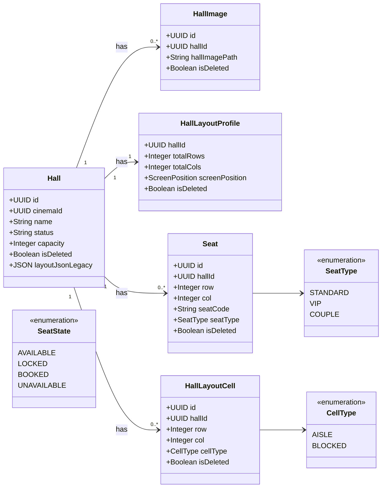

# RFC: Chuẩn Hóa Seat-Map Canonical Cho BE + FE

## 1. Mục tiêu tài liệu
- Tên tài liệu chính thức: `SEAT_SERVICE_MIGRATION_PLAN.md`.
- Dùng chung cho Backend và Frontend để triển khai mô hình seat-map canonical.
- Chỉ dùng **1 file RFC duy nhất**, không tách thêm file phụ.

## 2. Tổng quan thay đổi
- Backend là nguồn chuẩn cho layout và trạng thái ghế.
- FE chỉ render từ một payload duy nhất của showtime.
- `layoutJsonLegacy` còn giữ tạm cho giai đoạn dual-read/cutover, không còn là source of truth dài hạn.

## 3. Class Diagram chuẩn (domain-level)
> Ghi chú: Diagram cố ý **không** đưa `timeCreated/timeUpdated` theo yêu cầu.



## 4. Ràng buộc dữ liệu bắt buộc
- `HallImage`: unique `(hall_id, hall_image_path)`.
- `Seat`: unique `(hall_id, seat_code)`.
- `Seat`: unique `(hall_id, row, col)`.
- `HallLayoutCell`: unique `(hall_id, row, col)`.
- Một tọa độ `(hall_id, row, col)` không được vừa là `Seat` vừa là `HallLayoutCell`.

## 5. Vì sao cần cả `HallLayoutProfile` và `HallLayoutCell`
- `HallLayoutProfile` lưu metadata toàn lưới để FE biết cách dựng khung: số hàng/cột và hướng màn hình.
- `HallLayoutCell` lưu các ô không bán vé (`AISLE`, `BLOCKED`) để FE render đúng bản đồ ghế.
- `Seat` chỉ lưu ghế thật có thể bán vé (`STANDARD`, `VIP`, `COUPLE`).

### Ví dụ hall 3x5
- `HallLayoutProfile`: `totalRows=3`, `totalCols=5`, `screenPosition=TOP`.
- `Seat`: có `A1, A2, A4, A5, ...`.
- `HallLayoutCell`: có `(row=1,col=3,type=AISLE)`, `(row=3,col=3,type=BLOCKED)`.

Kết quả: FE render được đầy đủ sơ đồ (ghế + lối đi + blocked), còn booking chỉ xử lý ghế thật.

## 6. FE Rendering Contract (Canonical)

### 6.1 API FE chỉ cần gọi
- `GET /api/showtimes/{showtimeId}/seat-map`

### 6.2 Response contract
- Trả về:
  - `showtimeId`
  - `hallId`
  - `totalRows`
  - `totalCols`
  - `screenPosition`
  - `cells[]`

### 6.3 Ý nghĩa `cells[]`
- `kind=SEAT`:
  - Có `seatCode`, `seatType`, `state`, `price`.
  - FE render ghế; disable chọn nếu `state` là `LOCKED`, `BOOKED`, hoặc `UNAVAILABLE`.
- `kind=CELL`:
  - Có `cellType` (`AISLE|BLOCKED`) và `state=UNAVAILABLE`.
  - FE render ô tĩnh; không cho chọn và không gửi booking.

### 6.4 Quy tắc submit booking từ FE
- Chỉ gửi `seatCode[]` của các phần tử `kind=SEAT`.
- Không gửi `row/col`, không gửi `cellType`, không gửi ô `kind=CELL`.

### 6.5 Ví dụ payload đầy đủ
```json
{
  "showtimeId": "11111111-1111-1111-1111-111111111111",
  "hallId": "22222222-2222-2222-2222-222222222222",
  "totalRows": 3,
  "totalCols": 5,
  "screenPosition": "TOP",
  "cells": [
    { "row": 1, "col": 1, "kind": "SEAT", "seatCode": "A1", "seatType": "STANDARD", "state": "BOOKED", "price": 70000 },
    { "row": 1, "col": 2, "kind": "SEAT", "seatCode": "A2", "seatType": "STANDARD", "state": "AVAILABLE", "price": 70000 },
    { "row": 1, "col": 3, "kind": "CELL", "cellType": "AISLE", "state": "UNAVAILABLE" },
    { "row": 1, "col": 4, "kind": "SEAT", "seatCode": "A4", "seatType": "VIP", "state": "AVAILABLE", "price": 90000 },
    { "row": 1, "col": 5, "kind": "SEAT", "seatCode": "A5", "seatType": "VIP", "state": "AVAILABLE", "price": 90000 },

    { "row": 2, "col": 1, "kind": "SEAT", "seatCode": "B1", "seatType": "STANDARD", "state": "AVAILABLE", "price": 70000 },
    { "row": 2, "col": 2, "kind": "SEAT", "seatCode": "B2", "seatType": "STANDARD", "state": "AVAILABLE", "price": 70000 },
    { "row": 2, "col": 3, "kind": "CELL", "cellType": "AISLE", "state": "UNAVAILABLE" },
    { "row": 2, "col": 4, "kind": "SEAT", "seatCode": "B4", "seatType": "VIP", "state": "LOCKED", "price": 90000 },
    { "row": 2, "col": 5, "kind": "SEAT", "seatCode": "B5", "seatType": "VIP", "state": "AVAILABLE", "price": 90000 },

    { "row": 3, "col": 1, "kind": "SEAT", "seatCode": "C1", "seatType": "COUPLE", "state": "AVAILABLE", "price": 120000 },
    { "row": 3, "col": 2, "kind": "SEAT", "seatCode": "C2", "seatType": "COUPLE", "state": "AVAILABLE", "price": 120000 },
    { "row": 3, "col": 3, "kind": "CELL", "cellType": "BLOCKED", "state": "UNAVAILABLE" },
    { "row": 3, "col": 4, "kind": "SEAT", "seatCode": "C4", "seatType": "COUPLE", "state": "AVAILABLE", "price": 120000 },
    { "row": 3, "col": 5, "kind": "SEAT", "seatCode": "C5", "seatType": "COUPLE", "state": "AVAILABLE", "price": 120000 }
  ]
}
```

## 7. Outbox vs Saga (kết luận chính thức)
- Saga và Outbox không thay thế nhau.
- Saga giải quyết điều phối nghiệp vụ đa service (orchestration/choreography).
- Outbox giải quyết độ tin cậy khi publish event sau commit DB (tránh mất event do dual-write).
- Vì vậy nếu có async event, vẫn cần Outbox dù sau này có Saga.

### Trạng thái hiện tại theo phase
- `seat-service`: đã có outbox record khi đổi layout.
- Phase tiếp theo: mở rộng publisher/retry Outbox cho `booking-service`.

## 8. Checklist review tài liệu
- Diagram mới khớp mô hình canonical seat-map.
- Thuật ngữ thống nhất: `showtimeId`, `hallId`, `seatCode`, `hallImagePath`, `SeatState`, `CellType`.
- FE có đủ contract và ví dụ payload để tự triển khai render + submit.

