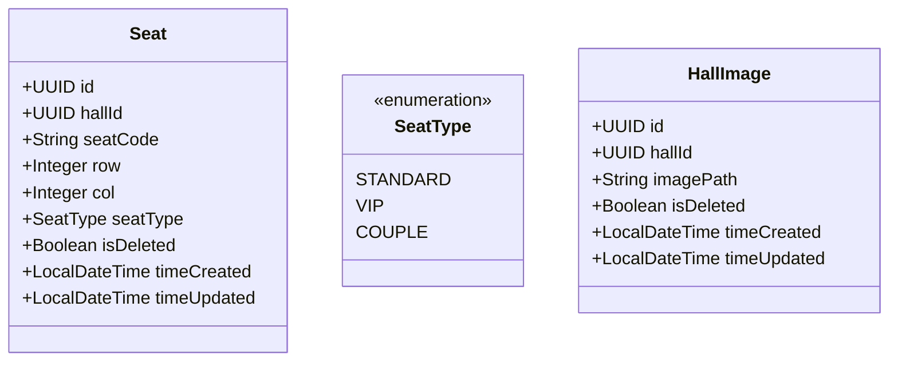
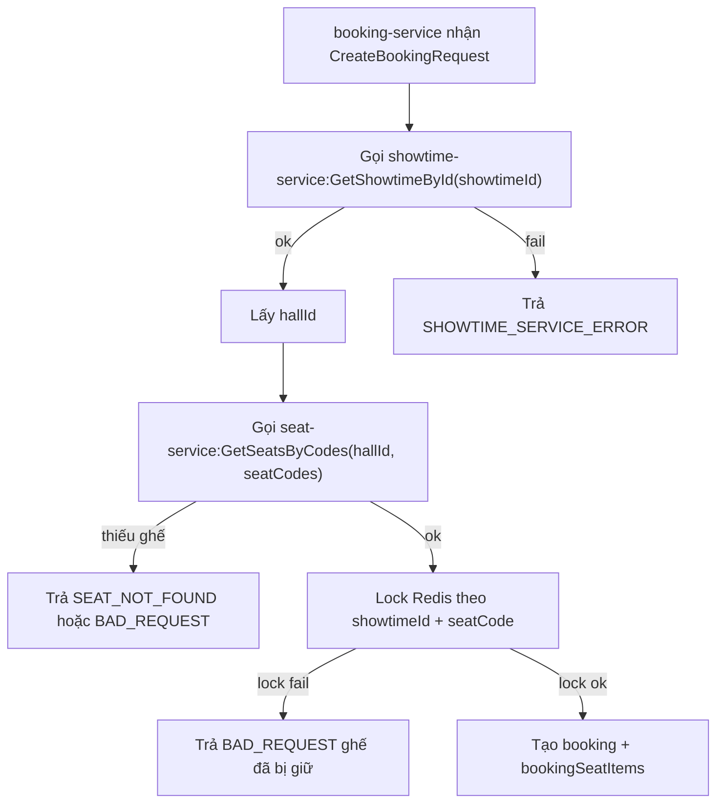

# RFC: Kế Hoạch Tách Seat Thành `seat-service`

## 1. Thông Tin Tài Liệu
- Tên tài liệu: `SEAT_SERVICE_MIGRATION_PLAN.md`
- Mục tiêu: Chuẩn hóa kế hoạch tách ghế sang microservice riêng.
- Phạm vi: `hall-service`, `seat-service`, `showtime-service`, `booking-service`, `common-lib`, `compose/envoy`.
- Trạng thái: Draft để duyệt trước khi code.
- Ngày cập nhật: 2026-05-18 (UTC+07:00)

## 2. Tổng Quan Thay Đổi Lớn

## 2.1 Vấn đề hiện tại
- Dữ liệu ghế đang phụ thuộc `hall.layout_json`, gây khó quản lý vòng đời ghế như một domain độc lập.
- Luồng booking chưa có nguồn sự thật tập trung cho seat inventory theo hall/showtime.
- Các thay đổi liên quan ghế dễ lan sang `hall-service` vì chưa có boundary rõ.

## 2.2 Mục tiêu sau thay đổi
- Tách ghế thành service riêng `seat-service`, là nguồn dữ liệu ghế duy nhất.
- Booking validate ghế dựa trên dữ liệu backend (`showtime -> hall -> seat`) trước khi lock Redis.
- Giữ `HallImage` ở `hall-service`, chỉ lưu `imagePath` dạng relative path.

## 2.3 Không nằm trong phạm vi phase này
- Không triển khai upload file ảnh trong backend.
- Không lưu `AISLE` thành bản ghi ghế trong v1.
- Không mô tả chi tiết FE implementation.

## 3. Kiến Trúc Đích Và Boundary Service

| Service | Trách nhiệm chính | Không chịu trách nhiệm |
|---|---|---|
| `seat-service` | Quản lý seat inventory theo hall; API seat; gRPC seat nội bộ | Hall metadata, showtime lifecycle, upload ảnh |
| `hall-service` | Hall metadata + HallImage (`imagePath`) | Validate seat booking theo showtime |
| `showtime-service` | Showtime metadata; ánh xạ `showtimeId -> hallId/cinemaId` | Quản lý seat inventory |
| `booking-service` | Booking lifecycle, payment status, lock ghế Redis | Định nghĩa seat master data |

Luồng validate ghế chuẩn:
1. `booking-service` nhận request tạo booking.
2. Gọi `showtime-service` gRPC lấy `hallId` từ `showtimeId`.
3. Gọi `seat-service` gRPC lấy/validate danh sách `seatCode` trong hall đó.
4. Nếu hợp lệ mới lock Redis và tạo booking.

## 4. Class Diagram Và Mô Hình Dữ Liệu

## 4.1 Class diagram đề xuất


## 4.2 Chi tiết bảng `seat` (thuộc `seat-service`)
- Cột:
  - `id uuid primary key`
  - `hall_id uuid not null`
  - `seat_code varchar(20) not null`
  - `seat_row int not null`
  - `seat_col int not null`
  - `seat_type varchar(20) not null` (`STANDARD|VIP|COUPLE`)
  - `is_deleted boolean not null default false`
  - `time_created timestamp not null`
  - `time_updated timestamp not null`
- Constraint:
  - `unique (hall_id, seat_code)`
  - `unique (hall_id, seat_row, seat_col)`
- Index:
  - `(hall_id, is_deleted)`
  - `(hall_id, seat_type, is_deleted)`

## 4.3 Chi tiết bảng `hall_image` (giữ ở `hall-service`)
- Cột:
  - `id uuid primary key`
  - `hall_id uuid not null`
  - `image_path varchar(500) not null`
  - `is_deleted boolean not null default false`
  - `time_created timestamp not null`
  - `time_updated timestamp not null`
- Constraint:
  - `unique (hall_id, image_path)`
- Index:
  - `(hall_id, is_deleted)`

## 5. API Contract Chi Tiết (Dự Kiến Triển Khai)

## 5.1 `seat-service` REST API

### A. `PUT /api/seats/halls/{hallId}`
- Mục đích: Replace toàn bộ seat inventory của một hall.
- Request mẫu:
```json
{
  "seats": [
    { "seatCode": "A1", "row": 1, "col": 1, "seatType": "STANDARD" },
    { "seatCode": "A2", "row": 1, "col": 2, "seatType": "VIP" },
    { "seatCode": "A3-A4", "row": 1, "col": 3, "seatType": "COUPLE" }
  ]
}
```
- Response thành công (mẫu):
```json
{
  "message": "Seats replaced successfully"
}
```

### B. `GET /api/seats/halls/{hallId}`
- Mục đích: Lấy danh sách ghế active của hall theo thứ tự `row, col`.
- Response mẫu:
```json
{
  "hallId": "f88f4a58-9b13-4fd7-a066-4f03d0f40e5a",
  "seats": [
    {
      "id": "a9177f8b-b4ec-4223-a216-b4e3e301a4d9",
      "seatCode": "A1",
      "row": 1,
      "col": 1,
      "seatType": "STANDARD"
    }
  ]
}
```

### C. `POST /api/seats/validate`
- Mục đích: Validate danh sách seatCode theo `showtimeId`.
- Request mẫu:
```json
{
  "showtimeId": "e46f4f67-0e24-4f49-8c90-92db5a46dc29",
  "seatCodes": ["A1", "A2", "A3-A4"]
}
```
- Response hợp lệ:
```json
{
  "valid": true,
  "hallId": "f88f4a58-9b13-4fd7-a066-4f03d0f40e5a",
  "resolvedSeats": [
    { "seatCode": "A1", "seatType": "STANDARD" },
    { "seatCode": "A2", "seatType": "VIP" }
  ]
}
```
- Response không hợp lệ:
```json
{
  "valid": false,
  "hallId": "f88f4a58-9b13-4fd7-a066-4f03d0f40e5a",
  "missingSeatCodes": ["A99"]
}
```

## 5.2 `hall-service` image API (giữ nguyên định hướng)
- `POST /api/halls/{hallId}/images`: thêm ảnh (lưu `imagePath`).
- `GET /api/halls/{hallId}/images`: lấy danh sách ảnh.
- `DELETE /api/halls/{hallId}/images/{imageId}`: soft delete ảnh.

## 5.3 Quy tắc validate `imagePath`
- Chỉ chấp nhận relative path, ví dụ `/uploads/halls/hall-a-01.jpg`.
- Reject URL tuyệt đối (`http://...`, `https://...`).
- Không cho rỗng và không vượt quá độ dài cho phép.

## 6. gRPC Contract Nội Bộ

## 6.1 `showtime-service` gRPC
- Method: `GetShowtimeById(showtimeId)`
- Mục đích: Trả về thông tin showtime để suy ra hall context.
- Output tối thiểu:
  - `showtimeId`
  - `hallId`
  - `cinemaId`

## 6.2 `seat-service` gRPC
- Method: `GetSeatsByCodes(hallId, seatCodes[])`
- Mục đích: Trả danh sách ghế tồn tại/active theo hall và seatCodes.

## 6.3 Gợi ý timeout/retry cho internal RPC
- Timeout mặc định đề xuất: 1000ms-2000ms.
- Retry đề xuất: chỉ retry idempotent call, tối đa 1-2 lần, có backoff ngắn.
- Nếu timeout/fail: map về `*_SERVICE_ERROR` tương ứng.

## 7. Luồng Booking End-To-End Và Điểm Fail



Các điểm fail bắt buộc cover test:
- Showtime không tồn tại.
- Seat không thuộc hall của showtime.
- Seat đã bị xóa mềm.
- Redis lock conflict.

## 8. Kế Hoạch Migration Dữ Liệu

## 8.1 Nguồn dữ liệu
- Nguồn: `hall.layout_json` hiện có ở `hall-service`.

## 8.2 Quy tắc mapping
- Parse `items[]`.
- Item `type = SEAT`: convert thành ghế vật lý trong `seat`.
- Item `type = AISLE`: bỏ qua, không insert vào `seat`.
- Chuẩn hóa `seatCode` sang uppercase.

## 8.3 Các phase migration
1. Phase A: dựng `seat-service` + schema + API cơ bản.
2. Phase B: backfill dữ liệu từ `layout_json` sang `seat`.
3. Phase C: đối soát song song (seat count, duplicate, invalid type).
4. Phase D: chuyển booking sang validate bằng `seat-service`.
5. Phase E: ngừng phụ thuộc runtime vào `layout_json` (giữ cột tạm cho rollback window).

## 8.4 Checklist đối soát dữ liệu
- Số ghế mỗi hall đúng kỳ vọng từ layout cũ.
- `duplicate (hallId, seatCode) = 0`.
- `duplicate (hallId, row, col) = 0`.
- `seatType` invalid = 0.

## 9. Rollout / Cutover / Rollback

## 9.1 Rollout
- Deploy `seat-service`.
- Chạy migration batch.
- Bật validate seat qua feature flag/config.
- Theo dõi error rate và latency.

## 9.2 Điều kiện cutover
- Tỷ lệ lỗi validation trong ngưỡng cho phép.
- Không có mismatch nghiêm trọng khi đối soát dữ liệu.
- Booking flow qua test tích hợp thành công.

## 9.3 Rollback
- Tắt feature flag validate qua `seat-service`.
- Quay về luồng validate cũ tạm thời.
- Giữ nguyên `layout_json` trong rollback window.
- Ghi log đầy đủ để rerun migration sau khi fix.

## 10. Bảng Quy Tắc Validate Seat

| Quy tắc | Mô tả | Hành vi khi vi phạm |
|---|---|---|
| `seatCode` bắt buộc | Không null/rỗng, normalize uppercase | `BAD_REQUEST` |
| `seatCode` unique trong cùng payload | Không trùng lặp request | `BAD_REQUEST` |
| `row`, `col` > 0 | Tọa độ ghế hợp lệ | `BAD_REQUEST` |
| `(row,col)` unique trong cùng hall | Không có 2 ghế cùng tọa độ | `BAD_REQUEST` |
| `seatType` hợp lệ | Chỉ `STANDARD|VIP|COUPLE` ở v1 | `BAD_REQUEST` |
| Không cho `AISLE` trong seat table | `AISLE` không lưu thành Seat | `BAD_REQUEST` |
| Ghế phải thuộc hall của showtime | Validate theo `showtimeId -> hallId` | `SEAT_NOT_FOUND`/`BAD_REQUEST` |

## 11. Bảng Mapping Lỗi Nghiệp Vụ

| Nhóm lỗi | Mã lỗi dự kiến | Khi nào dùng |
|---|---|---|
| Dữ liệu request sai | `BAD_REQUEST`, `INVALID_INPUT`, `INVALID_FORMAT` | Payload sai format hoặc vi phạm rule validate |
| Ghế không hợp lệ | `SEAT_NOT_FOUND` | SeatCode không tồn tại hoặc đã xóa mềm trong hall target |
| Showtime/hall không tồn tại | `SHOWTIME_NOT_FOUND`, `HALL_NOT_FOUND` | Không resolve được context cho validation |
| Lỗi gọi service nội bộ | `SHOWTIME_SERVICE_ERROR`, `SEAT_SERVICE_ERROR`, `BOOKING_SERVICE_ERROR` | gRPC timeout/network/unavailable |
| Quyền truy cập | `FORBIDDEN`, `UNAUTHORIZED` | Sai role hoặc thiếu auth header |

Ghi chú: tên error chi tiết sẽ bám `ErrorCode` trong `common-lib` khi implement.

## 12. Test Matrix

## 12.1 Unit test
- Validate request seat:
  - trùng `seatCode`
  - trùng `(row,col)`
  - `seatType` invalid
  - `row/col <= 0`
- Validate `imagePath`:
  - nhận relative path hợp lệ
  - reject absolute URL

## 12.2 Integration test
- `booking-service` + `showtime-service` + `seat-service`:
  - seat hợp lệ -> booking tiếp tục bình thường
  - seat sai hall -> reject
  - seat không tồn tại -> reject
  - seat đã xóa mềm -> reject
- Migration test với dữ liệu có `COUPLE`, `VIP`, `AISLE`.

## 12.3 Regression test
- Quyền manager/staff/customer trên endpoint liên quan.
- Lock/unlock seat hiện tại không bị phá vỡ.
- API hall/showtime hiện hữu không regression ngoài phạm vi seat-flow.

## 13. Tiêu Chí Nghiệm Thu (Đo Được)

## 13.1 KPI chức năng
- 100% booking mới phải đi qua validate seat backend trước lock.
- 0 trường hợp đặt thành công ghế không tồn tại trong hall của showtime.
- 100% API seat contract test pass.

## 13.2 KPI chất lượng rollout
- Error rate sau cutover không tăng vượt ngưỡng đã thống nhất.
- P95 latency của luồng create booking không tăng bất thường sau bật validation.
- Migration report không có mismatch nghiêm trọng.

## 14. Checklist Triển Khai Theo Phase

## 14.1 Phase A - Foundation
- Tạo module `seat-service` chuẩn parent pom.
- Tạo entity/repository/service/controller + validation.
- Add module vào root `pom.xml`.
- Cấu hình `compose` + `envoy` route cho seat API.

## 14.2 Phase B - Internal Contracts
- Bổ sung proto gRPC trong `common-lib`.
- Add RPC `GetShowtimeById` ở `showtime-service`.
- Add gRPC client seat/showtime ở `booking-service`.

## 14.3 Phase C - Migration
- Viết script/job convert `layout_json -> seat`.
- Chạy migration theo batch + log kết quả.
- Đối soát dữ liệu theo checklist.

## 14.4 Phase D - Cutover
- Bật validate seat theo config.
- Theo dõi metrics/log.
- Kích hoạt rollback nếu vượt ngưỡng lỗi.

## 15. Thuật Ngữ Chuẩn Dùng Xuyên Suốt
- `seatCode`: mã ghế nghiệp vụ (uppercase).
- `hallId`: định danh hall.
- `showtimeId`: định danh suất chiếu.
- `imagePath`: đường dẫn tương đối ảnh hall.

---

Tài liệu này là nguồn RFC duy nhất cho migration seat-service. Sau khi duyệt xong, implementation sẽ đi theo checklist từng phase ở trên.

## 16. Quyet Dinh Tam Thoi Ve Don Tai Lieu Legacy

Trong giai doan hien tai, KHONG xoa cac file tai lieu sau:
- `HALL_LAYOUT_JSON_SPEC.md`
- `RAM_OPTIMIZATION_NOTES.md`

Ly do:
- Refactor seat-service va cutover booking chua hoan tat.
- Can giu tai lieu legacy de doi chieu trong qua trinh migration.

Dieu kien duoc phep xoa sau nay:
1. Booking da chuyen han sang luong validate seat-service.
2. Runtime khong con phu thuoc contract `layoutJson` cu.
3. `README.md` va `TECHNICAL_AGENT_GUIDE.md` da duoc cap nhat dong bo theo kien truc moi.
