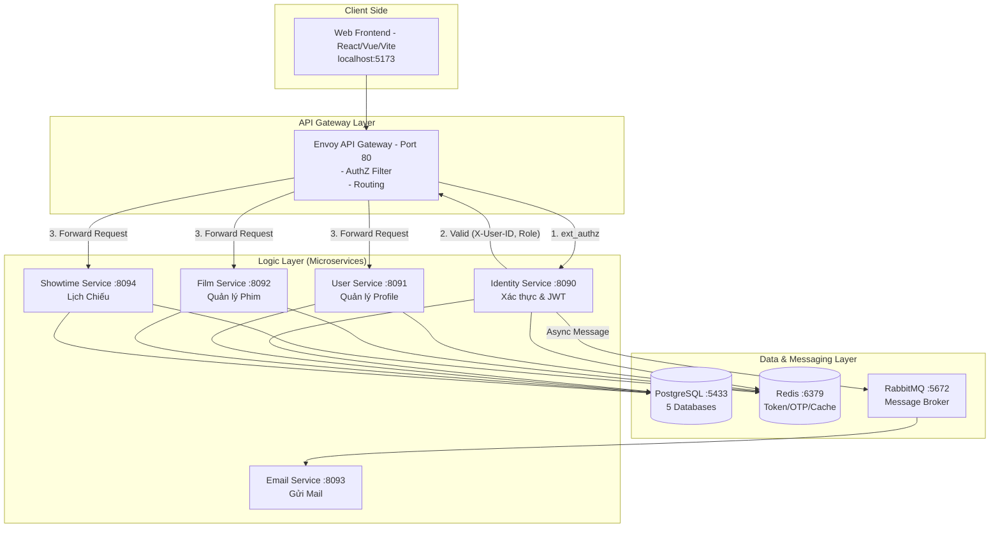

# TECHNICAL_AGENT_GUIDE - CinemaStar Engineering Handbook

> Tài liệu kỹ thuật chi tiết cho Developer và AI Agent.
> 
> Mục tiêu:
> - Giữ `README.md` thân thiện với end user.
> - Dồn toàn bộ kỹ thuật chuyên sâu vào file này để onboarding/maintenance nhanh hơn.

---

## Cách dùng tài liệu này

- Nếu bạn là người mới vào dự án: đọc theo thứ tự từ trên xuống.
- Nếu bạn là AI agent: ưu tiên đọc phần "AI Agent Playbook" ở cuối trước khi sửa code.
- Nếu bạn sửa liên service: luôn kiểm tra mục gRPC Contracts + Compose/Envoy.

---

## Legacy Technical Baseline (chi tiết 500+ dòng)

Phần bên dưới là bản kỹ thuật chi tiết đã được dùng trong dự án trước đó, giữ lại để tham chiếu đầy đủ.
Lưu ý: một số tên file compose/envoy trong phần lịch sử có thể khác với cấu trúc hiện tại, hãy ưu tiên các phần "Chạy nhanh", "Cấu trúc dự án" và "Hướng dẫn chạy" bên dưới.
# 🎬 CinemaStar — Hệ Thống Đặt Vé Rạp Phim (Microservices)

> **Khóa luận tốt nghiệp** — Hệ thống đặt vé xem phim trực tuyến hiện đại, xây dựng trên kiến trúc Microservices tinh gọn, bảo mật và hiệu suất cao.

---

## ⚡ Chạy Nhanh (Dev/Prod)

- **Dev (service chạy local VS Code, Envoy chạy Docker):**
```bash
docker compose -f compose.prod.yaml -f compose.local.yaml up -d
```
- **Prod (tất cả chạy trong Docker):**
```bash
docker compose -f compose.prod.yaml up -d
```

## 📋 Mục Lục

1. [🚀 Giới Thiệu](#-giới-thiệu)
2. [🏗️ Kiến Trúc Hệ Thống (Architecture)](#️-kiến-trúc-hệ-thống)
3. [🛠️ Công Nghệ Sử Dụng (Tech Stack)](#️-công-nghệ-sử-dụng)
4. [📁 Cấu Trúc Dự Án (Project Structure)](#-cấu-trúc-dự-án)
5. [📦 Chi Tiết Từng Service (Services Deep-Dive)](#-chi-tiết-từng-service)
6. [🌐 API Endpoints](#-api-endpoints)
7. [🐘 Cơ Sở Dữ Liệu & Caching (DB & Cache)](#-cơ-sở-dữ-liệu--caching)
8. [🚀 Hướng Dẫn Cài Đặt (Setup)](#-hướng-dẫn-cài-đặt)
9. [▶️ Hướng Dẫn Chạy (Run)](#️-hướng-dẫn-chạy)
10. [⚙️ Cấu Hình Môi Trường (Environment)](#️-cấu-hình-môi-trường)
11. [🗺️ Lịch Sử & Lộ Trình Phát Triển (Roadmap)](#️-lịch-sử-phát-triển)

---

## 🎯 Giới Thiệu

**CinemaStar** là hệ thống quản lý và đặt vé xem phim trực tuyến, được xây dựng theo kiến trúc **Microservices**. Hệ thống không chỉ là một ứng dụng đặt vé, mà là một hệ sinh thái hoàn chỉnh được thiết kế để giải quyết các bài toán về:

- 🔐 **Đăng ký / Đăng nhập** bằng email + OTP. Quản lý xác thực tập trung tại API Gateway.
- 👤 **Quản lý thông tin người dùng** với các roles: Customer, Manager, Staff, Admin.
- 🎬 **Quản lý phim** (Kho phim, tìm kiếm, phân loại) hỗ trợ phân trang hiệu suất cao (Cursor Pagination).
- 📅 **Quản lý lịch chiếu** (Tạo suất chiếu, bảo vệ chống xung đột thời gian, tự động cập nhật trạng thái).
- 📧 **Gửi email thông báo** (Xử lý bất đồng bộ).

---

## 🏗️ Kiến Trúc Hệ Thống

### Sơ đồ tổng quát (System Overview)



### Luồng xác thực qua Envoy (Gateway Pattern)

Envoy đóng vai trò là "người gác cổng" thông minh qua cơ chế **ext_authz**:

1. **Client** gửi request kèm header `Authorization: Bearer <token>` đến Envoy.
2. Envoy chặn request và gọi **ext_authz** nội bộ đến `identity-service/internal/auth/check`.
3. **Identity Service** sẽ:
   - Giải mã và xác thực JWT token (đảm bảo hạn dùng hợp lệ).
   - Kiểm tra trong **Redis** xem token có bị blacklist hay không (người dùng đã logout chưa).
4. Nếu hợp lệ, Identity Service trả về HTTP 200 kèm các header `X-User-ID` và `X-User-Role`.
5. Envoy lấy các header này từ kết quả ext_authz, gắn vào request gốc và truyền (forward) xuống service đích (User, Film, hoặc Showtime). Lớp bảo vệ này giúp các service con không cần tự quan tâm đến logic JWT phức tạp.

### Giao tiếp nội bộ giữa các Service (gRPC)

Từ bản cập nhật hiện tại, hệ thống tách rõ 2 lớp giao tiếp:

- **HTTP/REST** chỉ còn dành cho phía ngoài: Frontend -> Envoy Gateway -> Public API.
- **gRPC nội bộ** dùng cho các lệnh gọi service-to-service nhằm giảm overhead serialization, giảm độ trễ và gom contract tập trung bằng `.proto`.
- Lớp wiring gRPC hiện được chuẩn hóa theo **Spring gRPC official starter** để giảm bớt `ManagedChannel` / `ServerBuilder` config thủ công ở từng service.

Các luồng đã được chuyển sang **gRPC**:

- `identity-service` -> `user-service`: tạo profile Customer / Manager / Staff.
- Email được đẩy vào RabbitMQ để `email-service` xử lý bất đồng bộ.
- `showtime-service` -> `film-service`: lấy chi tiết phim theo `filmId`.
- `showtime-service` -> `booking-service`: chuẩn hóa contract kiểm tra showtime đã được đặt vé hay chưa.
- `showtime-service` -> `cinema-service`: lấy `cinemaId` theo `userId` (GetCinemaByUserId) để scope dữ liệu pricing policy theo rạp.

Contract gRPC được đặt tập trung trong `common-lib/src/main/proto` để mọi service dùng chung một chuẩn message/stub nội bộ. Việc bind server/client hiện đi qua cấu hình `spring.grpc.*` trong `application.yaml` cho các luồng RPC còn lại.

---

## 🛠️ Công Nghệ Sử Dụng

| Công nghệ | Version | Vai trò / Lý do lựa chọn |
|---|---|---|
| **Java** | 17 | Ngôn ngữ lập trình chính, ổn định, mạnh mẽ. |
| **Spring Boot** | 4.0.1 (core modules) | Framework chính tạo Microservices nhanh chóng. |
| **Spring Security** | Tích hợp | Xử lý JWT Authentication + Authorization. |
| **Spring Data JPA** | Tích hợp | ORM (Hibernate) truy vấn cơ sở dữ liệu chuyên sâu. |
| **Spring Data Redis** | Tích hợp | Giao tiếp với Redis qua Lettuce client. |
| **Spring AMQP** | 4.0.1 | Quản lý kết nối Message Broker (RabbitMQ). |
| **Spring Mail** | 4.0.1 | Hỗ trợ gửi template HTML qua JavaMailSender. |
| **Spring gRPC + Protocol Buffers** | Spring gRPC 1.0.2 / protoc 3.25.8 | Giao tiếp nội bộ service-to-service hiệu năng cao, dùng starter/autoconfig chính thức của Spring thay cho wiring thủ công. |
| **PostgreSQL** | 16 | RDBMS chính, ACID, hỗ trợ tốt UUID và JSON. |
| **Redis** | 7 | In-memory cache cực nhanh cho token, OTP, session, API cache. |
| **RabbitMQ** | 3.x | Hệ thống Queue xử lý các luồng bất đồng bộ (giảm latency). |
| **Envoy Proxy** | 1.31.x | API Gateway chuẩn microservices, ext_authz và routing linh hoạt. |
| **Docker Compose** | Mới nhất | Container hóa đồng bộ 100% môi trường dev/prod. |
| **Maven** | 3.9+ | Build tool mạnh mẽ quản lý dự án multi-module. |
| **jjwt** | 0.12.6 | Xử lý thế hệ Token ECDSA và RSA an toàn. |
| **MapStruct** | 1.6.3 | Tự động sinh code mapping DTO ↔ Entity siêu tốc. |
| **Lombok** | 1.18.30 | Giảm thiểu mã lặp (Getter, Setter, Builder). |
| **UUID Creator** | 5.3.7 | Tạo UUID v7 (Time-ordered) để tối ưu index B-Tree trong DB. |
| **SpringDoc** | 2.5.0 | Tự động trích xuất Swagger UI/OpenAPI document. |

---

## 📁 Cấu Trúc Dự Án

Dự án được phân tách thành các module Maven riêng biệt theo chuẩn thiết kế Domain-Driven Design (DDD).

```text
cinema-microservices/
├── common-lib/                    # 📚 Thư viện dùng chung (core standard)
│   └── src/main/java/com/cinema/
│       ├── Enum/                  # Enums: UserRole, UserStatus, FilmStatus, ShowTimeStatus
│       ├── controller/            # BaseController chuẩn hóa response REST (ok, created)
│       ├── dto/                   # APIResponse, CursorPageRequest/Response
│       ├── exception/             # GlobalExceptionHandler, ErrorCode tập trung 68 mã lỗi, BusinessException
│       ├── grpc/                  # Shared gRPC contracts, generated stubs, error utils
│       └── service/               # Service helpers dùng chung
│
├── identity-service/              # 🔐 Service xác thực và ủy quyền
│   └── src/main/java/.../
│       ├── config/                # JwtAuthenticationFilter, WebSecurityConfig, RedisConfig
│       ├── controller/            # UserController xử lý các API (/api/auth/*)
│       ├── dto/                   # Request/Response cho Account & Auth
│       ├── entity/                # Entity danh tính gốc (User, OtpData lưu memory/DB)
│       ├── mapper/                # Chuyển đổi qua MapStruct
│       ├── repository/            # Giao tiếp bảng accounts
│       ├── services/              # Logic Authentication (JWT cấp phát, verify, refresh)
│       └── utils/                 # Trình sinh mã OTP (OTPGenerator)
│
├── user-service/                  # 👤 Service quản lý hồ sơ người dùng
│   └── src/main/java/.../
│       ├── config/                # RedisConfig (Cache)
│       ├── controller/            # API hồ sơ (/api/users/*)
│       ├── entity/                # Hồ sơ chi tiết (Thông tin cá nhân, Ngân hàng)
│       └── services/              # Xử lý CRUD hồ sơ với Role tương ứng
│
├── film-service/                  # 🎬 Service quản lý kho phim
│   └── src/main/java/.../
│       ├── controller/            # API Phim (/api/films/*)
│       ├── entity/                # Film entity chứa metadata (Trailer, poster, duration...)
│       ├── repository/            # FilmRepository kèm Custom Method để Cursor Pagination
│       └── services/              # Xử lý tìm kiếm phức tạp và chuẩn hóa đầu vào phim
│
├── showtime-service/              # 📅 Service xếp lịch chiếu phim
│   └── src/main/java/.../
│       ├── controller/            # API Lịch chiếu (/api/showtimes/*)
│       ├── entity/                # ShowTime liên kết Film ID và thông tin phòng chiếu
│       └── services/              # Giải quyết bài toán xung đột lịch chiếu (Collision Detection)
│
├── email-service/                 # 📧 Service gửi thông báo
│   └── src/main/java/.../
│       └── services/              # Xử lý gửi email bất đồng bộ qua Gmail SMTP (@EnableAsync)
│
├── booking-service/               # 🧪 Skeleton service (chưa nối parent multi-module)
├── payment-service/               # 🧪 Skeleton service (chưa nối parent multi-module)
│
├── envoy/
│   ├── envoy.local.yaml           # 🔀 Envoy local (route tới host.docker.internal)
│   └── envoy.prod.yaml            # 🔀 Envoy prod (route tới service trong Docker)
│
├── postgres-init/
│   └── create-databases.sql       # 🐘 Script tự khởi động 5 DB độc lập cho microservices
│
├── compose.prod.yaml              # 🐳 Compose production/default (all services in Docker)
├── compose.local.yaml             # 🐳 Override local (Envoy route to local services)
└── pom.xml                        # 📦 Parent POM quản lý versions tập trung
```

---

## 📦 Chi Tiết Từng Service

### 1. `common-lib` (Thư viện dùng chung - Trái tim hệ thống)
Mọi service đều import thư viện này. Nó giải quyết triệt để sự lặp lại mã (DRY):
- **Dynamic API Response**: Class `APIResponse<T>` chuẩn hóa mọi payload gửi về Frontend (success, code, data, timestamp).
- **Global Error Handling**: Bắt lỗi toàn cục qua `@RestControllerAdvice`. Sử dụng Enum `ErrorCode` để quản lý tập trung mã lỗi logic (vd: 4001: USER_NOT_FOUND, 4002: FILM_TITLE_EXISTED).
- **Pagination Strategy**:
  - `film-service`: dùng **Cursor Pagination** (`CursorPageRequest`, `CursorPageResponse`) cho tập dữ liệu lớn.
  - `hall-service`, `showtime-service`, `cinema-service`: dùng **Page Pagination** (`PageRequest`, `PageResponse`) để đồng nhất payload cho FE/QA.

### 2. `identity-service` & Bảo mật (Security Model)
Đảm nhận trọng trách cổng kiểm tra chứng minh thư của hệ thống.
- **Mã hóa**: BCrypt (độ khó 10) chống brute-force bảng rainbow.
- **OTP System**: Xác minh email thực thụ. Mã sinh 6 số tự động được Redis giám sát, hết hạn sau 5 phút. Tích hợp giới hạn chỉ cho nhập sai 3 lần, nếu tái phạm sẽ lock tài khoản tạm thời.
- **Dual JWT Flow**: Khách hàng được cấp Access Token gắn trong Body (dùng trong RAM Frontend) và Refresh Token được cấp vào cấu hình chặt. 
- **Token Blacklist**: Logout là triệt để. Redis sẽ lưu vào sổ đen các JTI (Token ID) để khóa mọi Token bị hủy dù nó còn hạn sống.

### 3. `user-service`
Đóng gói chuyên biệt cho thông tin cá nhân.
- Cô lập riêng `Identity` và `Profile` để hạn chế vector tấn công lộ mật khẩu.
- Hỗ trợ lưu cấu hình Ngân hàng (`bankCode`, `accountNumber`) dành riêng cho chức năng hoàn tiền/đối soát trong tương lai.

### 4. `film-service`
Kho báu nội dung hệ thống.
- **Index Constraining**: Kiểm soát tính duy nhất theo partial unique index:
  - Chỉ chặn trùng `title + release_date` trên tập `is_deleted = false`.
  - Record đã xóa mềm (`is_deleted = true`) được phép trùng.
  - Script migration: `scripts/sql/2026-05-17-film-active-unique-index.sql`.
- **Soft Delete**: Mọi hành vi `DELETE` chỉ đổi cờ status DB `IsDeleted` sang True. Toàn vẹn dữ liệu cho các truy vấn báo cáo bán hàng lịch sử vẫn được bảo đảm tuyệt đối.
- **Complex Querying**: Tìm phim bằng từ khóa, lọc theo độ tuổi `AgeRating`, hoặc tình trạng hiện hành phim `FilmStatus`.
- **Future extension**: xem `FILM_REQUEST_FUTURE_NOTE.md` nếu sau này cần mở rộng luồng manager đề xuất phim chưa có trong catalog. Rule hiện tại vẫn giữ `ADMIN only` cho việc tạo phim.

### 5. `showtime-service` 
Bộ não hệ thống lập lịch chiếu phim hằng ngày.
- **Collision Rules Engine**: Không cho phép tạo đè suất chiếu. Bộ máy sẽ phân tích lịch của phòng chiếu mục tiêu, cảnh báo và từ chối nếu thời lượng bị lố giờ sang suất chiếu khác.
- Theo dõi sát vòng đời thực tiễn của suất (Pending -> Screening -> Ended).
- Quản lý **Pricing Policy** ngay trong `showtime-service` để giá vé đi cùng ngữ cảnh suất chiếu thay vì gắn cố định vào hall.
- Mỗi `showtime` hiện giữ `pricingPolicyId`, còn response showtime trả kèm object `pricingPolicy` để Frontend đọc giá trực tiếp.
- Pricing policy được scope theo `cinemaId`; service lấy `cinemaId` từ `cinema-service` qua gRPC `GetCinemaByUserId` dựa trên `X-User-ID`.

### 6. `email-service`
Nhận job gửi mail bất đồng bộ từ **RabbitMQ** để giảm tải request đồng bộ.
- Tách luồng IO với SMTP Google chậm chạp ra khỏi Response HTTP nhằm bảo vệ tính trải nghiệm thời gian thực của người dùng khi yêu cầu OTP hoặc vé điện tử.
- Listener có retry/backoff để xử lý tạm thời khi SMTP hoặc network lỗi.

---

## 🌐 API Endpoints

### 1. Identity Service (`/api/auth`)

| Method | Endpoint | Auth | Mô tả (Chi Tiết) |
|---|---|---|---|
| `POST` | `/api/auth/register` | ❌ | Đăng ký tài khoản Customer mới, hệ thống gửi OTP. |
| `POST` | `/api/auth/verify-otp` | ❌ | Xác thực mã OTP nhận từ email (Bị khóa sau 3 lần sai). |
| `POST` | `/api/auth/login` | ❌ | Đăng nhập tài khoản, trả về cụm Access & Refresh Token. |
| `POST` | `/api/auth/logout` | ❌ | Đăng xuất, đưa token hiện hành vào danh sách Blacklist Redis. |
| `POST` | `/api/auth/refresh_token` | ❌ | Trao đổi Refresh Token lấy Access Token mới. |
| `POST` | `/api/auth/forgot-password` | ❌ | Báo quên mật khẩu, đẩy một email mang OTP reset. |
| `POST` | `/api/auth/resend-otp` | ❌ | Yêu cầu gửi lại OTP cho các hành động trên. |
| `POST` | `/api/auth/change-password` | ✅ | Người dùng đổi mật khẩu mới (Cần Auth hợp lệ). |
| `POST` | `/api/auth/manager` | ✅ ADMIN | Cấp tài khoản cấp độ Manager. |
| `POST` | `/api/auth/staff` | ✅ ADMIN/MANAGER | Cấp tài khoản nhân sự Staff. |
| `GET` | `/internal/auth/check` | ✅ | Internal API. Trạm kiểm soát của Envoy. |

### 2. User Service (`/api/users`)

| Method | Endpoint | Auth | Mô tả |
|---|---|---|---|
| `POST` | `/api/users/customers` | Internal | Khởi tạo Profile KH sau khi Verify Identity. |
| `GET` | `/api/users/me` | ✅ Authenticated | Lấy thông tin profile của user hiện tại theo `X-User-ID`. |
| `PUT` | `/api/users/customers` | ✅ CUST | Cập nhật hồ sơ cá nhân. |
| `GET` | `/api/users/exists/{userId}` | Internal | Kiểm tra nhanh chéo Service xem User tồn tại không. |
| `GET/PUT/POST` | `/api/users/staffs|managers`| ✅ ADMIN | Các nghiệp vụ CRUD quản lý nhân sự chuyên quản. |

### 3. Film Service (`/api/films`)

| Method | Endpoint | Auth | Mô tả |
|---|---|---|---|
| `POST` | `/api/films/search` | ❌ Public | Tìm kiếm danh mục phim kết hợp Cursor Pagination + Filters. |
| `GET` | `/api/films/{id}` | ❌ Public | Lấy nguyên mẫu thông tin phim chi tiết (có đánh Cache Redis). |
| `POST` | `/api/films` | ✅ ADMIN | Đăng tải thông tin Phim mới. |
| `PUT` | `/api/films/{id}` | ✅ ADMIN | Chỉnh sửa cập nhật nội dung Phim. |
| `DELETE` | `/api/films/{id}` | ✅ ADMIN | Xóa mềm bộ phim khỏi hệ thống kinh doanh. |

### 4. Showtime Service (`/api/showtimes`)

| Method | Endpoint | Auth | Mô tả |
|---|---|---|---|
| `POST` | `/api/showtimes/search` | ❌ Public | Lấy danh sách suất chiếu theo `PageRequest` và trả full thông tin `film`, `hall`, `pricingPolicy`. |
| `POST` | `/api/showtimes` | ✅ MGMT | Tạo lịch chiếu hàng loạt theo khung giờ và gắn `pricingPolicyId` cho toàn bộ batch. |
| `PUT` | `/api/showtimes/{id}` | ✅ MGMT | Cập nhật chi tiết một showtime gồm thời gian, trạng thái và `pricingPolicyId`. |
| `PATCH` | `/api/showtimes/{id}` | ✅ MGMT | Tinh chỉnh nhanh trạng thái showtime. |
| `DELETE` | `/api/showtimes/{id}` | ✅ ADMIN | Bỏ lịch chiếu hệ thống (Cũng dùng Xóa Mềm). |
| `GET` | `/api/showtimes/{id}` | ❌ Public | Lấy chi tiết suất chiếu và trả full thông tin `film`, `hall`, `pricingPolicy`. |

### 4.1. Showtime Pricing Policy (`/api/showtimes/pricing-policies`)

| Method | Endpoint | Auth | Mô tả |
|---|---|---|---|
| `POST` | `/api/showtimes/pricing-policies` | ✅ MGMT | Tạo mới một policy giá cho ghế `STANDARD`, `VIP`, `COUPLE`. |
| `PUT` | `/api/showtimes/pricing-policies/{id}` | ✅ MGMT | Cập nhật bộ giá của policy, chỉ áp dụng khi policy chưa được showtime nào sử dụng. |
| `DELETE` | `/api/showtimes/pricing-policies/{id}` | ✅ MGMT | Xóa mềm policy giá, chỉ áp dụng khi policy chưa được showtime nào sử dụng. |
| `GET` | `/api/showtimes/pricing-policies/{id}` | ✅ MGMT | Lấy chi tiết một policy giá trong cinema hiện tại của user. |
| `GET` | `/api/showtimes/pricing-policies` | ✅ MGMT | Lấy danh sách policy giá của cinema hiện tại. |

### 5. Hall Service (`/api/halls`)

| Method | Endpoint | Auth | Mô tả |
|---|---|---|---|
| `POST` | `/api/halls` | ✅ MGMT | Tạo hall mới với `layoutJson` (JSON sơ đồ ghế để FE render). |
| `GET` | `/api/halls/{id}` | ❌ Public | Lấy chi tiết hall và trả `layoutJson` đầy đủ. |
| `POST` | `/api/halls/search` | ❌ Public | Tìm hall bằng `PageRequest/PageResponse`. |
| `PATCH` | `/api/halls/{id}/layout` | ✅ MGMT | Cập nhật toàn bộ `layoutJson` của hall. |

### 6. Cinema Service (`/api/cinemas`)

| Method | Endpoint | Auth | Mô tả |
|---|---|---|---|
| `POST` | `/api/cinemas` | ✅ ADMIN | Tạo cinema mới. |
| `GET` | `/api/cinemas/{id}` | ❌ Public | Lấy chi tiết một cinema theo id. |
| `POST` | `/api/cinemas/search` | ❌ Public | Tìm kiếm cinema bằng `PageRequest/PageResponse`. |
| `PUT` | `/api/cinemas/{id}` | ✅ ADMIN | Cập nhật thông tin cinema (địa chỉ, tọa độ, giờ hoạt động, manager). |
| `PATCH` | `/api/cinemas/{id}` | ✅ ADMIN | Cập nhật nhanh trạng thái cinema. |
| `DELETE` | `/api/cinemas/{id}` | ✅ ADMIN | Xóa mềm cinema và ngắt active staff mapping liên quan. |
| `POST` | `/api/cinemas/{id}/staffs` | ✅ ADMIN | Gán staff vào cinema. |
| `PUT` | `/api/cinemas/{id}/staffs` | ✅ ADMIN | Upsert/re-assign staff vào cinema theo `staffId`. |
| `DELETE` | `/api/cinemas/{id}/staffs/{staffId}` | ✅ ADMIN | Gỡ staff khỏi cinema (đánh dấu inactive). |
| `GET` | `/api/cinemas/{id}/staffs` | ❌ Public | Lấy danh sách staff mapping của cinema. |
| `GET` | `/api/cinemas/me` | ✅ MANAGER | Lấy cinema hiện tại do manager đang quản lý. |

Ghi chú gateway:
- Envoy đã route theo prefix `/api/cinemas/`, nên các method mới (bao gồm `PUT /api/cinemas/{id}/staffs`) không cần thêm route mới.

---

## 🐘 Cơ Sở Dữ Liệu & Caching

### Chiến Lược "Database per Service"
Tránh điểm chết thắt cổ chai của dạng cơ sở dữ liệu liền khối (Monolithic Database) truyền thống. Khóa liên kết ngoài (Foreign Key Constraints) bị loại bỏ có tính toán, các ID liên kết bằng chuẩn phân tán UUID.
Với việc Envoy điều phối và routing tải chia, khi có nhu cầu thì Postgresql có thể tự được dời cụm cluster riêng ra.

Năm cơ sở dữ liệu gồm: `identity_db`, `user_db`, `film_db`, `showtime_db`, `hall_db` được nhúng tự động thông qua khối lệnh của `/postgres-init/create-databases.sql`.

### Chiến Lược Redis
Áp dụng kho Redis v7 cung cấp băng thông nghìn Request/sec:
- **Tầng Xác Thực:** Giữ token vào RAM. Kể cả Database sập Identity Auth vẫn hoạt động liên tục vì Redis ôm hoàn toàn dữ liệu.
- **Tầng Tạm Thời (Transient):** OTP mã hóa 6 số gán định trạng thái phá hủy (TTL - 300 giây).
- **Tầng Gateway:** Envoy cache có thể được bật thêm khi cần để giảm Database roundtrip (hiện chưa bật trong config).

---

## 🚀 Hướng Dẫn Cài Đặt

### Yêu cầu hệ thống

- **Java 17** (JDK).
- **Maven 3.9+**.
- **Docker & Docker Compose**.
- Giới hạn RAM tối thiểu kiến nghị thiết bị **8GB** (Lý tưởng 16GB).
- **Git**.

### Bước 1: Clone dự án

```bash
git clone <repository-url>
cd cinema-microservices
```

### Bước 2: Chuẩn bị file `.env` siêu quan trọng

Tạo tệp `.env` cho mỗi một cấu trúc Service trong các thư mục `src/main/resources/`. Cụ thể:
- `identity-service/src/main/resources/.env`
- `user-service/src/main/resources/.env`
- `film-service/src/main/resources/.env`
- `showtime-service/src/main/resources/.env`
- `email-service/src/main/resources/.env`

*(Tham khảo mục **Cấu hình môi trường** ở dưới để biết các biến cần ghi).*
> ⚠️ **Lưu ý:** File `.env` chứa chìa khóa hệ thống. KHÔNG BAO GIỜ được mang commit lên cấu trúc mạng Git Public!

### Bước 3: Đóng gói (Build) thông qua Maven Multi-Module

Tại thư mục góc `cinema-microservices`:
```bash
# Lệnh tải sạch cache dependency và nén file thực thi chạy Jar nhưng Bỏ qua Test để nhanh hơn
mvn clean install -DskipTests
```

---

## ▶️ Hướng Dẫn Chạy

### Cách 1: Vận chuyển siêu tốc bằng Docker Compose (Đề xuất)

Dựng toàn bộ kiến trúc chỉ trong một dòng lệnh Terminal, tất cả hạ tầng (DB, Message Queue) và API Service đều đồng khởi chạy và tạo mạng nội bộ với nhau.
```bash
docker compose -f compose.prod.yaml up -d

# Check tình trạng cỗ máy
docker compose -f compose.prod.yaml ps
# Quản lý xem log ngẫu nhiên một Service
docker compose -f compose.prod.yaml logs -f identity-service
```

### Chạy Gateway Envoy theo chế độ Dev/Prod

- **Prod (default):** Envoy route tới service trong Docker network.
```bash
docker compose -f compose.prod.yaml up -d
```
- **Dev (service chạy local VS Code):** Envoy route về `host.docker.internal`.
```bash
docker compose -f compose.prod.yaml -f compose.local.yaml up -d
```

### Tương quan Port Mạng Trở Về:

| Dịch vụ / Hệ Tầng | Liên kết thực thi trên máy cá nhân |
|---|---|
| Envoy (Trung Tâm Gateway) | http://localhost:80 |
| Identity Service Web API | http://localhost:8090 (service local default) |
| User Profile Web API | http://localhost:8091 (service local default) |
| PostgreSQL Relational | `localhost:5433` (User: postgres / 123456) |
| Redis In-Memory KV | `localhost:6379` |
| RabbitMQ Management UI | http://localhost:15672 (admin / admin) |

*Muốn Tắt Toàn Bộ Dữ Liệu?*
```bash
docker compose -f compose.prod.yaml down -v
```

---

## ⚙️ Cấu Hình Môi Trường

Soạn thảo mã chuẩn cho toàn bộ file `.env` (Chỉnh URL, Password phù hợp):

**Cấu Trúc Các Base Chung (Copy đặt cho mọi file .env):**
```env
# === Database Connection ===
DB_URL=jdbc:postgresql://pg:5432/<database_name_tuong_ung>
DB_USERNAME=postgres
DB_PASSWORD=123456
JPA_DDL_AUTO=update
JPA_SHOW_SQL=true

# === Redis Connect ===
REDIS_HOST=redis
REDIS_PORT=6379
REDIS_TIMEOUT=5000

# === RabbitMQ Core ===
SPRING_RABBITMQ_HOST=rabbitmq
SPRING_RABBITMQ_PORT=5672
SPRING_RABBITMQ_USERNAME=admin
SPRING_RABBITMQ_PASSWORD=admin
```

**Biến Đặc Hữu Của Từng Dịch Vụ Cần Thêm (Cắt Dán Kèm Vào):**

**[identity-service]**
```env
SERVER_PORT=8090
USER_GRPC_HOST=user-service
USER_GRPC_PORT=9191
```

**[user-service]**
```env
SERVER_PORT=8091
GRPC_SERVER_PORT=9191
```

**[film-service]**
```env
SERVER_PORT=8092
GRPC_SERVER_PORT=9192
```

**[showtime-service]**
```env
SERVER_PORT=8094
FILM_GRPC_HOST=film-service
FILM_GRPC_PORT=9192
BOOKING_GRPC_HOST=booking-service
BOOKING_GRPC_PORT=9195
CINEMA_GRPC_HOST=cinema-service
CINEMA_GRPC_PORT=9196
```

**Schema note for `showtime-service`:**
- `show_time` có cột `pricing_policy_id` để liên kết logic tới bảng `pricing_policy`.
- `pricing_policy` lưu bộ giá cơ bản cho `STANDARD`, `VIP`, `COUPLE`.
- `pricing_policy` có thêm cột `cinema_id` để phân tách bộ giá theo từng cinema.
- Khi client gọi API showtime, response sẽ trả kèm `pricingPolicyId` và object `pricingPolicy`.
- Rule nghiệp vụ: `pricing_policy` đã được gán cho bất kỳ `showtime` nào thì không được update hoặc delete nữa.
- Rule nghiệp vụ bổ sung: policy chỉ được truy cập/sử dụng khi thuộc đúng cinema của manager hiện tại.


**[hall-services]**
```env
SERVER_PORT=8097
GRPC_SERVER_PORT=9197
DB_URL=jdbc:postgresql://pg:5432/hall_db
CINEMA_GRPC_HOST=cinema-service
CINEMA_GRPC_PORT=9196
```

**Schema note for `hall-services`:**
- `hall` lưu `layout_json` dạng JSON để FE render sơ đồ ghế.
- `layout_json` hỗ trợ loại ô ghế và ô `AISLE` (đường đi).
- gRPC nội bộ `GetHallById` dùng cho service khác (ví dụ `showtime-service`).

**[email-service]**
```env
SERVER_PORT=8093
MAIL_HOST=smtp.gmail.com
MAIL_PORT=587
MAIL_FROM_NAME=CinemaSystem
MAIL_USERNAME=nhap_mail@gmail.com
MAIL_PASSWORD=mat_khau_ung_dung_app_pass_cua_ban
```

> Khi chạy local không qua Docker network, có thể đổi các giá trị `*_GRPC_HOST` về `localhost`.
> `compose.prod.yaml` đã đồng bộ các host/port gRPC chính cho các service nội bộ; khi thêm service mới chỉ cần nối theo cùng convention này.
> Bên trong từng service, các biến môi trường này được map vào cấu hình `spring.grpc.client.channels.*.address` hoặc `spring.grpc.server.port`.

---

## 🗺️ Lịch Sử Phát Triển

### 🗓️ 01/04/2026 — Rà soát Tái Cấu Trúc Toàn Diện

**Đánh giá trạng thái thành quả Core:**

✅ **Các Mảnh Ghép Xong Nhiệm Vụ:**
1. Khung Sườn Multi-Module Microservices với chuẩn Common Library phân bố.
2. Hoàn tất Envoy Gateway áp dụng ext_authz và routing chuẩn, thay thế Nginx trong kiến trúc.
3. Bộ Token hoàn thiện (Role Check, OTP Timeout 5min Limit 3 lần, Refresh Token Flow).
4. Khảm Redis Error Handler Logic phân tán tải cực mạnh.
5. Triển khai Cursor Paging vào khối dữ liệu Film Data để tăng cường sức truy xuất vô hạn không giảm tốc.
6. Centralized Auto DB Script Configuration cho Container Init.
7. Áp mã UUID v7 thay cho v4 vào Primary Key.

⚠️ **Kế Hoạch & Lộ Trình Sắp Thi Hành:**

| Hạng Mục Tương Lai Mở Rộng | Mức Phân Quyền | Diễn Giải Nhiệm Vụ |
|---|---|---|
| **Hall Service (Rạp & Ghế)** | 🔴 Cao | Xây dựng sơ đồ rạp, phòng chiếu, ghế; chuẩn hóa map ghế để liên kết lịch chiếu. |
| **Booking Core Service** | 🔴 Cao | Xương sống kinh doanh (Bán Vé Core, Giữ Chỗ Redis Locking). Tương thích Gateway sẵn. Rule cứng: mỗi lượt booking tối đa 5 vé, vượt quá phải trả lỗi business. |
| **Payment Integration** | 🟡 Trung | VNPay/MoMo IPN, cập nhật trạng thái vé và giao dịch thanh toán. |

### 🗓️ 02/04/2026 — Nâng cấp Phân trang (Offset Pagination)
**Nội dung cập nhật:**
- Bổ sung bộ DTO phân trang truyền thống `PageRequest` và `PageResponse` vào `common-lib`.
- Refactor API lấy danh sách nhân sự (Staff/Manager) tại `user-service`. Dịch chuyển từ trả về List toàn bộ sang phân trang tối ưu.
- Thay đổi Endpoints:
  - `POST /api/users/staffs/search` (Phân trang Staff).
  - `POST /api/users/managers/search` (Phân trang Manager).

### 🗓️ 03/04/2026 — Tích hợp liên Service: Showtime & Booking
**Nội dung cập nhật:**
- Xây dựng giao thức kiểm tra trạng thái đặt vé giữa `showtime-service` và `booking-service`.
- Gắn REST Endpoint `GET /api/bookings/check-showtime/{showtimeId}` để tra cứu xem một suất chiếu đã phát sinh giao dịch đặt vé hay chưa.
- Chặn thay đổi trạng thái (Update Status) hoặc Xóa Phim (Delete) ở Showtime nếu như nhận được cờ báo đã có người đặt vé.
- Bổ sung mã lỗi `BOOKING_SERVICE_ERROR("9104")` vào thư viện `common-lib`.
- Bổ sung API `GET /api/showtimes/{id}` để hệ thống Frontend có thể nạp chi tiết một suất chiếu độc lập chuyên sâu thay vì chỉ tra cứu qua danh sách Search.
- Bổ sung Batch API `POST /api/films/batch` tại `film-service` hỗ trợ Frontend thực hiện Client-Side API Composition thay vì gom gọi (N+1 query) gây nghẽn rớt dây chuyền.
  - Sử dụng DTO chuẩn xác `BatchFilmRequest` (có `@NotEmpty`) và `BatchFilmResponse` để đóng gói dữ liệu an toàn chặn lỗi từ sớm.

### 🗓️ 03/04/2026 — Nâng cấp Inter-Service Communication sang gRPC
**Nội dung cập nhật:**
- Chuyển các lệnh gọi nội bộ đang dùng REST sang **gRPC** ở các luồng:
  - `identity-service` -> `user-service`
  - Email được đẩy vào RabbitMQ để `email-service` xử lý bất đồng bộ.
  - `showtime-service` -> `film-service`
  - `showtime-service` -> `booking-service` (theo contract gRPC thống nhất cho service tương lai)
- Bổ sung thư mục `common-lib/src/main/proto` chứa các contract:
  - `user_internal.proto`
  - `email_internal.proto`
  - `film_internal.proto`
  - `booking_internal.proto`
- Sinh shared gRPC stubs vào `common-lib` để các service tái sử dụng cùng một contract nội bộ.
- Thêm gRPC server bootstrap cho `user-service`, `film-service`.
- Thêm gRPC client config cho `identity-service`, `showtime-service`.
- Dọn bỏ `RestTemplate` nội bộ ở các luồng trên để tách hẳn REST public và RPC nội bộ.
- Dọn luồng gửi mail trong `identity-service`: bỏ `new Thread(...)` thủ công, giữ `@Async` + gRPC để giảm thread thừa và dễ kiểm soát hơn.
- Đồng bộ `compose.prod.yaml` cho cặp service đã có Dockerfile (`identity-service`, `user-service`) để container gọi nhau qua host nội bộ thay vì rơi về `localhost`.
- Sửa lại một số điểm cấu hình đi kèm:
  - `user-service` trả về mặc định đúng cổng HTTP `8091`.
  - `email-service` chuẩn hóa cổng HTTP `8093` để phục vụ nội bộ.
  - `identity-service` sửa cách đọc header phân quyền ở các luồng tạo `manager/staff` và đổi mật khẩu.

### 🗓️ 04/04/2026 — Chuẩn hóa gRPC theo Spring Official Starter
**Nội dung cập nhật:**
- Refactor lớp wiring gRPC từ cấu hình Java thủ công sang **Spring gRPC official starter** (`org.springframework.grpc:spring-grpc-spring-boot-starter`) để phù hợp hơn với hệ Spring Boot 4.
- Loại bỏ các class config tự tạo `ManagedChannel`, `BlockingStub`, `GrpcServerRunner` ở từng service.
- Chuyển client-side wiring sang `GrpcChannelFactory`, nhờ đó wrapper gRPC chỉ cần lấy channel theo tên (`user`, `email`, `film`, `booking`) thay vì tự build connection thủ công.
- Giữ nguyên các contract `.proto` và generated stubs trong `common-lib`, nên luồng giao tiếp nội bộ không bị đổi semantics.
- Chuẩn hóa prefix cấu hình từ `grpc.*` cũ sang `spring.grpc.*` trong `application.yaml`:
  - `spring.grpc.server.port`
  - `spring.grpc.client.channels.<name>.address`
- Biên dịch kiểm tra lại toàn bộ multi-module bằng Maven sau khi refactor và bảo đảm build thành công.
- Refactor chung header nội bộ sang hằng số dùng chung (`X-User-ID`, `X-User-Role`) để tránh sai lệch và giảm duplication.
- Cải thiện độ an toàn khi parse cursor: dùng URL decoder tương thích và bỏ lỗi khi cursor không hợp lệ.
- Tránh mutate list sort đầu vào trong search showtime để giảm side-effect khó debug.
- Dọn duplicate `authentication.setDetails` trong filter để giảm work thừa.
- Tối ưu query phim và showtime: tránh thao tác `toLowerCase` lặp lại, dùng `IN` cho enum status, thêm guard khi cursor thiếu field và ưu tiên so khớp UUID trực tiếp khi keyword là UUID.

### 🗓️ 05/04/2026 — Chuẩn hóa API Gateway với Envoy (Production-ready)
**Nội dung cập nhật:**
- Thay Nginx gateway bằng **Envoy Proxy** để phù hợp hơn với kiến trúc microservices/gRPC.
- Cấu hình `ext_authz` gọi `identity-service/internal/auth/check` để xác thực tập trung và tự động forward `X-User-ID`, `X-User-Role`.
- Thiết lập routing cho các service backend qua Envoy.
- Tách 2 cấu hình Envoy cho **local/prod** qua `envoy.local.yaml` và `envoy.prod.yaml` + `compose.local.yaml`.

### 09/04/2026 - Showtime pricing policy
**Nội dung cập nhật:**
- Loại bỏ DTO `ShowTimeWithFilmResponse`; thống nhất tất cả API showtime trả về `ShowTimeResponse` (đã gồm `film`, `hall`, `pricingPolicy`).
- Loại bỏ endpoint cũ `/api/showtimes/search-with-film` và `/api/showtimes/{id}/with-film`; thay bằng `/api/showtimes/search` và `/api/showtimes/{id}`.
- Thêm entity `PricingPolicy` vào `showtime-service` để quản lý giá `STANDARD`, `VIP`, `COUPLE`.
- Thêm cột `pricingPolicyId` vào `ShowTime` và nối vào luồng tạo showtime hàng loạt.
- Mở rộng response `showtime` để trả kèm `pricingPolicyId` và object `pricingPolicy`.
- Thêm cột `cinemaId` vào `pricing_policy` và validate policy theo cinema.
- Tích hợp gRPC `showtime-service` -> `cinema-service` (`GetCinemaByUserId`) để resolve `cinemaId` theo `X-User-ID`.
- Bổ sung `PUT /api/showtimes/{id}` để cập nhật chi tiết showtime, bao gồm thay đổi policy giá.
- Bổ sung CRUD API cho `pricing policy`:
  - `POST /api/showtimes/pricing-policies`
  - `PUT /api/showtimes/pricing-policies/{id}`
  - `DELETE /api/showtimes/pricing-policies/{id}`
  - `GET /api/showtimes/pricing-policies/{id}`
  - `GET /api/showtimes/pricing-policies`
- Khóa nghiệp vụ cho pricing policy: chỉ được sửa/xóa khi policy đó chưa được showtime nào sử dụng.

### 10/04/2026 - Hall layoutJson and AISLE update
**Nội dung cập nhật:**
- Refactor `hall-services` theo model `Hall` dùng `layoutJson` (JSON) thay vì bảng `Seat` rời.
- API hall cho FE gồm: `POST /api/halls`, `GET /api/halls/{id}`, `POST /api/halls/search`, `PATCH /api/halls/{id}/layout`.
- Bổ sung seat type `AISLE` để biểu diễn ô đường đi trong sơ đồ ghế.
- Bổ sung gRPC server `HallInternalService/GetHallById` và cấu hình `GRPC_SERVER_PORT=9197`.
- Cập nhật `compose.prod.yaml`, `compose.local.yaml`, `envoy.local.yaml`, `envoy.prod.yaml`, `postgres-init/create-databases.sql` để deploy đồng bộ.
- Điều chỉnh `showtime-service` dùng `HALL_GRPC_PORT` mặc định `9197`.
- Build compile đã pass với Maven local (`mvn`) cho `hall-service` + `common-lib`.
- Chuẩn hóa lại nội dung tổng kết README theo mốc cập nhật mới nhất ngày `10/04/2026`.

### 08/05/2026 - Booking service product MVP (gộp tài liệu về file chung)
**Nội dung cập nhật:**
- Nối `booking-service` vào parent multi-module (`pom.xml`) để build chung theo chuẩn repo.
- Bổ sung DB bootstrap cho booking:
  - `booking_user`
  - `booking_db`
  - grant/revoke tương ứng trong `postgres-init/create-databases.sql`.
- Nâng `booking-service` từ skeleton sang REST + JPA + Validation + gRPC client.
- Bổ sung entity `Product` trong `booking-service` (MVP chưa tách service riêng):
  - `cinemaId`, `name`, `type`, `price`, `description`, `imageUrl`, `status`, `isDeleted`, `timeCreated`, `timeUpdated`.
- Chuẩn hóa mapper theo style các service hiện có (MapStruct):
  - `ProductMapper.toEntity(...)`
  - `ProductMapper.updateEntityFromRequest(...)`
  - `ProductMapper.toResponse(...)`.
- Bổ sung gRPC `CinemaGrpcClient` để resolve `cinemaId` từ `X-User-ID` qua `GetCinemaByUserId` cho luồng operator.
- Bổ sung API product trong `booking-service`:
  - `POST /api/bookings/products`
  - `PUT /api/bookings/products/{id}`
  - `DELETE /api/bookings/products/{id}`
  - `GET /api/bookings/products/{id}`
  - `GET /api/bookings/products/me` (manager/staff theo cinema đăng nhập)
  - `GET /api/bookings/products/cinemas/{cinemaId}` (customer theo cinema đã chọn)
- Rule nghiệp vụ áp dụng:
  - Soft delete cho product.
  - Unique tên product trong cùng `cinemaId` (trên tập record chưa xóa).
  - `create/update/delete` được scope theo cinema của operator.
- Build check đã pass bằng Maven Wrapper:
  - `booking-service\\mvnw.cmd -DskipTests compile`
  - `booking-service\\mvnw.cmd -DskipTests test-compile`
- Mở rộng booking core cho phase đặt vé:
  - Bổ sung entity:
    - `Booking`
    - `BookingSeatItem`
    - `BookingProductItem`
    - `CustomerInfo` (embedded)
  - Bổ sung enums:
    - `BookingStatus` (`PENDING`, `RESERVED`, `CONFIRMED`, `CANCELLED`, `EXPIRED`)
    - `PaymentStatus` (`UNPAID`, `PAID`, `FAILED`, `REFUNDED`)
  - Bổ sung API booking:
    - `POST /api/bookings`
    - `GET /api/bookings/{id}`
    - `GET /api/bookings/me`
    - `GET /api/bookings/cinemas/me`
    - `PATCH /api/bookings/{id}/status`
    - `POST /api/bookings/{id}/cancel`
  - Chuẩn request frontend:
    - Chỉ dùng **1 payload** `CreateBookingRequest` khi khách đã chọn xong toàn bộ ghế + sản phẩm.
    - `customerInfo`, `seatItems`, `productItems` được thiết kế dạng nested object/list trong cùng request.
  - Redis seat lock:
    - Khóa ghế theo key `booking:seat-lock:{showtimeId}:{seatCode}`.
    - TTL mặc định `5` phút (`booking.seat-lock-minutes`).
    - Khi lock thất bại giữa chừng, rollback lock đã set trước đó.
    - Khi `cancel` hoặc status chuyển terminal (`CANCELLED`, `EXPIRED`, `CONFIRMED`) thì release lock.
  - Auto-expire booking:
    - Scheduler quét booking quá `reservedUntil` và tự chuyển sang `EXPIRED`.
    - Khi expire sẽ release lại Redis seat lock tương ứng.
  - Rule nghiệp vụ booking đã áp:
    - Tối đa `5` ghế mỗi booking.
    - Không cho seat trùng trong cùng request.
    - Snapshot tên/giá sản phẩm vào `BookingProductItem`.
    - Unique `(booking_id, seat_code)` và `(booking_id, product_id)`.
  - gRPC booking internal:
    - Triển khai `BookingInternalService/CheckShowtimeBooked` trong `booking-service`.
    - Mục tiêu: cho `showtime-service` kiểm tra suất chiếu đã có booking hay chưa trước khi update/delete.
    - Cấu hình server port: `spring.grpc.server.port` (`GRPC_SERVER_PORT`, mặc định `9195`).
  - Runtime wiring để service khác gọi được:
    - Bổ sung `booking-service` vào `compose.prod.yaml` (HTTP `8095`, gRPC `9195`).
    - Thêm route và cluster `/api/bookings` trong `envoy.prod.yaml` và `envoy.local.yaml`.

**Decision log (vì sao chọn như hiện tại):**
- Bối cảnh:
  - MVP cần lên nhanh chức năng menu bắp/nước để phục vụ đặt vé.
  - `booking-service` thời điểm bắt đầu vẫn là skeleton nên ưu tiên làm thẳng trong service này trước.
- Quyết định 1: chưa tách `product-service`, giữ `Product` trong `booking-service`.
  - Lý do: giảm độ phức tạp triển khai ban đầu, tránh tăng số lượng service khi nghiệp vụ chưa ổn định.
  - Hệ quả chấp nhận: sau này khi scale lớn có thể phải tách service và làm migration.
- Quyết định 2: dùng MapStruct mapper (`toEntity`, `updateEntityFromRequest`, `toResponse`) giống `film-service`/`showtime-service`.
  - Lý do: đồng nhất style code toàn repo, dễ review, giảm mapping thủ công.
- Quyết định 3: tách 2 luồng API đọc danh sách product:
  - Operator (`MANAGER`/`STAFF`): `GET /api/bookings/products/me` lấy cinema theo account đăng nhập.
  - Customer: `GET /api/bookings/products/cinemas/{cinemaId}` lấy theo cinema đã chọn trên UI.
  - Lý do: customer không có ngữ cảnh "cinema quản lý", nên phải dựa vào cinema được chọn.
- Quyết định 4: `GET /api/bookings/products/{id}` đọc theo `id` thuần.
  - Lý do: endpoint chi tiết by-id cần trả đúng record theo định danh; không ép scope manager cho use case đọc chi tiết cơ bản.
- Quyết định 5: create/update/delete vẫn scope theo account operator qua `GetCinemaByUserId`.
  - Lý do: tránh sửa dữ liệu xuyên cinema.
- Quyết định 6: booking create dùng một request tổng hợp duy nhất cho frontend.
  - Lý do: đúng flow checkout thực tế (khách chọn ghế + bắp nước xong mới submit 1 lần).
- Quyết định 7: dùng Redis lock ghế TTL 5 phút trong lúc chờ thanh toán.
  - Lý do: chặn tranh chấp ghế theo thời gian thực, đồng thời tự giải phóng lock khi hết hạn.
  - Rule chốt hiện tại:
  - Soft delete (`isDeleted`) cho product.
  - Unique tên product trong cùng `cinemaId` trên tập chưa xóa.
  - Trạng thái mặc định khi tạo nếu request không truyền: `ACTIVE`.
  - Các điểm chưa làm ở phase này:
  - Chưa tách `payment-service`/`product-service` ở mức production scale.
  - Chưa triển khai flow thanh toán hoàn chỉnh (capture/refund/webhook callback).
---
> Hệ thống được thiết kế theo kiến trúc mở và đã được rà soát tổng thể toàn bộ luồng xử lý đến **08/05/2026**. Mục tiêu là sẵn sàng đáp ứng quy mô hệ thống đặt vé trực tuyến yêu cầu High Availability.

---

## 🤖 AI Action Log

### 2026-04-10 18:59 (UTC+07:00) - Create README action logging skill
- Request: Review existing skills quickly and create a skill that logs each future request into README.md.
- Actions: Created `.agents/skills/readme-action-logger/SKILL.md` and set up append-log rules for each completed task.
- Files: `.agents/skills/readme-action-logger/SKILL.md`, `README.md`
- Result: The repository is ready to use README action logging for subsequent requests.

### 2026-04-10 19:00 (UTC+07:00) - Switch AI action logs to English
- Request: Write action log entries in English.
- Actions: Updated the logger skill rules to enforce English entries and translated the existing log entry to English.
- Files: `.agents/skills/readme-action-logger/SKILL.md`, `README.md`
- Result: AI action logs are now standardized in English.

### 2026-04-10 19:20 (UTC+07:00) - Diagnose and verify full project build
- Request: Re-check the whole project because it was failing and identify the cause.
- Actions: Ran compile checks across all modules, rebuilt and installed `common-lib`, installed parent POM to local Maven repo, and re-verified every service compile.
- Files: `README.md`
- Result: All modules now compile successfully with `-DskipTests` in local verification.

### 2026-04-10 20:15 (UTC+07:00) - Extend hall response with cinema payload
- Request: Add `cinemaResponse` in `HallResponse` and keep README action logging updated.
- Actions: Added `CinemaResponse` DTO in `hall-service`, extended `HallResponse` with `cinemaResponse`, mapped response population from `HallServiceImpl`, and updated mapper ignore rules for new field.
- Files: `hall-service/src/main/java/com/cinema/hall_services/dto/response/CinemaResponse.java`, `hall-service/src/main/java/com/cinema/hall_services/dto/response/HallResponse.java`, `hall-service/src/main/java/com/cinema/hall_services/services/impl/HallServiceImpl.java`, `hall-service/src/main/java/com/cinema/hall_services/mapper/HallMapper.java`, `README.md`
- Result: Hall API response now includes a `cinemaResponse` object with cinema id (and optional name field for future expansion).

### 2026-04-10 20:20 (UTC+07:00) - Fix Envoy route for POST /api/halls
- Request: Investigate `404 NR` when calling `POST /api/halls` from Postman.
- Actions: Updated Envoy routes to match both `/api/halls` and `/api/halls/` in `envoy.local.yaml` and `envoy.prod.yaml`.
- Files: `envoy/envoy.local.yaml`, `envoy/envoy.prod.yaml`, `README.md`
- Result: Gateway route matching now handles hall APIs with or without trailing slash.

### 2026-04-10 20:25 (UTC+07:00) - Fix Jackson package mismatch for layoutJson
- Request: Resolve `HttpMessageConversionException` for `HallCreateRequest.layoutJson`.
- Actions: Migrated hall-service JSON imports from `com.fasterxml.jackson.*` to `tools.jackson.*` (Spring 7/Jackson 3), covering request DTOs, response DTO, and service JSON processing.
- Files: `hall-service/src/main/java/com/cinema/hall_services/dto/request/HallCreateRequest.java`, `hall-service/src/main/java/com/cinema/hall_services/dto/request/UpdateHallLayoutRequest.java`, `hall-service/src/main/java/com/cinema/hall_services/dto/response/HallResponse.java`, `hall-service/src/main/java/com/cinema/hall_services/services/impl/HallServiceImpl.java`, `README.md`
- Result: `layoutJson` can be deserialized correctly by Spring message converters using Jackson 3 types.

### 2026-04-10 20:30 (UTC+07:00) - Remove deprecated JSON handling in hall service
- Request: Fix deprecated method usage and stabilize hall service JSON parsing.
- Actions: Reworked `HallServiceImpl` with `JsonMapper.builder().build()`, replaced integer checks with non-deprecated `isIntegralNumber()` flow, restored `cinemaId` resolution from `X-User-ID` (removed hardcoded value), and fixed malformed `parseSeatType` logic.
- Files: `hall-service/src/main/java/com/cinema/hall_services/services/impl/HallServiceImpl.java`, `README.md`
- Result: Hall service avoids deprecated JSON APIs and is back to manager-scoped cinema resolution.

### 2026-04-10 20:33 (UTC+07:00) - Remove deprecated textual JsonNode methods
- Request: Replace deprecated `isTextual()` and `asText()` calls in hall layout validation.
- Actions: Updated `HallServiceImpl` to use Jackson 3 `TextNode.textValue()` pattern in `readRequiredText` and `parseSeatType`, removing deprecated textual API usage.
- Files: `hall-service/src/main/java/com/cinema/hall_services/services/impl/HallServiceImpl.java`, `README.md`
- Result: Hall layout text parsing no longer depends on deprecated JsonNode textual methods.

### 2026-04-22 00:10 (UTC+07:00) - Add cinema staff PUT endpoint and migrate cinema mapper to MapStruct
- Request: Add missing `PUT` endpoint for cinema staff assignment and align mapper implementation style with other services.
- Actions: Added `PUT /api/cinemas/{id}/staffs` through controller/service/serviceImpl, migrated `cinema-service` mapper from manual class to MapStruct interface, and updated `cinema-service/pom.xml` with MapStruct processor config.
- Files: `cinema-service/src/main/java/com/cinema/cinema_service/controller/CinemaController.java`, `cinema-service/src/main/java/com/cinema/cinema_service/services/CinemaService.java`, `cinema-service/src/main/java/com/cinema/cinema_service/services/impl/CinemaServiceImpl.java`, `cinema-service/src/main/java/com/cinema/cinema_service/mapper/CinemaMapper.java`, `cinema-service/pom.xml`, `README.md`, `TECHNICAL_AGENT_GUIDE.md`
- Result: Cinema staff APIs now support idempotent `PUT` update flow and mapper style is consistent with MapStruct-based services.

### 2026-04-22 00:40 (UTC+07:00) - Fix RedisConfig generic pool typing and serializer deprecation
- Request: Investigate compile errors related to `GenericObjectPoolConfig<?>` and `GenericJackson2JsonRedisSerializer`.
- Actions: Updated Redis pool generic type to `GenericObjectPoolConfig<StatefulConnection<?, ?>>` and replaced deprecated `GenericJackson2JsonRedisSerializer` with `GenericJacksonJsonRedisSerializer` in Redis configs.
- Files: `identity-service/src/main/java/com/cinema/identity_service/config/RedisConfig.java`, `user-service/src/main/java/com/cinema/user_service/config/RedisConfig.java`, `film-service/src/main/java/com/cinema/film_service/config/RedisConfig.java`, `showtime-service/src/main/java/com/cinema/showtime_service/config/RedisConfig.java`, `README.md`, `TECHNICAL_AGENT_GUIDE.md`
- Result: Removed incompatible generic type errors in Lettuce pooling config and eliminated deprecated Redis serializer usage in the affected services.

### 2026-05-13 07:05 (UTC+07:00) - Migrate cinema search pagination to PageRequest/PageResponse
- Request: Refactor `cinema-service` search pagination from cursor-based to page-based request.
- Skills used: `backend-dev-guidelines`, `api-documentation`.
- Actions:
  - Switched `POST /api/cinemas/search` request type from `CursorPageRequest<CinemaField>` to `PageRequest<CinemaField>`.
  - Switched response type from `CursorPageResponse<CinemaResponse>` to `PageResponse<CinemaResponse>`.
  - Reworked service search flow to use `page/size` and compute `totalElements`, `totalPages`, `hasNext`, `hasPrevious`.
  - Added repository methods `searchWithPageAndSortAndFilter(...)` and `countWithFilter(...)` while preserving keyword/filter/sort behavior.
  - Verified compile via containerized Maven build in Docker.
- Files:
  - `cinema-service/src/main/java/com/cinema/cinema_service/controller/CinemaController.java`
  - `cinema-service/src/main/java/com/cinema/cinema_service/services/CinemaService.java`
  - `cinema-service/src/main/java/com/cinema/cinema_service/services/impl/CinemaServiceImpl.java`
  - `cinema-service/src/main/java/com/cinema/cinema_service/repository/CinemaRepositoryImpl.java`
- Result: Cinema search API now supports page-based pagination payload:
  - `{"page":1,"size":12,"keyword":"","filterBy":[],"sortBy":[]}`

### 2026-05-13 07:20 (UTC+07:00) - Add managerName in CinemaResponse
- Request: Add `managerName` field to cinema response for frontend usage.
- Skills used: `backend-dev-guidelines`, `api-documentation`.
- Actions:
  - Added `managerName` to `CinemaResponse`.
  - Updated `CinemaMapper` mapping to ignore `managerName` explicitly to keep MapStruct compile-safe with `ReportingPolicy.ERROR`.
  - Verified compile via Docker build.
- Files:
  - `cinema-service/src/main/java/com/cinema/cinema_service/dto/response/CinemaResponse.java`
  - `cinema-service/src/main/java/com/cinema/cinema_service/mapper/CinemaMapper.java`
- Result: API response now includes `managerName` field (currently nullable until manager profile-name source is wired).

### 2026-05-13 07:35 (UTC+07:00) - Wire managerName for cinema search/getById via user-service gRPC
- Request: Return real `managerName` in `GET /api/cinemas/{id}` and `POST /api/cinemas/search`.
- Skills used: `backend-dev-guidelines`, `api-documentation`.
- Actions:
  - Added internal RPC `GetUserBasicById` in shared `user_internal.proto`.
  - Implemented RPC handler in `user-service` gRPC layer and exposed `UserService.getUserById(...)`.
  - Added `UserGrpcClient` in `cinema-service` and enriched `managerName` for `getById` + `search`.
  - Added gRPC client channel config in `cinema-service` and runtime env in `compose.prod.yaml`.
- Result: `managerName` is now populated from `user-service` for search/getById responses, with graceful fallback to `null` if user-service is unavailable.


---

## AI Agent Playbook (Bổ sung mới)

### A. Quy tắc ra quyết định nhanh

1. Thay đổi chỉ 1 service, không đổi contract: sửa local service.
2. Thay đổi payload liên service: bắt đầu từ `common-lib/src/main/proto`.
3. Thay đổi auth/permission: kiểm tra cả Envoy + identity + business service.
4. Thay đổi lỗi nghiệp vụ: map vào `ErrorCode`, tránh hardcode string.
5. Thay đổi response cho frontend: cập nhật DTO + mapper + controller docs.

### B. Checklist bắt buộc trước khi kết thúc task

1. Có vi phạm scope theo `cinemaId` không?
2. Có kiểm tra role (`X-User-Role`) đúng chưa?
3. Có fallback khi gRPC fail chưa?
4. Có lỗi message tiếng Việt không dấu không?
5. Có đổi config env/port thì compose/envoy đã đồng bộ chưa?
6. Có ảnh hưởng contract cũ không (backward compatibility)?

### C. Chiến lược debug production-like

- Bước 1: xác định lỗi ở lớp nào (Gateway / Service / DB / MQ / Redis).
- Bước 2: grep `error code` trong `common-lib` trước để map business context.
- Bước 3: trace request path qua headers nội bộ (`X-User-ID`, `X-User-Role`).
- Bước 4: nếu liên service, test gRPC consumer trước rồi mới nhìn provider.
- Bước 5: chỉ refactor khi đã có reproduction rõ.

### D. Template note khi mở PR

- Scope:
- Impacted services:
- Proto change:
- Breaking change risk:
- Envoy/Compose change:
- Fallback strategy:
- Test evidence:

---

Cập nhật kỹ thuật gần nhất: 13/05/2026.

### 2026-05-20 Hall API Simplification (ADR)
- Status: Accepted
- Skills used: architecture-decision-records, api-design-principles

#### Context
- FE su dung 1 man hinh duy nhat de tao/sua hall.
- FE gui full payload moi lan submit (name, status, layoutDefinition).
- Kien truc moi da tach seat canonical sang seat-service (gRPC internal).

#### Options considered
1. Giu 3 DTO + 3 endpoint rieng (`HallCreateRequest`, `UpdateHallRequest`, `UpdateHallStatusRequest`)
- Pros: endpoint chuyen biet, de phan quyen chi tiet.
- Cons: FE phai ghep nhieu flow, de goi nham endpoint, contract phuc tap.

2. Gop 1 DTO chung cho create/update, bo patch status rieng
- Pros: FE don gian, contract gon, dung voi UX 1 form.
- Cons: can bao ve nghiep vu khi update layout trong luc dang co booking.

#### Decision
- Chon Option 2.
- Tao DTO chung `HallUpsertRequest` cho ca `POST /api/halls` va `PUT /api/halls/{id}`.
- Bo endpoint `PATCH /api/halls/{id}` cap nhat status rieng.
- Bo cac DTO cu: `HallCreateRequest`, `UpdateHallRequest`, `UpdateHallStatusRequest`.
- `createHall` va `updateHall` deu xu ly layoutDefinition thong qua `seat-service` (gRPC).

#### Consequences
- Positive:
  - FE chi con 1 contract de tao/sua hall.
  - Backend de maintain hon, it duplicate DTO.
  - Van giu duoc rule an toan: chan sua layout neu hall dang co booking active.
- Trade-off:
  - Mat endpoint status-rieng; moi thay doi status di qua full form submit.

#### Safety notes
- `PUT /api/halls/{id}` van check `HALL_LAYOUT_IN_USE` truoc khi replace layout.
- Neu seat-layout chua ton tai, backend fallback create layout trong update flow.

### 2026-05-20 Hall Form Contract Refinement (ADR)
- Status: Accepted (Supersedes `2026-05-20 Hall API Simplification (ADR)` phien ban truoc)
- Skills used: architecture-decision-records, api-design-principles

#### Context
- FE van dung 1 giao dien tao/sua hall, gui full payload.
- Team muon ten DTO ro nghia nghiep vu (`Create`/`Update`) thay vi `Upsert`.
- Hall co nhieu anh, can gui danh sach anh trong cung request hall thay vi API them tung anh.

#### Decision
- Tach lai DTO:
  - `HallCreateRequest`
  - `UpdateHallRequest`
- Ca 2 DTO deu gom:
  - `name`, `status`, `layoutDefinition`, `imagePaths: List<String>`
- Bo endpoint add image rieng `POST /api/halls/{id}/images`.
- Dong bo anh theo full payload trong create/update:
  - Anh co trong request: tao moi/khai phuc neu da soft-delete.
  - Anh khong con trong request: soft-delete.

#### Consequences
- Positive:
  - Ten request ro nghia va quen thuoc cho team.
  - FE van chi can 1 form, 1 lan submit la cap nhat ca hall + layout + images.
  - Khong can quan ly API them anh rieng.
- Trade-off:
  - Update la full-replace image list, FE phai gui day du danh sach anh hien tai.
