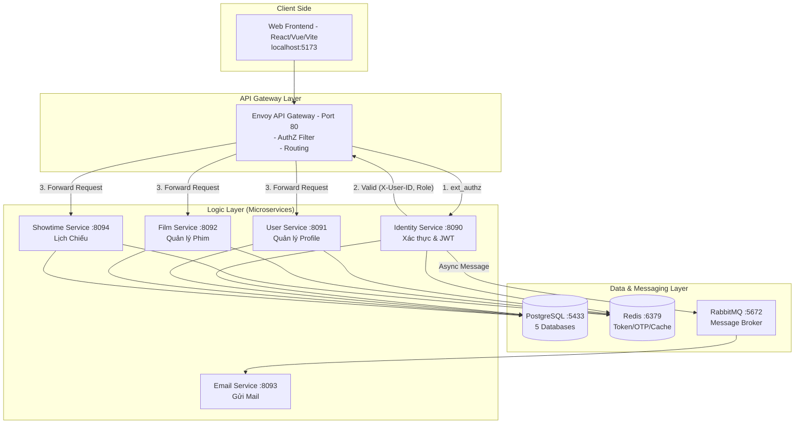

# Sổ tay kỹ thuật CinemaStar

> Tài liệu kỹ thuật chi tiết cho Developer và AI Agent.
> 
> Mục tiêu:
> - Giữ `README.md` thân thiện với end user.
> - Dồn toàn bộ kỹ thuật chuyên sâu vào file này để onboarding/maintenance nhanh hơn.

---

## Cách dùng tài liệu này

- Nếu bạn là người mới vào dự án: đọc theo thứ tự từ trên xuống.
- Nếu bạn là AI agent: ưu tiên đọc phần "Sổ tay tác nghiệp AI" ở cuối trước khi sửa code.
- Nếu bạn sửa liên service: luôn kiểm tra mục gRPC Contracts + Compose/Envoy.

## Changelog ngắn (2026-07-05 - booking report)

- `booking-service` báo cáo `POST /api/bookings/reports/showtimes/search` đã trả thêm `cinemaName`, `hallName`, `filmName` cho từng item report bằng lookup qua `CinemaGrpcClient`, `HallGrpcClient`, `FilmGrpcClient`.
- `occupancyRate` của report showtime đã đổi sang tỷ lệ thực `bookedSeats / capacity` với scale 4, nên ví dụ `7/54` sẽ ra `0.1296` thay vì `12.96`.
- `booking-service` showtime report đã đổi sang aggregate query theo showtime ngay ở DB và prefetch gRPC song song cho showtime/seat capacity để giảm độ trễ khi render report.
- `booking-service` đã thêm index JPA trên `booking` và `booking_seat_item.booking_id` để giảm cost lọc report suất chiếu và join đếm ghế.
- `postgres-init/add-booking-performance-indexes.sql` và `scripts/apply-booking-performance-indexes.sh` là bộ lệnh apply index thủ công trên VPS qua `docker exec` khi không muốn phụ thuộc `ddl-auto=update`.
- `film-service` prod compose trước đó thiếu `REVIEW_GRPC_HOST/PORT` nên `averageRating`/`reviewCount` có thể fallback về `0`; đã bổ sung review gRPC channel vào `compose.prod.yaml` và `film-service` config.
- `film-service` đang cache `FilmResponse` ở `cache name=films`, nên nếu film đã bị cache từ trước khi review-service có dữ liệu thì cần clear cache/evict để thấy rating mới.
- Page/total summary của báo cáo giữ nguyên shape hiện tại, chỉ đổi giá trị occupancy để khớp với item.
- `booking-service` đã thêm `POST /api/bookings/reports/showtimes/export` và export này, cùng `payment-service` export film, đều lấy toàn bộ data đã lọc thay vì cắt theo `pageRequest.size`.
- Verification mới nhất: `BookingServiceImplTest` và `PaymentSessionServiceImplTest` đã có regression cho export showtime/film khi `pageSize=1`, nhưng file Excel vẫn chứa đầy đủ dòng dữ liệu.
- `compose.prod.yaml` đã bỏ `film-service -> review-service` trong `depends_on` để phá vòng phụ thuộc gRPC `booking-service -> film-service -> review-service -> booking-service`; gRPC host/port review vẫn giữ nguyên để lookup rating hoạt động lúc runtime.
- Files chạm: `compose.prod.yaml`.
- Reason: Compose sẽ validate toàn bộ dependency graph ngay cả khi chạy `--no-deps`, nên một cạnh startup không cần thiết cũng đủ làm `docker compose up` fail nếu tạo cycle.
- Verification: sửa chỉ là gỡ dependency order, không đổi contract env; service vẫn có thể resolve nhau qua DNS nội bộ container khi runtime.

## Changelog ngắn (2026-07-05)

- `payment-service` đã được bổ sung channel gRPC `film` trong `application.yaml` và `compose.prod.yaml` (`FILM_GRPC_HOST/PORT`, `depends_on: film-service`), đồng thời thu hẹp `@SpringBootApplication` scan về `com.cinema.payment_service` + `com.cinema.exception` để tránh lỗi quét proto classes trong `common-lib`; mục tiêu là `GET /api/payments/revenues/films/search` lấy được `title` từ `film-service` thay vì rơi về `null`.
- Files chạm: `payment-service/src/main/resources/application.yaml`, `compose.prod.yaml`, `payment-service/src/main/java/com/cinema/payment_service/PaymentServiceApplication.java`.
- Reason: `FilmGrpcClient` đang gọi `channelFactory.createChannel("film")`, nhưng config production trước đó không khai báo channel này nên lookup tên phim thất bại và `filmName` bị rỗng trong response; đồng thời `scanBasePackages = "com.cinema"` làm `contextLoads` vấp bytecode proto của `common-lib`.
- Verification: đối chiếu lại `film_internal.proto` và `FilmInternalGrpcService` xác nhận film-service trả field `title`; `payment-service` Maven test pass toàn bộ (`42 tests, 0 failures, 0 errors`) sau khi thêm channel `film` và thu hẹp component-scan.
- Remaining risk: container đang chạy bản cũ phải restart/redeploy thì env mới có hiệu lực; nếu chưa restart, API cũ vẫn có thể tiếp tục trả `null`.

## Changelog ngắn (2026-07-04)

- `review-service` đã trả thêm `name` bên cạnh `userId` trong `ReviewResponse` và enrich response bằng gRPC `GetUserBasicById` từ `user-service`; đồng thời `ReviewServiceApplication` được thu hẹp component-scan để tránh quét nhầm proto classes trong `common-lib`.
- Files chạm: `review-service/src/main/java/com/cinema/review_service/dto/response/ReviewResponse.java`, `review-service/src/main/java/com/cinema/review_service/grpc/UserGrpcClient.java`, `review-service/src/main/java/com/cinema/review_service/service/impl/ReviewServiceImpl.java`, `review-service/src/main/java/com/cinema/review_service/ReviewServiceApplication.java`, `review-service/src/main/resources/application.yaml`, `compose.prod.yaml`, `review-service/src/test/java/com/cinema/review_service/service/impl/ReviewServiceImplTest.java`, `review-service/src/test/java/com/cinema/review_service/ReviewServiceApplicationTests.java`.
- Reason: review card đang chỉ hiện `Khách #...` vì response cũ chỉ có `userId`; backend cần trả thêm tên hiển thị để FE có thể render tên thật khi phù hợp, và scan scope cũ `com.cinema` làm `contextLoads` vấp vào bytecode proto trong `common-lib`.
- Verification: `review-service` Maven test pass toàn bộ (`ReviewServiceApplicationTests` và 2 test service mới), đồng thời context đã khởi động được sau khi bỏ scan `com.cinema` tổng và chỉ giữ `com.cinema.review_service` + `com.cinema.exception`.
- Remaining risk: FE vẫn cần ưu tiên render `name`; nếu UI chưa cập nhật thì nó sẽ tiếp tục dùng label ẩn danh cũ dù API đã có dữ liệu tên.

- `review-service` và `film-service` trong `compose.prod.yaml` đã được nới thêm bộ nhớ: cả hai đều tăng `MaxMetaspaceSize` lên `160m`, `ReservedCodeCacheSize` lên `64m`, và `mem_limit` lên `448m`; `review-service` dùng `Xmx224m`, còn `film-service` dùng `Xmx224m`.
- Files chạm: `compose.prod.yaml`.
- Reason: `review-service` đã từng OOM ở Metaspace, còn `film-service` trong `docker stats` đang chạy sát trần >90%; tăng đồng bộ JVM và container limit giúp giảm nguy cơ chết khi traffic tăng hoặc Spring/Hibernate sinh thêm class/proxy.
- Verification: đối chiếu lại block `film-service` và `review-service` trong `compose.prod.yaml`; thay đổi chỉ là tuning tài nguyên, không đụng logic nghiệp vụ.
- Remaining risk: nếu peak load tiếp tục tăng, có thể cần tune thêm heap/metaspace theo số liệu thực tế sau khi deploy.

- `review-service` trong `compose.prod.yaml` đã được nới bộ nhớ để tránh `OutOfMemoryError: Metaspace`: `MaxMetaspaceSize` tăng từ `96m` lên `128m`, `ReservedCodeCacheSize` từ `48m` lên `64m`, và `mem_limit` từ `224m` lên `352m`.
- Files chạm: `compose.prod.yaml`.
- Reason: log container cho thấy app chết sau khi khởi động xong vì Metaspace, không phải heap; mức cũ quá sát trần cho Spring/Hibernate/gRPC runtime hiện tại.
- Verification: đối chiếu lại block `review-service` trong `compose.prod.yaml`; thay đổi chỉ là tuning tài nguyên, không ảnh hưởng contract API.
- Remaining risk: nếu traffic hoặc số proxy/class tăng mạnh hơn nữa, vẫn có thể cần tăng tiếp `mem_limit` hoặc giảm class churn từ runtime.

- `booking-service` đã siết rule review eligibility: chỉ booking `CONFIRMED + PAID` và có `showtimeEndDateTime` nhỏ hơn `now` mới trả `eligible=true` qua gRPC `checkUserEligibleForReview`; `review-service` tiếp tục dùng client này để chặn/mở review.
- Files chạm: `booking-service/src/main/java/com/cinema/booking_service/grpc/BookingInternalGrpcService.java`, `booking-service/src/main/java/com/cinema/booking_service/repository/BookingRepository.java`, `booking-service/src/test/java/com/cinema/booking_service/grpc/BookingInternalGrpcServiceTest.java`.
- Reason: người dùng đã mua vé và thanh toán xong vẫn chưa được review nếu suất chiếu chưa kết thúc; rule phải bám theo `endTime < now` của vé chứ không chỉ trạng thái thanh toán.
- Verification: `BookingInternalGrpcServiceTest` pass 7/7 sau khi thêm 2 test mới cho case đã chiếu rồi và case chưa chiếu xong; `review-service` compile main cũng đã chạy xanh trong session trước đó.
- Remaining risk: nếu booking cũ trong DB chưa có `showtimeEndDateTime`, eligibility sẽ không mở cho review cho tới khi dữ liệu được backfill hoặc booking được tạo theo flow mới.

- `review-service` đã sửa lỗi PostgreSQL `text ~~ bytea` ở các API search review/comment bằng cách bỏ `LIKE concat('%', :keyword, '%')` trong JPQL và chuyển sang truyền sẵn `keywordPattern` từ service.
- Files chạm: `review-service/src/main/java/com/cinema/review_service/repository/ReviewRepository.java`, `review-service/src/main/java/com/cinema/review_service/repository/CommentRepository.java`, `review-service/src/main/java/com/cinema/review_service/service/impl/ReviewServiceImpl.java`, `review-service/src/main/java/com/cinema/review_service/service/impl/CommentServiceImpl.java`.
- Reason: log production cho thấy query `searchByFilmIdAndCursor` bind tham số keyword thành kiểu không khớp trong biểu thức concat/LIKE, làm Postgres suy ra RHS là `bytea` và nổ ở runtime.
- Verification: đã đối chiếu lại toàn bộ call site search trong review-service để cùng dùng helper `toLikePattern(...)` và param name `keywordPattern`; full Maven test chưa chạy được trong session này vì `mvn` không có sẵn trên máy hiện tại.
- Remaining risk: cần deploy/restart review-service rồi smoke test `POST /api/films/{filmId}/reviews/search` và comment search để xác nhận lỗi runtime đã hết hẳn.

- `compose.prod.yaml` đã khai báo `cinema-shared` là network `external: true`, nên Envoy sẽ dùng lại network có sẵn thay vì để project `cinema-deploy` cố tạo lại và sinh warning.
- Files chạm: `compose.prod.yaml`.
- Reason: trên VPS đã có network `cinema-shared` dùng chung giữa stack CinemaStar và container khác, nên Compose cần được báo rõ đây là network bên ngoài quản lý.
- Verification: đối chiếu lại block `envoy` và `networks` trong `compose.prod.yaml`; thay đổi chỉ tác động cách Compose attach network, không đổi service logic.
- Remaining risk: nếu network `cinema-shared` chưa tồn tại trên máy deploy mới, `docker compose up` sẽ báo lỗi cho tới khi tạo network một lần bằng tay.

- `postgres-init/create-databases.sql` đã được bổ sung đầy đủ `review_user` và `review_db` theo cùng pattern với các service còn lại: tạo role/login password, tạo database owner, revoke `PUBLIC`, rồi grant toàn quyền cho role.
- Files chạm: `postgres-init/create-databases.sql`.
- Reason: `review-service` trong `compose.prod.yaml` đã trỏ sẵn tới `jdbc:postgresql://postgres:5432/review_db` và `review_user`, nhưng script bootstrap PostgreSQL chưa tạo cặp này nên deploy mới có thể thiếu DB/user.
- Verification: đối chiếu static với `compose.prod.yaml` và `review-service/src/main/resources/application.yaml`; không cần đổi thêm config service vì phần compose đã đúng.
- Remaining risk: nếu PostgreSQL instance đã được khởi tạo từ trước mà không chạy lại script init, cần tạo/migrate thủ công `review_db` và `review_user` một lần.

- `envoy` đã được cập nhật để route review-service đúng nghĩa: các route search/view của review/comment được disable `ext_authz`, còn create/update/delete vẫn đi qua auth như cũ; review-service cluster mới trỏ về port `8101`.
- Files chạm: `envoy/envoy.local.yaml`, `envoy/envoy.prod.yaml`.
- Reason: review view cần public, nhưng mutation vẫn cần token. Gateway phải tách rõ theo path vì review search dùng `POST`, không thể dựa vào method.
- Verification: review/search routes được đặt trước route generic `/api/films` để không bị film-service nuốt mất.

- `film-service` đã tách nốt mapping của `ActorServiceImpl` và `TypeServiceImpl` sang `ActorMapper` và `FilmTypeMapper`, nên không còn `toResponse(...)` thủ công nằm trong service cho actor/type nữa.
- `user-service` phần loyalty đã được rà lại và hiện vẫn đi qua `UserMapper`/response DTO có sẵn, không có pattern dựng response dài trong service cần đổi thêm.
- Files chạm: `film-service/src/main/java/com/cinema/film_service/mapper/ActorMapper.java`, `film-service/src/main/java/com/cinema/film_service/mapper/FilmTypeMapper.java`, `film-service/src/main/java/com/cinema/film_service/services/impl/ActorServiceImpl.java`, `film-service/src/main/java/com/cinema/film_service/services/impl/TypeServiceImpl.java`.
- Reason: giữ boundary sạch, đồng bộ style MapStruct đang dùng ở các module còn lại, và tránh response builder/manual mapping nằm rải trong service.
- Verification: đã quét tĩnh lại `film-service/src/main/java/com/cinema/film_service/services/impl`; không còn `private toResponse(...)` trong actor/type service.

- `review-service` đã tách toàn bộ mapping response ra `mapper/` theo style MapStruct của monorepo, nên `ReviewServiceImpl` và `CommentServiceImpl` giờ chỉ còn business logic, auth, cursor paging, soft delete và gắn quan hệ media/parent.
- `booking-service` đã bổ sung eligibility gRPC cho review qua `checkUserEligibleForReview(userId, filmId)` để review-service không phải biết logic booking nội bộ.
- Files chạm: `review-service/src/main/java/com/cinema/review_service/mapper/ReviewMapper.java`, `review-service/src/main/java/com/cinema/review_service/mapper/CommentMapper.java`, `review-service/src/main/java/com/cinema/review_service/service/impl/ReviewServiceImpl.java`, `review-service/src/main/java/com/cinema/review_service/service/impl/CommentServiceImpl.java`, `review-service/src/main/java/com/cinema/review_service/entity/Review.java`, `review-service/pom.xml`, `booking-service/src/main/java/com/cinema/booking_service/repository/BookingRepository.java`.
- Reason: giữ boundary sạch hơn, đồng bộ với các service khác trong repo đang dùng MapStruct cho entity/response mapping.
- Verification: chưa chạy full Maven build trong phiên này vì môi trường hiện không có `mvn` khả dụng trực tiếp.

- `film-service` và `showtime-service` đã bỏ hẳn legacy scalar `actor/type` khỏi response và gRPC payload, chỉ còn model quan hệ `types`/`actors`.
- `film-service` đã bỏ luôn helper sync legacy `FilmCatalogSyncService`; create/update film giờ resolve `typeIds`/`actorIds` trực tiếp từ repository, còn `TypeServiceImpl` và `ActorServiceImpl` không còn refresh film sau update/delete.
- Film response đã tách sang DTO brief riêng cho nested `types/actors`, nên màn search/detail không còn mang theo `id/timeCreated/timeUpdated` của type/actor; DTO quản trị type/actor vẫn giữ nguyên để không phá màn admin.
- Files chạm: `common-lib/src/main/proto/film_internal.proto`, `film-service/src/main/java/com/cinema/film_service/entity/Film.java`, `film-service/src/main/java/com/cinema/film_service/repository/FilmRepositoryImpl.java`, `film-service/src/main/java/com/cinema/film_service/dto/request/CreateFilmRequest.java`, `film-service/src/main/java/com/cinema/film_service/dto/request/UpdateFilmRequest.java`, `film-service/src/main/java/com/cinema/film_service/dto/response/FilmResponse.java`, `film-service/src/main/java/com/cinema/film_service/dto/request/FilmField.java`, `film-service/src/main/java/com/cinema/film_service/mapper/FilmMapper.java`, `film-service/src/main/java/com/cinema/film_service/grpc/FilmInternalGrpcService.java`, `film-service/src/main/java/com/cinema/film_service/services/impl/FilmServiceImpl.java`, `film-service/src/main/java/com/cinema/film_service/services/impl/TypeServiceImpl.java`, `film-service/src/main/java/com/cinema/film_service/services/impl/ActorServiceImpl.java`, `showtime-service/src/main/java/com/cinema/showtime_service/dto/response/FilmResponse.java`, `showtime-service/src/main/java/com/cinema/showtime_service/mapper/FilmMapper.java`, `scripts/drop-film-legacy-columns.sql`.
- Reason: sau khi backfill hoàn tất thì không còn lý do giữ helper sync legacy nữa; nguồn sự thật hiện nằm ở relation `types/actors` và mapper/repository đã tự lọc `isDeleted=false`.
- Verification: local `film_db` đã drop thành công `films.actor` và `films.type`; query schema xác nhận chỉ còn 15 cột và không còn legacy scalar.
- Remaining risk: compile reactor vẫn đang gặp lỗi `common-lib` classpath/generated class lookup trong môi trường Maven/Docker hiện tại, nên cần clean/rebuild môi trường để xác nhận full build xanh.

## Changelog ngắn (2026-07-03)

- `film-service` đã chuẩn hóa lại validation message cho CRUD `type` và `actor` sang tiếng Việt có dấu.
- Files chạm: `film-service/src/main/java/com/cinema/film_service/dto/request/CreateFilmTypeRequest.java`, `film-service/src/main/java/com/cinema/film_service/dto/request/UpdateFilmTypeRequest.java`, `film-service/src/main/java/com/cinema/film_service/dto/request/CreateActorRequest.java`, `film-service/src/main/java/com/cinema/film_service/dto/request/UpdateActorRequest.java`.
- Reason: trước đó một số message vẫn là bản không dấu như `Ten the loai khong duoc de trong`, làm response validation kém nhất quán với phần film DTO đã dùng tiếng Việt có dấu.
- Verification: đã sửa trực tiếp annotation message; đây là thay đổi chuỗi hiển thị nên không cần đổi logic hoặc schema.
- Remaining risk: các message validation khác trong module khác nếu vẫn còn không dấu sẽ cần chuẩn hóa tiếp theo cùng một rule.

- `booking-service` đã chặn luôn confirm thanh toán nếu booking đã quá `reservedUntil`, kể cả khi scheduler chưa kịp đổi trạng thái sang `EXPIRED`.
- Files chạm: `booking-service/src/main/java/com/cinema/booking_service/grpc/BookingInternalGrpcService.java`, `booking-service/src/test/java/com/cinema/booking_service/grpc/BookingInternalGrpcServiceTest.java`.
- Reason: nếu chỉ mở ghế lại ở seat-map mà không chặn confirm payment thì có thể xảy ra race condition, khách thanh toán trễ vẫn bị nhận vé.
- Verification: thêm test `confirmBookingPayment_shouldRejectWhenReservationExpired`, và vẫn giữ nhánh `getSeatRuntimeStates` trả `AVAILABLE` sau khi quá hạn để UI không bị kẹt ghế.
- Remaining risk: scheduler vẫn cần chạy để dọn DB/Redis, nhưng nghiệp vụ thanh toán giờ đã có “gate” cuối cùng theo `reservedUntil`.

- `booking-service` đã đổi nguồn sự thật của runtime seat state: `getSeatRuntimeStates` giờ chỉ coi booking `PENDING/RESERVED` là `LOCKED` khi `reservedUntil` هنوز còn hiệu lực, còn booking quá hạn sẽ trả `AVAILABLE` ngay mà không chờ scheduler quét.
- Files chạm: `booking-service/src/main/java/com/cinema/booking_service/repository/BookingSeatItemRepository.java`, `booking-service/src/main/java/com/cinema/booking_service/grpc/BookingInternalGrpcService.java`, `booking-service/src/test/java/com/cinema/booking_service/grpc/BookingInternalGrpcServiceTest.java`.
- Reason: `seat-map` đang đọc trạng thái ghế từ booking-service; nếu chỉ chờ job dọn hết hạn thì sơ đồ có thể giữ ghế cũ lâu hơn TTL Redis.
- Verification: thêm test cho case booking đã hết `reservedUntil` nhưng vẫn còn `RESERVED` trong DB, đảm bảo API runtime seat trả `AVAILABLE`.
- Remaining risk: scheduler vẫn cần giữ để dọn DB sang `EXPIRED` và release Redis, nhưng nó không còn là điều kiện để seat-map mở lại ghế.

- `booking-service` đã tách lỗi “ghế đã được giữ / đã có người đặt” ra khỏi `BAD_REQUEST` chung bằng `ErrorCode.SEAT_ALREADY_LOCKED`, để FE hiển thị message rõ ràng hơn khi khách chọn trùng ghế.
- Files chạm: `common-lib/src/main/java/com/cinema/exception/ErrorCode.java`, `booking-service/src/main/java/com/cinema/booking_service/services/impl/BookingServiceImpl.java`, `booking-service/src/test/java/com/cinema/booking_service/services/impl/BookingServiceImplTest.java`.
- Reason: case ghế đang bị giữ là xung đột nghiệp vụ, không phải lỗi input chung; nếu trả `9005` thì người dùng chỉ thấy "Bad request" và không biết phải chọn ghế khác.
- Verification: logic đã đổi và test mới được thêm, nhưng full `booking-service` build hiện đang bị chặn bởi lỗi generated mapper có sẵn trong module (`BookingSeatItemMapperImpl.java` trong `target/generated-sources`), nên chưa chốt được green run ở module này trong phiên hiện tại.
- Remaining risk: cần dọn/xử lý lỗi mapper sinh code ở `booking-service` trước khi có thể xác nhận test đầy đủ; bản thân nhánh đổi message cho ghế đã rõ ràng hơn và không ảnh hưởng các case `BAD_REQUEST` khác.

- `payment-service` đã thêm cache TTL 15 giây cho `GET /api/payments/bookings/{bookingId}/promotions` ngay trong `PromotionEngine`, dùng key theo `bookingId + requesterUserId` để FE mở lại danh sách nhiều lần không phải gọi lại gRPC và không phải duyệt lại toàn bộ promotion list.
- Files chạm: `payment-service/src/main/java/com/cinema/payment_service/support/PromotionEngine.java`, `payment-service/src/test/java/com/cinema/payment_service/support/PromotionEngineTest.java`.
- Reason: danh sách khuyến mãi khả dụng thường được mở lặp lại trong cùng một booking; cache ngắn giúp giảm tải mà vẫn chấp nhận được rủi ro stale rất nhỏ.
- Verification: test cache mới pass và full `payment-service` pass `35 tests, 0 failures, 0 errors`.
- Remaining risk: nếu booking thay đổi trong đúng 15 giây TTL thì response cache có thể hơi cũ; trade-off này được chấp nhận để đổi lấy tốc độ và giảm call lặp.

## Changelog ngắn (2026-07-03)

- `payment-service` đã sửa nhánh reuse checkout trong `PaymentSessionServiceImpl` để so `promotionId` từ snapshot `payment_transaction_promotion` thay vì suy ra từ `promotionCode` của transaction chính.
- Files chạm: `payment-service/src/main/java/com/cinema/payment_service/services/impl/PaymentSessionServiceImpl.java`, `payment-service/src/test/java/com/cinema/payment_service/services/impl/PaymentSessionServiceImplTest.java`.
- Reason: `promotionCode` chỉ là snapshot hiển thị, còn nghiệp vụ chọn khuyến mãi giờ dựa trên ID; nếu code đổi sau này thì so theo code sẽ dễ lệch hành vi reuse.
- Verification: test đơn lẻ cho case reuse theo snapshot ID pass, và full `payment-service` cũng pass `34 tests, 0 failures, 0 errors`.
- Remaining risk: các transaction lịch sử chưa có snapshot `promotionId` vẫn có thể rơi về fallback theo code cũ, nhưng nhánh mới đã ưu tiên ID khi dữ liệu tồn tại.

## Changelog ngắn (2026-07-02)

- `booking-service` đổi booking report từ ngữ nghĩa doanh thu sang hiệu suất vận hành: response bỏ các field tiền, thêm `expiredCount` và `conversionRate`, export Excel có title `BÁO CÁO HIỆU SUẤT BOOKING THEO RẠP`.
- Files chạm: `booking-service/src/main/java/com/cinema/booking_service/services/impl/BookingServiceImpl.java`, `booking-service/src/main/java/com/cinema/booking_service/dto/request/BookingRevenueField.java`, `booking-service/src/main/java/com/cinema/booking_service/dto/response/BookingRevenueItemResponse.java`, `booking-service/src/main/java/com/cinema/booking_service/dto/response/BookingRevenueSummaryResponse.java`, `common-lib/src/main/java/com/cinema/excel/ExcelExportUtils.java`, `REPORT_GUIDE.md`, `REVENUE_REPORT_RULES.md`, `booking-service/BOOKING_PERFORMANCE_REPORT_NOTE.md`.
- Reason: FE cần một note rõ contract mới để map lại table/export đúng theo report hiệu suất, không còn render như báo cáo tiền.
- Verification: đã đối chiếu lại controller/service/DTO/export contract và update tài liệu hướng dẫn tương ứng; chưa chạy test vì đây là thay đổi tài liệu.
- Remaining risk: nếu FE vẫn render theo cột tiền cũ thì table/export sẽ lệch shape; cần đồng bộ UI mapping theo note mới.

- Thêm pipeline CI/CD GitHub Actions cho toàn bộ repo: chạy Maven test trước, build/push Docker image cho từng service lên GHCR, rồi SSH vào VPS để `docker compose pull && up -d`.
- Files chạm: `.github/workflows/ci-cd.yml`, `README.md`.
- Reason: muốn có flow push `main` là tự kiểm tra, tự build image, và tự đưa bản mới lên VPS theo `compose.prod.yaml` hiện có.
- Verification: đã đối chiếu image naming với `compose.prod.yaml` để khớp `IMAGE_REPO/${service}:${IMAGE_TAG}`; chưa chạy workflow thật vì chưa có secrets/GitHub runner trong workspace này.
- Remaining risk: workflow phụ thuộc đủ secrets `VPS_*` và `GHCR_*`, đồng thời VPS phải có Docker và quyền login GHCR.

- `identity-service` từng gặp lỗi login 500 vì `JWT_ACCESS_EXPIRATION` trên VPS bị set sai đơn vị, dẫn tới TTL Redis của `accessToken` bị âm khi trừ buffer 60s.
- Files liên quan: `identity-service/src/main/java/com/cinema/identity_service/services/impl/UserServiceImpl.java`, `identity-service/src/test/java/com/cinema/identity_service/services/impl/UserServiceImplTokenFlowTest.java`.
- Reason: env thực tế đang là `JWT_ACCESS_EXPIRATION=70`, tức 70ms chứ không phải 70s, nên Redis `SET` trả `ERR invalid expire time in 'set' command'`.
- Verification: xác nhận qua log runtime; code đã để nguyên logic cũ, và fix đúng là đổi env sang đơn vị milliseconds hợp lệ.
- Remaining risk: nếu ai đó set lại theo kiểu số giây thay vì milliseconds, lỗi sẽ tái diễn ngay khi trừ `TOKEN_EXPIRY_BUFFER=60000`.

- `payment-service` đã tách toàn bộ logic aggregate report doanh thu ra khỏi `PaymentSessionServiceImpl` sang helper top-level `payment_service.support.RevenueReportSupport`; service chỉ còn orchestration + repo access, còn report helper được test riêng.
- Files chạm: `payment-service/src/main/java/com/cinema/payment_service/support/RevenueReportSupport.java`, `payment-service/src/main/java/com/cinema/payment_service/services/impl/PaymentSessionServiceImpl.java`, `payment-service/src/test/java/com/cinema/payment_service/support/RevenueReportSupportTest.java`, `payment-service/src/test/java/com/cinema/payment_service/services/impl/PaymentSessionServiceImplTest.java`.
- Reason: tránh nhét accumulator class nội bộ trong service, giữ code dễ đọc và đúng ranh giới support/service hơn.
- Verification: chưa chạy Maven vì môi trường không có `mvn`; đã cập nhật service/test wiring để compile theo cấu trúc hiện tại.

- `identity-service` giữ nguyên nghiệp vụ refresh cũ: khi rotate `refreshToken`, nếu `accessToken` cũ vẫn còn key trong Redis thì refresh bị từ chối và toàn bộ auth cookie bị clear.
- Files chạm: `identity-service/src/main/java/com/cinema/identity_service/services/impl/UserServiceImpl.java`, `identity-service/src/test/java/com/cinema/identity_service/services/impl/UserServiceImplTokenFlowTest.java`.
- Reason: đây là rule nghiệp vụ của hệ thống, không phải lỗi kỹ thuật; refresh chỉ được phép khi session cũ đã hết/được revoke khỏi Redis.
- Verification: đã khôi phục lại nhánh `hasAccessToken` trong `refreshToken` và sửa test tương ứng; chưa chạy lại full Maven vì module `identity-service` hiện vẫn vướng lỗi compile sẵn có ở generated/proto symbols.
- Remaining risk: nếu FE hoặc gateway gọi refresh trước khi access token Redis hết key, hệ thống sẽ trả `REFRESH_TOKEN_MISSING` theo đúng rule hiện tại.

## Changelog ngắn (2026-06-28)

- `chatbot/api/schemas.py` đã thêm lớp sanitize request theo contract từng nhóm API: page search, film search, showtime-by-film, report; chatbot giờ tự cắt field thừa và map alias sort `TIME_CREATED -> CREATED_AT` cho cinema-service trước khi gọi BE.
- Đã thêm test unit cho sanitizer outbound ở `chatbot/tests/test_request_body_sanitizer.py`, cover `search_cinemas`, `search_films_customer`, `search_showtimes_by_film`, và report body để chặn regress request sai format.
- `FE/CinemaStar` chatbot đã chuyển luồng showtime theo tên phim sang orchestration 2 bước deterministic: resolve `filmId` bằng `search_films_customer`/`search_films`, rồi gọi `search_showtimes_by_film` trong cùng một turn chat.
- `run_chat()` giờ có thể trả `iterations > 1` khi thực sự gọi nhiều API, thay vì cố định 1 như trước; `api_calls` cũng phản ánh đủ chuỗi lookup.
- `chatbot/services/chat.py` đã được gắn log sequence theo từng bước gọi API: start/success/fail của `_execute_plan`, log start của special showtime flow, và log tổng `api_ids` cuối turn để debug nhanh trường hợp bot dừng ở bước 1.
- `chatbot/services/chat.py` đã siết lại film-title extractor bằng cắt chuỗi accent-insensitive, để các cụm thừa như `ở rạp`, `vào ngày 29/06`, `hôm nay` không còn bị nhét vào keyword phim làm `search_films_customer` trả rỗng.
- `chatbot/services/chat.py` đã sửa request search rạp dùng đúng field sort `CREATED_AT` của `cinema-service`; trước đó bot lỡ gửi `TIME_CREATED` nên `/api/cinemas/search` bị `9001` khi resolve cinema trước bước lấy suất chiếu.
- `chatbot/prompts/select_api.py` đã siết rule router: nếu khách hỏi showtime có tên phim nhưng chưa có `filmId`, tuyệt đối không chọn `search_showtimes`; bot phải resolve phim trước.
- Files chạm: `FE/CinemaStar/chatbot/services/chat.py`, `FE/CinemaStar/chatbot/prompts/select_api.py`.
- Reason: người dùng không biết `filmId`, nên chatbot phải tự đi qua bước lookup phim rồi mới truy suất suất chiếu.
- Verification: đã compile kiểm tra Python syntax sau khi sửa; cần smoke test lại câu “liệt kê các suất chiếu của phim Mưa Đỏ cho tôi” để xác nhận bot đi qua `search_films_customer/search_films` → `search_showtimes_by_film`.

- `FE/CinemaStar` chatbot đã mở rộng luồng suất chiếu theo rạp: khi khách chỉ nêu rạp/ngày mà không nêu phim, bot sẽ resolve `cinemaId`, lấy danh sách phim đang chiếu ở rạp đó, rồi gọi tiếp `search_showtimes_by_film` cho từng phim để trả về đúng suất chiếu thay vì dừng ở thông tin rạp.
- `chatbot/apis/catalog.py` và `chatbot/prompts/select_api.py` được cập nhật để ghi rõ rule orchestrator mới: case theo rạp không được kết thúc ở `search_cinemas` hoặc `search_films_customer` đơn lẻ.
- Files chạm: `FE/CinemaStar/chatbot/services/chat.py`, `FE/CinemaStar/chatbot/apis/catalog.py`, `FE/CinemaStar/chatbot/prompts/select_api.py`.
- Reason: màn chat trước đó chỉ trả thông tin rạp do chưa đi tiếp sang showtime lookup cho từng phim trong rạp.
- Verification: đã sửa orchestration code; cần smoke test lại câu “cho tôi suất chiếu của rạp lê văn việt” để xác nhận bot trả ra danh sách suất thay vì cinema info.

- `FE/CinemaStar` chatbot đã đổi nhánh tìm suất chiếu theo tên phim sang đa ứng viên: thay vì chốt đúng 1 `filmId`, bot sẽ rank các film match tốt nhất rồi gọi `search_showtimes_by_film` cho nhiều film candidate, giảm lỗi bỏ sót khi title như `1917` có nhiều biến thể.
- Files chạm: `FE/CinemaStar/chatbot/services/chat.py`.
- Reason: các title mơ hồ hoặc trùng tên có thể trả nhiều film item, và chỉ chọn 1 filmId dễ khiến bot kết luận sai là không có suất chiếu.
- Verification: đã cập nhật code; cần smoke test lại câu “Liệt kê danh sách suất chiếu và rạp của phim 1917 giúp tôi” để xem bot lấy được showtime từ đúng biến thể phim.

- `FE/CinemaStar` chatbot giờ validate `filmId` bằng UUID trước khi gọi `search_showtimes_by_film`; nếu upstream trả item không có UUID hợp lệ thì bot bỏ qua item đó thay vì gọi `/showtimes/films/1917/search` và gây lỗi `Invalid uuid format`.
- Files chạm: `FE/CinemaStar/chatbot/services/chat.py`.
- Reason: path param của showtime API phải là UUID thật từ `search_films_customer`, không được suy diễn từ title.
- Verification: đã thêm chặn và log cảnh báo cho item invalid; cần restart chatbot rồi test lại câu `1917` để xác nhận path ra UUID đúng chuẩn.

- `FE/CinemaStar` chatbot đã làm history-aware cho các câu tham chiếu như "film này": resolver giờ đọc cả history để lấy lại tên phim/rạp vừa được nhắc, thay vì chỉ nhìn câu hiện tại rồi suy ra sai.
- Files chạm: `FE/CinemaStar/chatbot/services/chat.py`.
- Reason: câu rút gọn của khách sau khi đã nhắc phim/rạp trước đó không đủ dữ liệu để regex hiện tại tự suy ra đúng `filmId` hoặc `cinemaId`.
- Verification: logic đã được nối vào `run_chat()`; cần smoke test lại hội thoại nhiều lượt như case `1917` + `rạp Lê Văn Việt` + `ngày mai` để xác nhận bot dùng đúng ngữ cảnh cũ.

- `FE/CinemaStar` chatbot đã siết lại `_extract_cinema_keyword()` để cắt bỏ các phần thừa như "ngày mai", "suất chiếu", "lúc mấy" khỏi keyword rạp trước khi search, tránh nhét cả câu hỏi vào tên rạp và làm lệch search_cinemas.
- Files chạm: `FE/CinemaStar/chatbot/services/chat.py`.
- Reason: câu hỏi kiểu "rạp cinema lê văn việt ngày mai có suất chiếu..." trước đó khiến keyword rạp bị quá dài, nên bot trả lại thông tin rạp thay vì đi tiếp tới showtime lookup.
- Verification: đã cập nhật rule trimming; cần restart chatbot và test lại câu hỏi theo rạp + ngày để xác nhận nó trả showtime thay vì chỉ cinema info.

- `FE/CinemaStar` chatbot đã đổi default missing-date của showtime sang quét một dải 7 ngày kế tiếp thay vì chỉ hỏi ngược khách hoặc chỉ mặc định "hôm nay".
- Files chạm: `FE/CinemaStar/chatbot/services/chat.py`.
- Reason: câu kiểu "tra giúp em suất chiếu của phim Mưa Đỏ với ạ" không nên bắt khách tự nêu ngày; bot phải tự thử các ngày gần nhất để tìm suất trước khi kết luận thiếu dữ liệu.
- Verification: code đã compile pass; cần smoke test lại case "Mưa đỏ" không nêu ngày để xác nhận bot tự tìm được showtime trong dải ngày gần nhất nếu có dữ liệu.

- `FE/CinemaStar` chatbot đã tách serializer request theo API: `/api/films/customer/search` chỉ gửi `showtimeDate`, còn `/api/showtimes/films/{filmId}/search` chỉ gửi `date`, tránh field thừa làm BE trả `9001`.
- Files chạm: `FE/CinemaStar/chatbot/api/schemas.py`, `FE/CinemaStar/chatbot/services/chat.py`.
- Reason: request body chung trước đó bị serialize cả `date` và `showtimeDate`, trong khi film-service/customer-search chỉ chấp nhận `showtimeDate`.
- Verification: đã chỉnh executor để truyền `api_id` vào serializer; cần restart chatbot và test lại case "bắt đầu từ 7h sáng ngày mai" để xác nhận request film-search không còn bị 9001.

- `FE/CinemaStar` chatbot đã bỏ lọc `showtimeDate` ở bước `search_films_customer` khi khách chưa nói ngày rõ ràng; ngày chỉ còn được quét ở bước `search_showtimes_by_film`.
- Files chạm: `FE/CinemaStar/chatbot/services/chat.py`.
- Reason: khóa film search vào một ngày mặc định khiến nhánh orchestration dừng sớm và không thật sự đi qua 2 API khi khách hỏi suất chiếu tổng quát.
- Verification: logic đã refactor sang "search film theo title trước, search showtime theo dải ngày sau"; cần smoke test lại câu hỏi thiếu ngày để xác nhận iterations tăng >1 khi có dữ liệu.

- `FE/CinemaStar` chatbot đã thêm nhánh đặc biệt cho câu hỏi khách về suất chiếu theo rạp/ngày: trước hết resolve `cinemaId` bằng `search_cinemas`, rồi gọi `search_films_customer` để lấy phim có suất chiếu, thay vì đẩy khách vào `search_showtimes` và bắt phải có `filmId`.
- `SearchFilmsRequestBody` trong chatbot giờ đồng bộ cả `showtimeDate` lẫn alias `date`, để request gửi sang BE khớp `film-service`/`showtime-service` mà không bị lệch field.
- `chatbot/apis/catalog.py` và `chatbot/prompts/select_api.py` đã siết rule router: khách hỏi “có suất chiếu tối nay ở rạp X” không được chọn `search_showtimes`; phải đi theo luồng customer/public.
- Files chạm: `FE/CinemaStar/chatbot/services/chat.py`, `FE/CinemaStar/chatbot/api/schemas.py`, `FE/CinemaStar/chatbot/apis/catalog.py`, `FE/CinemaStar/chatbot/prompts/select_api.py`.
- Reason: khách không biết `filmId`, nên bot cần tự resolve rạp và ngày xem trước khi tra cứu thay vì trả lỗi format từ API nội bộ.
- Verification: chưa chạy full integration; cần smoke test lại câu “có suất chiếu tối nay không rạp cinema lê văn việt á” để xác nhận bot đi qua `search_cinemas` → `search_films_customer` và không còn hit `/api/showtimes/search`.

- `booking-service` mở admin write access cho `PUT/POST/DELETE /api/bookings/products` theo pattern `admin bypass`, còn `MANAGER` vẫn phải đi qua scope cinema như cũ.
- `ProductServiceImpl` giờ resolve cinema scope theo role: `ADMIN` lấy toàn bộ cinema active từ `cinemaGrpcClient.getAllActiveCinemas()`, `MANAGER` vẫn dùng `getCinemaIdsByUserId(...)`, `STAFF` vẫn bị chặn ở write path.
- Files chạm: `booking-service/src/main/java/com/cinema/booking_service/services/impl/ProductServiceImpl.java`, `booking-service/src/test/java/com/cinema/booking_service/services/impl/ProductServiceImplTest.java`.
- Reason: admin trước đó bị chặn nhầm ở `validateManagerRole(...)`, trong khi rule mong muốn là admin được thao tác trên mọi cinema active.
- Verification: test mới đã được thêm cho admin bypass, manager scope, staff forbidden, manager không có cinema, và admin bị chặn khi cinema không active; build reactor hiện vẫn bị kẹt ở `common-lib` protobuf temp-dir issue trên workspace này nên chưa có green full-run.
- Remaining risk: nếu cần CI pass thì vẫn phải xử lý lỗi plugin protobuf của `common-lib` trong môi trường build, vì đây là blocker ngoài logic product.

## Changelog ngắn (2026-06-28)

- `booking-service` test compile bị fail vì import `ActionMessageResponse` nhầm từ package nội bộ thay vì `com.cinema.dto.response`.
- Files chạm: `booking-service/src/test/java/com/cinema/booking_service/services/impl/ProductServiceImplTest.java`.
- Reason: `ActionMessageResponse` là DTO chung trong `common-lib`, nên test package local không thể tự định nghĩa lại cùng tên mà phải import đúng source thật.
- Verification: build reactor gốc bằng `booking-service/mvnw.cmd -f ..\pom.xml -DskipTests -pl booking-service -am package` đã pass sau khi sửa import; module đơn lẻ không phải cách verify tin cậy cho case này.
- Remaining risk: nếu CI vẫn build theo module riêng lẻ, cần đảm bảo nó dùng reactor root để kéo `common-lib` mới nhất thay vì cache cũ.

## Changelog ngắn (2026-06-28)

- `FE/CinemaStar` chatbot đã bỏ cơ chế đọc token từ `localStorage` cho riêng `/chat` và chuyển sang gửi cookie thật của browser bằng `credentials: include`.
- `src/api/chatbot.js` ở `DEV` luôn đi qua `/chatbot/chat` qua Vite proxy; URL remote chỉ còn là fallback cho production, để tránh browser gọi thẳng vào chatbot HTTP cũ thay vì đi qua gateway HTTPS `https://cinema-api.duckdns.org/chat`.
- `chatbot/main.py` giờ dùng CORS allowlist thay vì `allow_origins=["*"]`, để request có credentials từ FE origin được browser chấp nhận; cấu hình origin có thể override bằng `CHATBOT_CORS_ORIGINS`.
- Files chạm: `FE/CinemaStar/src/api/chatbot.js`, `FE/CinemaStar/chatbot/main.py`, `FE/CinemaStar/chatbot/.env.example`.
- Reason: trước đó FE chỉ forward `auth_cookie` từ storage cục bộ, nên khi deploy khác origin cookie không còn đi qua được và chatbot log `cookie=no`.
- Verification: đã chuyển `/chat` sang `credentials: include` và giữ body chỉ còn `question`/`history`; CORS default đã giới hạn theo origin cụ thể thay vì wildcard.
- `envoy/envoy.prod.yaml` đã thêm route `/chat` và cluster `chatbot` để public endpoint đi qua HTTPS gateway thay vì browser gọi thẳng `http://cinema-api.duckdns.org:8000/chat`.
- `compose.prod.yaml` và `FE/CinemaStar/chatbot/docker-compose.yml` cùng join network `cinema-shared`, để Envoy resolve được hostname `chatbot` sang container Python ở compose riêng.
- Files chạm: `envoy/envoy.prod.yaml`, `compose.prod.yaml`, `FE/CinemaStar/chatbot/docker-compose.yml`.
- Reason: Envoy route `/chat` chỉ hoạt động nếu gateway và chatbot thật sự thấy nhau qua DNS Docker, nên 2 stack riêng vẫn phải share một network chung.
- `compose.prod.yaml` cũng thêm alias `cinema-api.duckdns.org` cho Envoy trên network chung, để chatbot gọi `CINEMA_API_BASE_URL=https://cinema-api.duckdns.org/api` nhưng DNS nội bộ vẫn resolve về gateway, tránh lỗi intermittent `Temporary failure in name resolution`.
- Verification: chatbot service có alias `chatbot` trên network chung, Envoy attach cùng network đó, nên upstream `chatbot:8000` có thể resolve qua Docker DNS thay vì cần chung một compose file; chatbot cluster phải giữ HTTP/1.1 upstream, không bật `http2_protocol_options`, vì Uvicorn sẽ trả `Invalid HTTP request received` nếu nhận HTTP/2 preface.
- Remaining risk: production vẫn phụ thuộc cookie auth của `identity-service` phải được set đúng `Secure` + `SameSite=None` thì browser mới gửi cross-site ổn định.

## Changelog ngắn (2026-06-10)

- Chuẩn hóa success message và mutation response theo một enum chung trong `common-lib`, đồng thời bỏ helper string tự do ở `BaseController`.
- `BaseController` giờ chỉ nhận `SuccessMessage`, nên mọi `APIResponse.message` và `ActionMessageResponse.message` đều lấy từ nguồn sự thật tiếng Việt thay vì hardcode rải rác.
- Các mutation đã được chuyển sang action-only ở những luồng đã trả payload cũ: `booking-service` (`createBooking`, `cancelBooking`), `payment-service` (`createPromotion`, `updatePromotion`, `createSession`, `requestRefund`), `showtime-service` (`createShowTime`, `updateShowTime`, `deleteShowTime`), `upload-service` (`uploadImages`, `createVideoSession`, `uploadVideoChunk`, `completeVideoUpload`).
- Các read/list/detail endpoint vẫn giữ DTO cũ nhưng đổi message envelope sang enum theo nghiệp vụ, ví dụ `PRODUCT_FETCHED`, `PRICING_POLICY_FETCHED`, `PRODUCTS_SEARCHED`, `PROMOTIONS_SEARCHED`.
- Files chính đã chạm: `common-lib/src/main/java/com/cinema/Enum/SuccessMessage.java`, `common-lib/src/main/java/com/cinema/controller/BaseController.java`, các controller/service tương ứng ở `booking-service`, `payment-service`, `showtime-service`, `upload-service`, `cinema-service`, `hall-service`, `film-service`, `identity-service`, `user-service`.
- Verification:
  - `booking-service` compile pass
  - `payment-service` compile pass
  - `showtime-service` compile pass
  - `upload-service` compile pass
  - `common-lib`, `identity-service`, `user-service` compile pass
- Remaining risk:
  - một số service khác trong reactor (`cinema-service`, `hall-service`) vẫn có dấu hiệu build nhiễu từ gRPC/classpath trong workspace hiện tại, nên nếu cần full reactor pass thì nên chạy lại trên môi trường sạch hoặc sau khi dọn `target/` toàn repo.

## Changelog ngắn (2026-06-11)

- `identity-service` now owns customer creation for staff-sell through both REST `POST /api/auth/customer` and gRPC `CreateCustomerProfile`.
- `booking-service` no longer creates/deletes walk-in customers through `user-service` HTTP; when `customerId = null` it calls `identity-service` gRPC, receives the new `userId`, and sets `booking.userId` from that reply.
- `customerId = null` skips id lookup entirely; the flow only validates duplicate `phone` and `email` when creating the new customer.
- `identity-service` performs best-effort cleanup if identity persistence fails after user profile creation, and `booking-service` deletes the created customer through `identity-service` if booking save fails.
- `user-service` adds a dedicated gRPC delete RPC for booking cleanup so the compensation path does not need the admin-actor audit route.
- Đã dọn sạch 3 REST internal customer endpoint cũ ở `user-service` (`POST /internal/customers`, `GET /internal/customers/{id}`, `DELETE /internal/customers/{id}`), đồng thời bỏ luôn `booking-service` HTTP client lookup cũ; nhánh `customerId != null` giờ validate tồn tại qua `identity-service` gRPC thay vì `user-service` REST.
- `BookingServiceImplTest` và `UserServiceImplPhoneLookupTest` đã được cập nhật/giảm scope theo luồng mới, build xác nhận pass với `BookingServiceImplTest`: `22 tests, 0 failures, 0 errors` và `UserServiceImplPhoneLookupTest`: `2 tests, 0 failures, 0 errors`.
- `payment-service` đã chuẩn hóa lại test theo contract `ActionMessageResponse` cho `createSession`, `createPromotion`, `updatePromotion`; build `payment-service` đã pass lại sau khi sửa các assertion kiểu response cũ.
- `upload-service` cũng đã chuẩn hóa theo cùng pattern `ActionMessageResponse` cho `uploadImages`, `createVideoSession`, `uploadVideoChunk`, `completeVideoUpload`; build `upload-service` pass lại sau khi sửa test mutation.
- Files chính đã chạm:
  - `common-lib/src/main/proto/identity_internal.proto`
  - `common-lib/src/main/proto/user_internal.proto`
  - `booking-service/src/main/java/com/cinema/booking_service/grpc/IdentityGrpcClient.java`
  - `booking-service/src/main/java/com/cinema/booking_service/services/impl/BookingServiceImpl.java`
  - `identity-service/src/main/java/com/cinema/identity_service/controller/UserController.java`
  - `identity-service/src/main/java/com/cinema/identity_service/grpc/IdentityInternalGrpcService.java`
  - `identity-service/src/main/java/com/cinema/identity_service/services/impl/UserServiceImpl.java`
  - `user-service/src/main/java/com/cinema/user_service/grpc/UserInternalGrpcService.java`
- Verification:
  - `mvnw.cmd -f ..\\pom.xml -pl booking-service,identity-service,user-service -am -Dtest=BookingServiceImplTest,UserServiceImplTokenFlowTest -Dsurefire.failIfNoSpecifiedTests=false test`
  - `BookingServiceImplTest`: `21 tests, 0 failures, 0 errors`
  - `UserServiceImplTokenFlowTest`: `30 tests, 0 failures, 0 errors`
- Remaining risk:
  - compensation vẫn là best-effort giữa 2 service; nếu gRPC delete fail sau khi booking/customer đã được tạo, có thể còn lệch tạm thời cho tới khi retry hoặc dọn tay.

### Showtime service: ghế couple odd count fallback

- API gợi ý ghế trong `showtime-service` không còn reject cứng khi `preferCoupleSeat=true` nhưng `seatCount` là số lẻ.
- Với case này, service sẽ bỏ qua nhánh exact và đi thẳng sang fallback, ưu tiên tổ hợp couple gần nhất theo số chẵn trước, phần ghế dư còn lại xử lý theo logic sắp xếp hiện tại.
- Files touched: `showtime-service/src/main/java/com/cinema/showtime_service/services/impl/SeatSuggestionServiceImpl.java`, `showtime-service/src/test/java/com/cinema/showtime_service/services/impl/SeatSuggestionServiceImplTest.java`.
- Verification:
  - test mục tiêu bị chặn bởi lỗi compile sẵn có ở `showtime-service/src/test/java/com/cinema/showtime_service/services/impl/ShowTimeServiceImplTest.java` (`ActionMessageResponse#getSuccessResponse()` chưa tồn tại)

### User service: lookup customer theo phone

- `user-service` siết `phone` thành unique ở entity và thêm validate tại create/update để tránh trùng dữ liệu customer/manager/staff.
- Thêm endpoint exact lookup `GET /api/users/customers/lookup?phone=...` để FE bán vé tra nhanh customer theo số điện thoại và chỉ nhận payload tối giản `id`, `name`, `phone`.
- Luồng Google customer không còn dùng phone hằng số cứng; phone placeholder được sinh theo từng user để không đụng unique constraint khi đồng bộ sang `user-service`.
- Nếu Google placeholder phone vẫn đụng unique, service sẽ retry tối đa 5 lần với candidate phone khác trước khi fail.
- Files touched: `common-lib/src/main/java/com/cinema/exception/ErrorCode.java`, `user-service/src/main/java/com/cinema/user_service/entity/User.java`, `user-service/src/main/java/com/cinema/user_service/repository/UserRepository.java`, `user-service/src/main/java/com/cinema/user_service/controller/UserController.java`, `user-service/src/main/java/com/cinema/user_service/services/impl/UserServiceImpl.java`, `user-service/src/main/java/com/cinema/user_service/dto/response/CustomerInfoResponse.java`, `identity-service/src/main/java/com/cinema/identity_service/services/impl/UserServiceImpl.java`.
- Verification:
  - `mvn -pl user-service,identity-service -am -Dtest=UserServiceImplPhoneLookupTest,UserServiceImplAuditTest,UserServiceImplTokenFlowTest -Dsurefire.failIfNoSpecifiedTests=false test`

### Cinema service: gộp staff vào create/update rạp

- `cinema-service` đã đổi `createCinema`/`updateCinema` để nhận luôn `staffIds` trong request và tự sync `cinema_staff` trong cùng transaction thay vì phụ thuộc hoàn toàn vào endpoint gán staff riêng.
- `CreateCinemaRequest`/`UpdateCinemaRequest` giờ có thêm `staffIds`; khi tạo mới, `MANAGER` sẽ được gắn `managerId` từ token, còn `ADMIN` vẫn có thể truyền `managerId` rõ ràng.
- `updateCinema` đã thêm check ownership cho `MANAGER`: chỉ rạp đang gắn với `managerId` của token mới được sửa; `managerId` chỉ `ADMIN` mới được thay đổi, và update không còn chặn bởi `validateNoActiveBookingForCinema(...)`.
- Files touched: `cinema-service/src/main/java/com/cinema/cinema_service/services/impl/CinemaServiceImpl.java`, `cinema-service/src/main/java/com/cinema/cinema_service/dto/request/CreateCinemaRequest.java`, `cinema-service/src/main/java/com/cinema/cinema_service/dto/request/UpdateCinemaRequest.java`, `cinema-service/src/test/java/com/cinema/cinema_service/services/impl/CinemaServiceImplTest.java`.
- Verification:
  - `mvn -pl cinema-service -am -Dtest=CinemaServiceImplTest -Dsurefire.failIfNoSpecifiedTests=false test`
  - `CinemaServiceImplTest`: `17 tests, 0 failures, 0 errors`
- Remaining risk:
  - sync staff đang dựa vào unique `staff_id`; nếu sau này business đổi sang một staff thuộc nhiều rạp thì cần thiết kế lại bảng `cinema_staff`.

### Cinema service: bỏ endpoint staff assignment cũ

- Đã xóa 3 endpoint staff riêng khỏi `CinemaController`: `POST /api/cinemas/{id}/staffs`, `PUT /api/cinemas/{id}/staffs`, `DELETE /api/cinemas/{id}/staffs/{staffId}`.
- `CinemaService` và `CinemaServiceImpl` cũng đã bỏ các method `assignStaff`, `updateStaffAssignment`, `unassignStaff`; luồng chính thức giờ chỉ còn sync `staffIds` trong `createCinema` và `updateCinema`.
- `GET /api/cinemas/{id}/staffs` vẫn giữ lại để xem danh sách staff hiện gắn với rạp.
- Verification:
  - compile/test sẽ cần rerun sau khi dọn route cũ; mục tiêu là `CinemaServiceImplTest` vẫn pass và không còn reference nào tới staff assignment endpoint cũ.
- Remaining risk:
  - nếu frontend/UAT còn gọi các route staff cũ thì sẽ nhận lỗi 404 sau khi deploy.

## Changelog ngắn (2026-05-30)

- `ErrorCode 4008 (VERIFY_TOKEN_MISSING)` đổi HTTP status từ `401 Unauthorized` sang `400 Bad Request`.
- Mục tiêu: tránh frontend tự động gọi `refresh_token` khi lỗi xảy ra trong luồng OTP (`verify-otp`/`resend-otp`/`forgot-password`).
- `ErrorCode 4009 (REFRESH_TOKEN_MISSING)` giữ nguyên `401 Unauthorized` để dành riêng cho ngữ cảnh phiên đăng nhập/refresh token.
- Bổ sung log chẩn đoán Google OAuth tại `identity-service`: khi `code -> token` fail sẽ log thêm `WWW-Authenticate`, `rawResponseBody`, `tokenEndpoint` để tách nhanh lỗi `invalid_client` / `invalid_grant` / policy.
- Google OAuth exchange đã chuyển sang HTTP form-urlencoded (theo đúng shape request `curl` chạy thành công) để tránh lỗi `401` từ client library cũ.
- Ghi nhận bug quan trọng: request token endpoint gửi sai mẫu payload (JSON) sẽ fail; Google `/token` cần `application/x-www-form-urlencoded` với đủ field chuẩn.

## Changelog ngắn (2026-06-03)

- `showtime-service` chặn `startDateTime` trong quá khứ ngay từ đầu khi tạo suất chiếu.
- Luồng tạo showtime vẫn giữ buffer 30 phút, nhưng cho phép suất chiếu kết thúc sau `closeTime` nếu giờ bắt đầu hợp lệ.
- Thêm kiểm tra giờ mở/đóng rạp khi tạo và cập nhật showtime để normalize theo khung vận hành.
- Bổ sung job chuyển trạng thái showtime `scheduled -> ongoing` và `ongoing -> finished`.
- Test `ShowTimeServiceImplTest` đã cover các case: start quá khứ, tạo slot qua mốc đóng cửa, cập nhật ngoài giờ vận hành, và scheduler transition.
- `compose.prod.yaml` khai báo sẵn 3 biến scheduler cho `showtime-service` để prod config nhìn rõ giá trị chạy thực tế mà không phụ thuộc env ngoài.
- `compose.prod.yaml` set `TZ=Asia/Ho_Chi_Minh` và `JAVA_TOOL_OPTIONS=-Duser.timezone=Asia/Ho_Chi_Minh` cho toàn bộ Java service để `LocalDateTime.now()` và scheduler chạy theo giờ Việt Nam.
- Tách rule search showtime theo đúng nghiệp vụ: `search showtime` giờ có thể lọc mọi trạng thái, gồm cả `FINISHED`, còn `search showtime theo phim` chỉ tự ép `SCHEDULED` + `ONGOING`.
- Bỏ hardcode status ở `ShowTimeRepositoryImpl` để repository chỉ còn là engine filter trung tính; status rule được đẩy lên service layer cho từng API.
- Thêm filter `STATUS IN [SCHEDULED, ONGOING]` riêng cho `searchShowtimesByFilmId(...)`, đồng thời cho phép `searchShowtimes(...)` nhận status filter từ request mà không bị chặn ngầm.
- Mở rộng keyword search của `booking-service` cho 2 API operator cinema `purchased/search` và `unpaid/search`: keyword giờ là text thuần, tìm case-insensitive theo mã đơn, tên phim, tên khách, SDT và ghế; bỏ nhánh parse UUID cũ để keyword như `123` không còn gây lỗi.
- Với keyword search booking, `seatCode` được search bằng `EXISTS` trên `booking_seat_item` để không nhân bản dòng kết quả; `cinemaName` không còn tham gia keyword search, vì dropdown rạp đã là filter riêng.
- Sửa lỗi SQL `lower(uuid)` trong keyword search booking: cột UUID `id` chỉ dùng `LIKE` trực tiếp trên cast string, không bọc `LOWER()`; keyword không khớp thì trả rỗng thay vì ném lỗi database.
- Khi cần `LIKE` trên UUID `booking.id`, dùng `concat('', id)` để ép PostgreSQL cast sang text trước rồi mới lower/like; `.as(String.class)` của Criteria không đáng tin cậy cho PostgreSQL trong case này.
- Search booking theo tên phim/tên khách/số điện thoại/ghế đã chuyển sang accent-insensitive: keyword được strip dấu bằng `Normalizer`, còn phía SQL dùng `translate(lower(field), ...)` để `Cuối` có thể match `KÈO CUỐI` thay vì chỉ match khi gõ đúng nguyên dấu.
- Lý do phải làm vậy: `lower()` chỉ giải quyết hoa/thường, không xử lý bỏ dấu tiếng Việt; nếu không normalize hai phía thì search text có dấu rất dễ bị lọt mất kết quả dù UI và data đều đúng.
- Verify bằng `booking-service` compile lại thành công sau khi đổi keyword predicate (`BUILD SUCCESS`), chưa có integration test DB riêng cho accent search nên vẫn cần chú ý khi deploy lên môi trường thật.
- Verify bằng `BookingServiceImplTest` sau khi sửa: `12 tests`, `0 failures`, `0 errors`.
- Verify bằng `ShowTimeServiceImplTest` sau khi sửa: `16 tests`, `0 failures`, `0 errors`.
- Đồng bộ helper search accent-insensitive ra nhiều service khác bằng `common-lib/src/main/java/com/cinema/text/SearchTextUtils.java`.
  - helper normalize keyword bằng `Normalizer` + `đ/Đ -> d`
  - SQL `LIKE` dùng `translate(lower(field), ...)` để match tiếng Việt có dấu và không dấu
  - repository áp dụng ở `cinema-service`, `film-service`, `booking-service`, `payment-service`
  - in-memory search áp dụng ở `payment-service` (`PromotionServiceImpl`) và `showtime-service` (`PricingPolicyServiceImpl`)
- Giữ nguyên các nhánh exact-match / UUID / status / date / between; chỉ đổi behavior search text người dùng nhìn thấy.
- Verify build:
  - `common-lib` install pass
  - `booking-service` compile + `BookingServiceImplTest` pass
  - `payment-service` compile + `PaymentSessionServiceImplTest` pass
  - `payment-service` compile + `PromotionServiceImplTest` pass
  - `showtime-service` compile + `ShowTimeServiceImplTest` pass
  - `cinema-service` và `film-service` compile pass; test service hiện tại trong workspace có fixture/mock lệch sẵn nên không dùng làm blocker cho đổi search accent-insensitive này.
- Mở rộng accent-insensitive search tiếp sang:
  - `hall-service` search hall name/cinemaId bằng helper chung
  - `showtime-service` keyword/search predicate bằng helper chung cho các UUID field liên quan showtime
  - `user-service` 3 endpoint `/staffs/search`, `/customers/search`, `/managers/search` dùng repository custom để search theo keyword accent-insensitive trên `id`, `name`, `email`, `phone`, `bankCode`, `accountNumber`, `accountName`
- `user-service` search giờ không còn chỉ page theo role; keyword text có dấu được normalize bằng helper chung và search theo role vẫn giữ nguyên.
- Verify build bổ sung:
  - `booking-service` reactor compile pass với `common-lib`
  - `user-service`, `showtime-service`, `hall-service` reactor compile pass với `common-lib`
- Test hiện có của `cinema-service` và `film-service` vẫn có fixture/mock lệch sẵn ở workspace nên không dùng để chặn thay đổi search accent-insensitive; logic compile/runtime của các search path đã được xác nhận qua build.
- Đổi `/api/cinemas/me` sang `POST /api/cinemas/me/search` để giữ đúng scope quyền hiện tại nhưng trả về `PageResponse<CinemaResponse>` giống các search endpoint khác; manager/staff chỉ nhìn thấy rạp trong phạm vi của họ và vẫn chỉ lấy cinema `ACTIVE`.
- `CinemaServiceImpl` tách pipeline search page chung ra helper riêng để `searchCinemas(...)` và `searchMyManagedCinemas(...)` dùng lại toàn bộ keyword/filter/sort/page/enrich logic, chỉ khác phần scope quyền.
- Verify bằng `CinemaServiceImplTest` mới cho `/api/cinemas/me/search`:
  - manager thấy đúng rạp của mình
  - staff thấy đúng rạp được gán
  - 2 test mục tiêu pass `2 tests, 0 failures, 0 errors`
- Bỏ `GET /api/payments/reconciliation` vì summary đối soát trùng vai trò với report search/export; sau đó cũng bỏ luôn `POST /api/payments/reconciliation/search` và `POST /api/payments/reconciliation/export` để payment-service chỉ còn report doanh thu payment.
- Thêm [`REPORT_GUIDE.md`](./REPORT_GUIDE.md) để giải thích riêng ý nghĩa các report payment/booking/showtime, kèm ví dụ dùng trong thực tế và câu trả lời ngắn khi bị hỏi vấn đáp.
- Xóa hẳn reconciliation detail khỏi payment-service: `PaymentController`, `PaymentSessionService`, `PaymentSessionServiceImpl`, `PaymentTransactionRepositoryImpl`, `PaymentSessionServiceImplTest`, và 3 DTO reconciliation đã bị bỏ; verify bằng `PaymentSessionServiceImplTest` pass `6 tests, 0 failures, 0 errors`.

## Changelog ngắn (2026-06-04)

- Thêm `scripts/import-booking-payment.sh` để seed dữ liệu booking/payment trực tiếp từ các DB thật đang chạy trong container PostgreSQL.
- Script đọc `user_db`, `showtime_db`, `hall_db`, `seat_db`, `pricing_policy`, `film_db`, rồi sinh 100 booking + 100 payment transaction theo luồng API: `RESERVED/UNPAID` -> `PENDING` -> `CONFIRMED/PAID`.
- Script cũng seed 1 promotion mẫu trong `payment_db` và gán promotion đó cho 50 booking/payment bất kỳ, đồng thời insert `payment_transaction_promotion` để khớp luồng code checkout/preview/report.
- Booking seat item được tạo theo ghế thật của từng hall và giá snapshot lấy từ `pricing_policy` theo cinema.
- Script có thể lọc riêng theo `SHOWTIME_DATE=YYYY-MM-DD` để chỉ seed booking/payment trên đúng ngày showtime cần test/report; khi lọc ngày thì điều kiện này được đẩy xuống SQL từ đầu để không bị cắt mất showtime của đúng ngày đó do `LIMIT` sớm.
- `order_invoice_number`, `provider_ref`, `webhook_event_key` đã được ghép theo ngày và showtime để không đụng unique khi chạy thêm batch ngày khác.
- Mục tiêu của script là phục vụ import test/report trên VPS, nên ưu tiên dữ liệu hợp lệ, ổn định và có thể chạy lại với `ON CONFLICT` trên các bảng chính.
- `film-service` thêm lọc `cinemaId` cho riêng `POST /api/films/customer/search`; admin search vẫn giữ nguyên behavior cũ.
- `showtime-service` thêm gRPC nội bộ `ListActiveFilmIdsByCinema` để customer search chỉ thấy phim đang chiếu ở đúng rạp được chọn.
- `common-lib` tắt `clearOutputDirectory` cho `protobuf-maven-plugin` để tránh lỗi dọn thư mục generated-sources trên bind mount/dynamic build environment khi generate gRPC code.

## Changelog ngắn (2026-06-05)

- Sửa 3 file use case DOCX để tách lại theo nghiệp vụ rộng hơn thay vì gộp quá tay theo endpoint:
  - `Đặc tả usecase identity-user.docx` tăng lên 16 bảng, bổ sung riêng `Xác thực OTP` và `Gửi lại mã OTP`.
  - `Đặc tả usecase cinema-hall-seat.docx` tăng lên 9 bảng, bổ sung `Tra cứu danh sách rạp chiếu của tôi` và `Xem danh sách nhân sự rạp chiếu`.
  - `Đặc tả usecase film-showtime-booking-payment.docx` tăng lên 26 bảng, tách `showtime`, `booking`, `payment` thành các use case đọc/chi tiết/lịch sử/báo cáo riêng hơn.
- Mục tiêu: khớp báo cáo khóa luận với nghiệp vụ thật của repo, giữ `tra cứu/xem` và `quản lý` là nhóm trình bày, không dùng HTTP method làm ranh giới use case.
- Verification:
  - đọc lại 3 DOCX bằng `python-docx` và xác nhận đúng số bảng mới
  - xác nhận từng bảng vẫn giữ cấu trúc `2 cột x 8 dòng`
  - Word đang mở 3 tài liệu và trạng thái đã `Saved=True` sau khi cập nhật
- Remaining risk:
  - chưa render PNG bằng LibreOffice vì môi trường vẫn không có `soffice`; kiểm tra visual layout vẫn là điểm cần chú ý nếu mở file trong Word khác renderer.

## Changelog ngắn (2026-06-09)

- Thêm tài liệu FE-facing cho tính năng gợi ý ghế tại `SHOWTIME_SEAT_SUGGESTION_FE_GUIDE.md`.
- Khóa rõ rule API seat suggestion để FE không hiểu nhầm:
  - endpoint nằm ở `showtime-service`
  - request chỉ gồm `seatCount` và `preferCoupleSeat`
  - `seatCount` chỉ từ `1..5`
  - `preferCoupleSeat = true` thì `seatCount` phải chẵn
  - `candidates` là **up to 5**, không bắt buộc đủ 5 phần tử
  - nếu tổng ghế trống không đủ thì backend trả lỗi, không tự bịa kết quả
- Mục tiêu của tài liệu là giúp FE render đúng thứ tự backend trả về và hiểu luôn rule fallback: ưu tiên block ghế liền nhau, gần trung tâm, couple nếu được chọn, rồi tie-break theo hàng xa màn hình hơn.

- Thêm API gợi ý ghế thật vào `showtime-service`:
  - `POST /api/showtimes/{showtimeId}/seat-suggestions`
  - FE gửi `seatCount` và `preferCoupleSeat`
  - backend trả `candidates` tối đa 5 phần tử, FE map bằng `seatCodes`
- Thêm error code chung `INSUFFICIENT_AVAILABLE_SEATS` để báo đúng trường hợp tổng ghế trống không đủ cho yêu cầu gợi ý.
- Unit test mới đã cover:
  - ghế couple được ưu tiên khi bật checkbox
  - fallback sang tổ hợp nhỏ hơn khi không có block đúng size
  - thiếu ghế trống thì trả lỗi
  - `seatCount > 5` và `preferCoupleSeat=true` với số ghế lẻ đều bị reject

> [!WARNING]
> **BUG GỐC CỦA LUỒNG GOOGLE LOGIN**
> - Bản triển khai ban đầu đã gửi request đổi `code -> token` theo **mẫu sai** (payload kiểu JSON / client library cũ).
> - Google `/token` chỉ ăn đúng khi request là **`application/x-www-form-urlencoded`** và có đủ field:
>   - `code`
>   - `client_id`
>   - `client_secret`
>   - `redirect_uri`
>   - `grant_type=authorization_code`
> - Kết quả thực tế đã kiểm chứng:
>   - Cùng một container, `curl` form-urlencoded -> `HTTP 200`
>   - App Java cũ -> `HTTP 401`
> - Vì vậy nếu gặp lại lỗi này, **đừng ưu tiên nghi ngờ HTTPS/Envoy**; hãy kiểm tra ngay **request shape** trước.

## Runbook: Google OAuth `code_exchange_failed` (401)

Khi log callback pass state nhưng fail ở `POST https://oauth2.googleapis.com/token`:

1. Tạo mới OAuth Client loại `Web application` trong Google Auth Platform.
2. Đặt chính xác `Authorized redirect URI`:
   - `https://cinema-api.duckdns.org/api/auth/google/callback`
3. Đặt `Audience` là `External`, `Publishing status = Production` để không giới hạn test users.
4. Cập nhật env trên VPS cho `identity-service`:
   - `GOOGLE_CLIENT_ID=<new-client-id>`
   - `GOOGLE_CLIENT_SECRET=<new-client-secret>`
   - `GOOGLE_CLIENT_IDS=<new-client-id>`
   - `GOOGLE_REDIRECT_URI=https://cinema-api.duckdns.org/api/auth/google/callback`
5. Restart container và xác minh env trong container:
   - `docker exec -it <identity-container> sh -lc 'printenv | grep GOOGLE_'`
6. Re-test login bằng Gmail cá nhân chưa từng là test user.
7. Nếu `curl` đổi code trong cùng container trả `200` nhưng app Java vẫn fail, coi đây là dấu hiệu request-shape/library issue (không phải HTTPS bị chặn). Ưu tiên verify lại payload `application/x-www-form-urlencoded` theo đúng các field:
   - `code`
   - `client_id`
   - `client_secret`
   - `redirect_uri`
   - `grant_type=authorization_code`
8. Phân loại nhanh theo response body:
   - `invalid_grant`: code sai, code hết hạn, code đã dùng, hoặc code bị encode/decode sai.
   - `code_exchange_failed` từ service: lỗi HTTP khi gọi token endpoint hoặc Google trả non-2xx.

### Known Issue: Google token call chậm / không ổn định

- Hiện tượng: callback vào service bình thường, nhưng `code -> token` có lúc chậm hơn kỳ vọng hoặc fail ngắt quãng.
- Nguyên nhân đã gặp trong dự án: request mẫu sai định dạng (`application/json`) dẫn tới exchange lỗi; sau khi đổi sang `application/x-www-form-urlencoded` thì flow ổn định.
- Dấu hiệu nhận biết nhanh:
  - `Google OAuth exchange start` có log, nhưng `Google OAuth exchange success` không xuất hiện.
  - `curl` cùng container chạy đúng với cùng `client_id/client_secret/redirect_uri`, nhưng app Java vẫn fail.
  - Response debug trước đó cho thấy `401` khi dùng lib cũ, còn `200` khi dùng form request trực tiếp.
- Lưu ý quan trọng: `authorization code` là one-time token; không retry cùng một `code` vì sẽ dễ gặp `invalid_grant`.
- Quy trình xử lý chuẩn:
  1. So thời gian giữa log `Google OAuth exchange start` và log success/fail để đo độ trễ thực tế.
  2. Nếu cần test tay, luôn lấy `code` mới ngay trước lúc gọi `/token`.
  3. Nếu `curl` trong cùng container trả `200` nhưng app fail, ưu tiên kiểm tra request body/encoding thay vì nghi ngờ HTTPS hoặc Envoy.
 4. Nếu có nhiều lần fail liên tiếp, đối chiếu response body:
     - `invalid_grant`: lỗi vòng đời `code` (hết hạn/đã dùng/sai format).
     - `invalid_client`: lệch `client_id`/`client_secret`.
 5. Khi debug xong, rotate `GOOGLE_CLIENT_SECRET` nếu secret đã lộ qua terminal/log.

### 2026-05-30 Audit mail cho update/delete user

- `user-service` là nơi phát notification audit chính cho mọi update/delete profile.
- Mail audit dùng lại queue RabbitMQ hiện có qua `SendEmailRequest`, không thêm API mail mới.
- Nội dung mail phải có:
  - `actorName`
  - `actorRole`
  - `targetName`
  - `action`
  - danh sách field theo mẫu `old -> new`
- Mail chỉ queue **sau khi DB commit thành công**; rollback thì không gửi.
- Soft delete chỉ set `isDeleted = true`, không xóa vật lý.
- Các query đọc danh sách/chi tiết trong `user-service` phải lọc `isDeleted = false`, nếu không user đã xóa vẫn bị lộ ra ở search/get.
- Nếu delete đi qua orchestration từ `identity-service`, chỉ gọi gRPC sang `user-service` để tránh gửi mail trùng.
- `actorName` ưu tiên lấy từ profile theo `X-User-ID`, fallback email/id nếu profile không có tên.

---

## Nền tảng kỹ thuật cũ (chi tiết 500+ dòng)

Phần bên dưới là bản kỹ thuật chi tiết đã được dùng trong dự án trước đó, giữ lại để tham chiếu đầy đủ.
Lưu ý: một số tên file compose/envoy trong phần lịch sử có thể khác với cấu trúc hiện tại, hãy ưu tiên các phần "Chạy nhanh", "Cấu trúc dự án" và "Hướng dẫn chạy" bên dưới.
# 🎬 CinemaStar — Hệ Thống Đặt Vé Rạp Phim (Microservices)

> **Khóa luận tốt nghiệp** — Hệ thống đặt vé xem phim trực tuyến hiện đại, xây dựng trên kiến trúc Microservices tinh gọn, bảo mật và hiệu suất cao.

---

## ⚡ Chạy Nhanh (Dev/Prod)

- **Dev (service chạy local VS Code, Envoy chạy Docker):**
```bash
docker compose -f compose.prod.yaml -f compose.local.yaml up -d
```
- **Prod (tất cả chạy trong Docker):**
```bash
docker compose -f compose.prod.yaml up -d
```

## 📋 Mục Lục

1. [🚀 Giới Thiệu](#-giới-thiệu)
2. [🏗️ Kiến Trúc Hệ Thống (Architecture)](#️-kiến-trúc-hệ-thống)
3. [🛠️ Công Nghệ Sử Dụng (Tech Stack)](#️-công-nghệ-sử-dụng)
4. [📁 Cấu Trúc Dự Án (Project Structure)](#-cấu-trúc-dự-án)
5. [📦 Chi Tiết Từng Service (Services Deep-Dive)](#-chi-tiết-từng-service)
6. [🌐 API Endpoints](#-api-endpoints)
7. [🐘 Cơ Sở Dữ Liệu & Caching (DB & Cache)](#-cơ-sở-dữ-liệu--caching)
8. [🚀 Hướng Dẫn Cài Đặt (Setup)](#-hướng-dẫn-cài-đặt)
9. [▶️ Hướng Dẫn Chạy (Run)](#️-hướng-dẫn-chạy)
10. [⚙️ Cấu Hình Môi Trường (Environment)](#️-cấu-hình-môi-trường)
11. [🗺️ Lịch Sử & Lộ Trình Phát Triển (Roadmap)](#️-lịch-sử-phát-triển)

---

## 🎯 Giới Thiệu

**CinemaStar** là hệ thống quản lý và đặt vé xem phim trực tuyến, được xây dựng theo kiến trúc **Microservices**. Hệ thống không chỉ là một ứng dụng đặt vé, mà là một hệ sinh thái hoàn chỉnh được thiết kế để giải quyết các bài toán về:

- 🔐 **Đăng ký / Đăng nhập** bằng email + OTP. Quản lý xác thực tập trung tại API Gateway.
- 👤 **Quản lý thông tin người dùng** với các roles: Customer, Manager, Staff, Admin.
- 🎬 **Quản lý phim** (Kho phim, tìm kiếm, phân loại) hỗ trợ phân trang hiệu suất cao (Cursor Pagination).
- 📅 **Quản lý lịch chiếu** (Tạo suất chiếu, bảo vệ chống xung đột thời gian, tự động cập nhật trạng thái).
- 📧 **Gửi email thông báo** (Xử lý bất đồng bộ).

---

## 🏗️ Kiến Trúc Hệ Thống

### Sơ đồ tổng quát (System Overview)



### Luồng xác thực qua Envoy (Gateway Pattern)

Envoy đóng vai trò là "người gác cổng" thông minh qua cơ chế **ext_authz**:

1. **Client** gửi request kèm header `Authorization: Bearer <token>` đến Envoy.
2. Envoy chặn request và gọi **ext_authz** nội bộ đến `identity-service/internal/auth/check`.
3. **Identity Service** sẽ:
   - Giải mã và xác thực JWT token (đảm bảo hạn dùng hợp lệ).
   - Kiểm tra trong **Redis** xem token có bị blacklist hay không (người dùng đã logout chưa).
4. Nếu hợp lệ, Identity Service trả về HTTP 200 kèm các header `X-User-ID` và `X-User-Role`.
5. Envoy lấy các header này từ kết quả ext_authz, gắn vào request gốc và truyền (forward) xuống service đích (User, Film, hoặc Showtime). Lớp bảo vệ này giúp các service con không cần tự quan tâm đến logic JWT phức tạp.

### Giao tiếp nội bộ giữa các Service (gRPC)

Từ bản cập nhật hiện tại, hệ thống tách rõ 2 lớp giao tiếp:

- **HTTP/REST** chỉ còn dành cho phía ngoài: Frontend -> Envoy Gateway -> Public API.
- **gRPC nội bộ** dùng cho các lệnh gọi service-to-service nhằm giảm overhead serialization, giảm độ trễ và gom contract tập trung bằng `.proto`.
- Lớp wiring gRPC hiện được chuẩn hóa theo **Spring gRPC official starter** để giảm bớt `ManagedChannel` / `ServerBuilder` config thủ công ở từng service.

Các luồng đã được chuyển sang **gRPC**:

- `identity-service` -> `user-service`: tạo profile Customer / Manager / Staff.
- Email được đẩy vào RabbitMQ để `email-service` xử lý bất đồng bộ.
- `showtime-service` -> `film-service`: lấy chi tiết phim theo `filmId`.
- `showtime-service` -> `booking-service`: chuẩn hóa contract kiểm tra showtime đã được đặt vé hay chưa.
- `showtime-service` -> `cinema-service`: lấy `cinemaId` theo `userId` (GetCinemaByUserId) để scope dữ liệu pricing policy theo rạp.

Contract gRPC được đặt tập trung trong `common-lib/src/main/proto` để mọi service dùng chung một chuẩn message/stub nội bộ. Việc bind server/client hiện đi qua cấu hình `spring.grpc.*` trong `application.yaml` cho các luồng RPC còn lại.

---

## 🛠️ Công Nghệ Sử Dụng

| Công nghệ | Version | Vai trò / Lý do lựa chọn |
|---|---|---|
| **Java** | 17 | Ngôn ngữ lập trình chính, ổn định, mạnh mẽ. |
| **Spring Boot** | 4.0.1 (core modules) | Framework chính tạo Microservices nhanh chóng. |
| **Spring Security** | Tích hợp | Xử lý JWT Authentication + Authorization. |
| **Spring Data JPA** | Tích hợp | ORM (Hibernate) truy vấn cơ sở dữ liệu chuyên sâu. |
| **Spring Data Redis** | Tích hợp | Giao tiếp với Redis qua Lettuce client. |
| **Spring AMQP** | 4.0.1 | Quản lý kết nối Message Broker (RabbitMQ). |
| **Spring Mail** | 4.0.1 | Hỗ trợ gửi template HTML qua JavaMailSender. |
| **Spring gRPC + Protocol Buffers** | Spring gRPC 1.0.2 / protoc 3.25.8 | Giao tiếp nội bộ service-to-service hiệu năng cao, dùng starter/autoconfig chính thức của Spring thay cho wiring thủ công. |
| **PostgreSQL** | 16 | RDBMS chính, ACID, hỗ trợ tốt UUID và JSON. |
| **Redis** | 7 | In-memory cache cực nhanh cho token, OTP, session, API cache. |
| **RabbitMQ** | 3.x | Hệ thống Queue xử lý các luồng bất đồng bộ (giảm latency). |
| **Envoy Proxy** | 1.31.x | API Gateway chuẩn microservices, ext_authz và routing linh hoạt. |
| **Docker Compose** | Mới nhất | Container hóa đồng bộ 100% môi trường dev/prod. |
| **Maven** | 3.9+ | Build tool mạnh mẽ quản lý dự án multi-module. |
| **jjwt** | 0.12.6 | Xử lý thế hệ Token ECDSA và RSA an toàn. |
| **MapStruct** | 1.6.3 | Tự động sinh code mapping DTO ↔ Entity siêu tốc. |
| **Lombok** | 1.18.30 | Giảm thiểu mã lặp (Getter, Setter, Builder). |
| **UUID Creator** | 5.3.7 | Tạo UUID v7 (Time-ordered) để tối ưu index B-Tree trong DB. |
| **SpringDoc** | 2.5.0 | Tự động trích xuất Swagger UI/OpenAPI document. |

---

## 📁 Cấu Trúc Dự Án

Dự án được phân tách thành các module Maven riêng biệt theo chuẩn thiết kế Domain-Driven Design (DDD).

```text
cinema-microservices/
├── common-lib/                    # 📚 Thư viện dùng chung (core standard)
│   └── src/main/java/com/cinema/
│       ├── Enum/                  # Enums: UserRole, UserStatus, FilmStatus, ShowTimeStatus
│       ├── controller/            # BaseController chuẩn hóa response REST (ok, created)
│       ├── dto/                   # APIResponse, CursorPageRequest/Response
│       ├── exception/             # GlobalExceptionHandler, ErrorCode tập trung 68 mã lỗi, BusinessException
│       ├── grpc/                  # Shared gRPC contracts, generated stubs, error utils
│       └── service/               # Service helpers dùng chung
│
├── identity-service/              # 🔐 Service xác thực và ủy quyền
│   └── src/main/java/.../
│       ├── config/                # JwtAuthenticationFilter, WebSecurityConfig, RedisConfig
│       ├── controller/            # UserController xử lý các API (/api/auth/*)
│       ├── dto/                   # Request/Response cho Account & Auth
│       ├── entity/                # Entity danh tính gốc (User, OtpData lưu memory/DB)
│       ├── mapper/                # Chuyển đổi qua MapStruct
│       ├── repository/            # Giao tiếp bảng accounts
│       ├── services/              # Logic Authentication (JWT cấp phát, verify, refresh)
│       └── utils/                 # Trình sinh mã OTP (OTPGenerator)
│
├── user-service/                  # 👤 Service quản lý hồ sơ người dùng
│   └── src/main/java/.../
│       ├── config/                # RedisConfig (Cache)
│       ├── controller/            # API hồ sơ (/api/users/*)
│       ├── entity/                # Hồ sơ chi tiết (Thông tin cá nhân, Ngân hàng)
│       └── services/              # Xử lý CRUD hồ sơ với Role tương ứng
│
├── film-service/                  # 🎬 Service quản lý kho phim
│   └── src/main/java/.../
│       ├── controller/            # API Phim (/api/films/*)
│       ├── entity/                # Film entity chứa metadata (Trailer, poster, duration...)
│       ├── repository/            # FilmRepository kèm Custom Method để Cursor Pagination
│       └── services/              # Xử lý tìm kiếm phức tạp và chuẩn hóa đầu vào phim
│
├── showtime-service/              # 📅 Service xếp lịch chiếu phim
│   └── src/main/java/.../
│       ├── controller/            # API Lịch chiếu (/api/showtimes/*)
│       ├── entity/                # ShowTime liên kết Film ID và thông tin phòng chiếu
│       └── services/              # Giải quyết bài toán xung đột lịch chiếu (Collision Detection)
│
├── email-service/                 # 📧 Service gửi thông báo
│   └── src/main/java/.../
│       └── services/              # Xử lý gửi email bất đồng bộ qua Gmail SMTP (@EnableAsync)
│
├── booking-service/               # 🎟️ Booking core service (seat lock + booking/product APIs + internal gRPC)
├── payment-service/               # 💳 Payment service (session + MoMo webhook + VietQR bank catalog)
│
├── envoy/
│   ├── envoy.local.yaml           # 🔀 Envoy local (route tới host.docker.internal)
│   └── envoy.prod.yaml            # 🔀 Envoy prod (route tới service trong Docker)
│
├── postgres-init/
│   └── create-databases.sql       # 🐘 Script tự khởi động 5 DB độc lập cho microservices
│
├── compose.prod.yaml              # 🐳 Compose production/default (all services in Docker)
├── compose.local.yaml             # 🐳 Override local (Envoy route to local services)
└── pom.xml                        # 📦 Parent POM quản lý versions tập trung
```

---

## 📦 Chi Tiết Từng Service

### 1. `common-lib` (Thư viện dùng chung - Trái tim hệ thống)
Mọi service đều import thư viện này. Nó giải quyết triệt để sự lặp lại mã (DRY):
- **Dynamic API Response**: Class `APIResponse<T>` chuẩn hóa mọi payload gửi về Frontend (success, code, data, timestamp).
- **Global Error Handling**: Bắt lỗi toàn cục qua `@RestControllerAdvice`. Sử dụng Enum `ErrorCode` để quản lý tập trung mã lỗi logic (vd: 4001: USER_NOT_FOUND, 4002: FILM_TITLE_EXISTED).
- **Pagination Strategy**:
  - `film-service`: dùng **Cursor Pagination** (`CursorPageRequest`, `CursorPageResponse`) cho tập dữ liệu lớn.
  - `hall-service`, `showtime-service`, `cinema-service`: dùng **Page Pagination** (`PageRequest`, `PageResponse`) để đồng nhất payload cho FE/QA.

### 2. `identity-service` & Bảo mật (Security Model)
Đảm nhận trọng trách cổng kiểm tra chứng minh thư của hệ thống.
- **Mã hóa**: BCrypt (độ khó 10) chống brute-force bảng rainbow.
- **OTP System**: Xác minh email thực thụ. Mã sinh 6 số tự động được Redis giám sát, hết hạn sau 5 phút. Tích hợp giới hạn chỉ cho nhập sai 3 lần, nếu tái phạm sẽ lock tài khoản tạm thời.
- **Dual JWT Flow**: Khách hàng được cấp Access Token gắn trong Body (dùng trong RAM Frontend) và Refresh Token được cấp vào cấu hình chặt. 
- **Token Blacklist**: Logout là triệt để. Redis sẽ lưu vào sổ đen các JTI (Token ID) để khóa mọi Token bị hủy dù nó còn hạn sống.

### 3. `user-service`
Đóng gói chuyên biệt cho thông tin cá nhân.
- Cô lập riêng `Identity` và `Profile` để hạn chế vector tấn công lộ mật khẩu.
- Hỗ trợ lưu cấu hình Ngân hàng (`bankCode`, `accountNumber`) dành riêng cho chức năng hoàn tiền/đối soát.

### 4. `film-service`
Kho báu nội dung hệ thống.
- **Index Constraining**: Kiểm soát tính duy nhất theo partial unique index:
  - Chỉ chặn trùng `title + release_date` trên tập `is_deleted = false`.
  - Record đã xóa mềm (`is_deleted = true`) được phép trùng.
  - Script migration: `scripts/sql/2026-05-17-film-active-unique-index.sql`.
- **Soft Delete**: Mọi hành vi `DELETE` chỉ đổi cờ status DB `IsDeleted` sang True. Toàn vẹn dữ liệu cho các truy vấn báo cáo bán hàng lịch sử vẫn được bảo đảm tuyệt đối.
- **Complex Querying**: Tìm phim bằng từ khóa, lọc theo độ tuổi `AgeRating`, hoặc tình trạng hiện hành phim `FilmStatus`.
- **Future extension**: xem `FILM_REQUEST_FUTURE_NOTE.md` nếu sau này cần mở rộng luồng manager đề xuất phim chưa có trong catalog. Rule hiện tại vẫn giữ `ADMIN only` cho việc tạo phim.

### 5. `showtime-service` 
Bộ não hệ thống lập lịch chiếu phim hằng ngày.
- **Collision Rules Engine**: Không cho phép tạo đè suất chiếu. Bộ máy sẽ phân tích lịch của phòng chiếu mục tiêu, cảnh báo và từ chối nếu thời lượng bị lố giờ sang suất chiếu khác.
- Theo dõi sát vòng đời thực tiễn của suất (Pending -> Screening -> Ended).
- Quản lý **Pricing Policy** ngay trong `showtime-service` để giá vé đi cùng ngữ cảnh suất chiếu thay vì gắn cố định vào hall.
- Mỗi `showtime` hiện giữ `pricingPolicyId`, còn response showtime trả kèm object `pricingPolicy` để Frontend đọc giá trực tiếp.
- Pricing policy được scope theo `cinemaId`; service lấy `cinemaId` từ `cinema-service` qua gRPC `GetCinemaByUserId` dựa trên `X-User-ID`.
- Booking lock rule: nếu showtime có booking active (`PENDING`, `RESERVED`, `CONFIRMED`) thì chặn update status/update/delete.

### Booking Lock Rule (Global cho showtime/hall/cinema)

- Primitive dùng chung: `booking-service` gRPC `HasActiveBookingByShowtimeIds`.
- `showtime`: check trực tiếp theo `showtimeId`.
- `hall`: lấy danh sách showtime active theo hall, nếu có booking active thì chặn update/delete.
- `cinema`: lấy toàn bộ hall active theo cinema, gom showtime active của các hall, nếu có booking active thì chặn update/update-status/delete.
- Chỉ các trạng thái booking active mới chặn: `PENDING`, `RESERVED`, `CONFIRMED`.
- Booking terminal (`CANCELLED`, `EXPIRED`) không chặn.

### 6. `email-service`
Nhận job gửi mail bất đồng bộ từ **RabbitMQ** để giảm tải request đồng bộ.
- Tách luồng IO với SMTP Google chậm chạp ra khỏi Response HTTP nhằm bảo vệ tính trải nghiệm thời gian thực của người dùng khi yêu cầu OTP hoặc vé điện tử.
- Listener có retry/backoff để xử lý tạm thời khi SMTP hoặc network lỗi.

---

## 🌐 API Endpoints

### 1. Identity Service (`/api/auth`)

| Method | Endpoint | Auth | Mô tả (Chi Tiết) |
|---|---|---|---|
| `POST` | `/api/auth/register` | ❌ | Đăng ký tài khoản Customer mới, hệ thống gửi OTP. |
| `POST` | `/api/auth/verify-otp` | ❌ | Xác thực mã OTP nhận từ email (Bị khóa sau 3 lần sai). |
| `POST` | `/api/auth/login` | ❌ | Đăng nhập tài khoản, trả về cụm Access & Refresh Token. |
| `POST` | `/api/auth/logout` | ❌ | Đăng xuất, đưa token hiện hành vào danh sách Blacklist Redis. |
| `POST` | `/api/auth/refresh_token` | ❌ | Trao đổi Refresh Token lấy Access Token mới. |
| `POST` | `/api/auth/forgot-password` | ❌ | Báo quên mật khẩu, đẩy một email mang OTP reset. |
| `POST` | `/api/auth/resend-otp` | ❌ | Yêu cầu gửi lại OTP cho các hành động trên. |

| `POST` | `/api/auth/manager` | ✅ ADMIN | Cấp tài khoản cấp độ Manager. |
| `POST` | `/api/auth/staff` | ✅ ADMIN/MANAGER | Cấp tài khoản nhân sự Staff. |
| `GET` | `/internal/auth/check` | ✅ | Internal API. Trạm kiểm soát của Envoy. |

### 2. User Service (`/api/users`)

| Method | Endpoint | Auth | Mô tả |
|---|---|---|---|
| Internal gRPC | `UserInternalService` | Internal | Khởi tạo Profile KH sau khi Verify Identity từ `identity-service`. |
| `GET` | `/api/users/me` | ✅ Authenticated | Lấy thông tin profile của user hiện tại theo `X-User-ID`. |
| `PUT` | `/api/users/customers` | ✅ CUST | Cập nhật hồ sơ cá nhân. |
| `GET` | `/api/users/exists/{userId}` | Internal | Kiểm tra nhanh chéo Service xem User tồn tại không. |
| `GET/PUT/DELETE/PATCH` | `/api/users/staffs|managers`| ✅ ADMIN | Quản lý hồ sơ nhân sự chuyên quản; tạo mới đi qua `identity-service` + gRPC nội bộ. |

### 3. Film Service (`/api/films`)

| Method | Endpoint | Auth | Mô tả |
|---|---|---|---|
| `POST` | `/api/films/search` | ❌ Public | Tìm kiếm danh mục phim kết hợp Cursor Pagination + Filters. |
| `POST` | `/api/films/customer/search` | ✅ CUSTOMER / STAFF / MANAGER / ADMIN | Tìm phim theo scope: customer xem phim active chung, staff/manager xem phim active trong cinema được gán, admin xem active film toàn hệ thống. |
| `GET` | `/api/films/{id}` | ❌ Public | Lấy nguyên mẫu thông tin phim chi tiết (có đánh Cache Redis). |
| `POST` | `/api/films` | ✅ ADMIN | Đăng tải thông tin Phim mới. |
| `PUT` | `/api/films/{id}` | ✅ ADMIN | Chỉnh sửa cập nhật nội dung Phim. |
| `DELETE` | `/api/films/{id}` | ✅ ADMIN | Xóa mềm bộ phim khỏi hệ thống kinh doanh. |

### 4. Showtime Service (`/api/showtimes`)

| Method | Endpoint | Auth | Mô tả |
|---|---|---|---|
| `POST` | `/api/showtimes/search` | ❌ Public | Lấy danh sách suất chiếu theo `PageRequest`, trả full thông tin `film`, `hall` (kèm `cinemaName`), `pricingPolicy` và thêm `totalSeatCapacity`, `occupiedSeats`, `availableSeats` để FE render trạng thái chỗ trống. |
| `POST` | `/api/showtimes` | ✅ MGMT | Tạo lịch chiếu hàng loạt theo khung giờ và gắn `pricingPolicyId` cho toàn bộ batch. |
| `PUT` | `/api/showtimes/{id}` | ✅ MGMT | Cập nhật chi tiết một showtime gồm thời gian, trạng thái và `pricingPolicyId`. |
| `PATCH` | `/api/showtimes/{id}` | ✅ MGMT | Tinh chỉnh nhanh trạng thái showtime. |
| `DELETE` | `/api/showtimes/{id}` | ✅ ADMIN | Bỏ lịch chiếu hệ thống (Cũng dùng Xóa Mềm). |
| `GET` | `/api/showtimes/{id}` | ❌ Public | Lấy chi tiết suất chiếu và trả full thông tin `film`, `hall` (kèm `cinemaName`), `pricingPolicy` và trạng thái chỗ còn trống. |

### 4.1. Showtime Pricing Policy (`/api/showtimes/pricing-policies`)

| Method | Endpoint | Auth | Mô tả |
|---|---|---|---|
| `POST` | `/api/showtimes/pricing-policies` | ✅ MGMT | Tạo mới một policy giá cho ghế `STANDARD`, `VIP`, `COUPLE`. |
| `PUT` | `/api/showtimes/pricing-policies/{id}` | ✅ MGMT | Cập nhật bộ giá của policy, chỉ áp dụng khi policy chưa được showtime nào sử dụng. |
| `DELETE` | `/api/showtimes/pricing-policies/{id}` | ✅ MGMT | Xóa mềm policy giá, chỉ áp dụng khi policy chưa được showtime nào sử dụng. |
| `GET` | `/api/showtimes/pricing-policies/{id}` | ✅ MGMT | Lấy chi tiết một policy giá trong cinema hiện tại của user. |
| `GET` | `/api/showtimes/pricing-policies` | ✅ MGMT | Lấy danh sách policy giá của cinema hiện tại. |

### 5. Payment Service (`/api/payments`)

| Method | Endpoint | Auth | Mô tả |
|---|---|---|---|
| `GET` | `/api/payments/vietqr/banks` | ❌ Public | Lấy danh mục ngân hàng từ local catalog đã sync từ VietQR. |
| `POST` | `/api/payments/sessions` | ✅ Authenticated | Tạo phiên thanh toán cho booking hiện tại (`CUSTOMER` theo ownership, `STAFF`/`MANAGER` theo cinema scope, `ADMIN` bypass). |
| `GET` | `/api/payments/sessions/{bookingId}` | ✅ Authenticated | Lấy phiên thanh toán mới nhất theo booking (scope theo user). |
| `POST` | `/api/payments/sessions/{bookingId}/refund` | ✅ Authenticated | Tạo yêu cầu hoàn tiền nội bộ (trạng thái `REFUND_PENDING`). |
| `POST` | `/api/payments/revenues/cinemas/search` | ✅ ADMIN/MGMT | Báo cáo doanh thu payment theo rạp, cho phép lọc `cinemaIds`, `filmIds`. |
| `POST` | `/api/payments/revenues/cinemas/export` | ✅ ADMIN/MGMT | Xuất Excel báo cáo doanh thu payment theo rạp, hỗ trợ `selectedIds` theo `cinemaId`. |
| `POST` | `/api/payments/promotions/preview` | ✅ Authenticated | Ước tính giảm giá từ promo code trước checkout. |
| `POST` | `/api/payments/webhooks/momo` | ❌ Public | Nhận webhook từ MoMo, verify chữ ký IPN, idempotent theo event key. |

- `POST /api/payments/sessions` trả `payUrl` và `qrCodeUrl` trong `PaymentSessionResponse` để FE render QR thanh toán trực tiếp trên trang người dùng.
- Scope hiện tại của `createSession` chỉ mở theo nghiệp vụ bán vé: customer chỉ tạo cho booking của mình, staff/manager tạo trong cinema được gán, admin có thể thao tác toàn quyền; các luồng `GET /sessions/{bookingId}` và `me/sessions/search` vẫn giữ scope cũ.

### 6. Hall Service (`/api/halls`)

| Method | Endpoint | Auth | Mô tả |
|---|---|---|---|
| `POST` | `/api/halls` | ✅ MGMT | Tạo hall mới với `layoutJson` (JSON sơ đồ ghế để FE render). |
| `GET` | `/api/halls/{id}` | ❌ Public | Lấy chi tiết hall và trả `layoutJson` đầy đủ. |
| `POST` | `/api/halls/search` | ❌ Public | Tìm hall bằng `PageRequest/PageResponse`. |
| `PATCH` | `/api/halls/{id}/layout` | ✅ MGMT | Cập nhật toàn bộ `layoutJson` của hall. |

### 7. Cinema Service (`/api/cinemas`)

| Method | Endpoint | Auth | Mô tả |
|---|---|---|---|
| `POST` | `/api/cinemas` | ✅ ADMIN | Tạo cinema mới. |
| `GET` | `/api/cinemas/{id}` | ❌ Public | Lấy chi tiết một cinema theo id. |
| `POST` | `/api/cinemas/search` | ❌ Public | Tìm kiếm cinema bằng `PageRequest/PageResponse`. |
| `PUT` | `/api/cinemas/{id}` | ✅ ADMIN | Cập nhật thông tin cinema (địa chỉ, tọa độ, giờ hoạt động, manager). |
| `PATCH` | `/api/cinemas/{id}` | ✅ ADMIN | Cập nhật nhanh trạng thái cinema. |
| `DELETE` | `/api/cinemas/{id}` | ✅ ADMIN | Xóa mềm cinema và ngắt active staff mapping liên quan. |
| `POST` | `/api/cinemas/{id}/staffs` | ✅ ADMIN | Gán staff vào cinema. |
| `PUT` | `/api/cinemas/{id}/staffs` | ✅ ADMIN | Upsert/re-assign staff vào cinema theo `staffId`. |
| `DELETE` | `/api/cinemas/{id}/staffs/{staffId}` | ✅ ADMIN | Gỡ staff khỏi cinema (đánh dấu inactive). |
| `GET` | `/api/cinemas/{id}/staffs` | ❌ Public | Lấy danh sách staff mapping của cinema. |
| `GET` | `/api/cinemas/me` | ✅ MANAGER | Lấy cinema hiện tại do manager đang quản lý. |

Ghi chú gateway:
- Envoy đã route theo prefix `/api/cinemas/`, nên các method mới (bao gồm `PUT /api/cinemas/{id}/staffs`) không cần thêm route mới.

---

## 🐘 Cơ Sở Dữ Liệu & Caching

### Chiến Lược "Database per Service"
Tránh điểm chết thắt cổ chai của dạng cơ sở dữ liệu liền khối (Monolithic Database) truyền thống. Khóa liên kết ngoài (Foreign Key Constraints) bị loại bỏ có tính toán, các ID liên kết bằng chuẩn phân tán UUID.
Với việc Envoy điều phối và routing tải chia, khi có nhu cầu thì Postgresql có thể tự được dời cụm cluster riêng ra.

Chín cơ sở dữ liệu gồm: `identity_db`, `user_db`, `film_db`, `showtime_db`, `hall_db`, `cinema_db`, `booking_db`, `payment_db`, `seat_db` được nhúng tự động thông qua khối lệnh của `/postgres-init/create-databases.sql`.

### Chiến Lược Redis
Áp dụng kho Redis v7 cung cấp băng thông nghìn Request/sec:
- **Tầng Xác Thực:** Giữ token vào RAM. Kể cả Database sập Identity Auth vẫn hoạt động liên tục vì Redis ôm hoàn toàn dữ liệu.
- **Tầng Tạm Thời (Transient):** OTP mã hóa 6 số gán định trạng thái phá hủy (TTL - 300 giây).
- **Tầng Gateway:** Envoy cache có thể được bật thêm khi cần để giảm Database roundtrip (hiện chưa bật trong config).

---

## 🚀 Hướng Dẫn Cài Đặt

### Yêu cầu hệ thống

- **Java 17** (JDK).
- **Maven 3.9+**.
- **Docker & Docker Compose**.
- Giới hạn RAM tối thiểu kiến nghị thiết bị **8GB** (Lý tưởng 16GB).
- **Git**.

### Bước 1: Clone dự án

```bash
git clone <repository-url>
cd cinema-microservices
```

### Bước 2: Chuẩn bị file `.env` siêu quan trọng

Tạo tệp `.env` cho mỗi một cấu trúc Service trong các thư mục `src/main/resources/`. Cụ thể:
- `identity-service/src/main/resources/.env`
- `user-service/src/main/resources/.env`
- `film-service/src/main/resources/.env`
- `showtime-service/src/main/resources/.env`
- `email-service/src/main/resources/.env`

*(Tham khảo mục **Cấu hình môi trường** ở dưới để biết các biến cần ghi).*
> ⚠️ **Lưu ý:** File `.env` chứa chìa khóa hệ thống. KHÔNG BAO GIỜ được mang commit lên cấu trúc mạng Git Public!

### Bước 3: Đóng gói (Build) thông qua Maven Multi-Module

Tại thư mục góc `cinema-microservices`:
```bash
# Lệnh tải sạch cache dependency và nén file thực thi chạy Jar nhưng Bỏ qua Test để nhanh hơn
mvn clean install -DskipTests
```

---

## ▶️ Hướng Dẫn Chạy

### Cách 1: Vận chuyển siêu tốc bằng Docker Compose (Đề xuất)

Dựng toàn bộ kiến trúc chỉ trong một dòng lệnh Terminal, tất cả hạ tầng (DB, Message Queue) và API Service đều đồng khởi chạy và tạo mạng nội bộ với nhau.
```bash
docker compose -f compose.prod.yaml up -d

# Check tình trạng cỗ máy
docker compose -f compose.prod.yaml ps
# Quản lý xem log ngẫu nhiên một Service
docker compose -f compose.prod.yaml logs -f identity-service
```

### Chạy Gateway Envoy theo chế độ Dev/Prod

- **Prod (default):** Envoy route tới service trong Docker network.
```bash
docker compose -f compose.prod.yaml up -d
```
- Edge HTTPS của gateway dùng listener `443` và có thể negotiate `h2` qua ALPN khi client truy cập `https://cinema-api.duckdns.org`.
- **Dev (service chạy local VS Code):** Envoy route về `host.docker.internal`.
```bash
docker compose -f compose.prod.yaml -f compose.local.yaml up -d
```
- Local overlay cũng mở `443`, nên nếu muốn test giống prod thì trỏ domain DuckDNS về máy dev và vào gateway bằng HTTPS.

### Tương quan Port Mạng Trở Về:

| Dịch vụ / Hệ Tầng | Liên kết thực thi trên máy cá nhân |
|---|---|
| Envoy (Trung Tâm Gateway) | http://localhost:80 (compat) / https://cinema-api.duckdns.org:443 (h2 test) |
| Identity Service Web API | http://localhost:8090 (service local default) |
| User Profile Web API | http://localhost:8091 (service local default) |
| PostgreSQL Relational | `localhost:5433` (User: postgres / 123456) |
| Redis In-Memory KV | `localhost:6379` |
| RabbitMQ Management UI | http://localhost:15672 (admin / admin) |

*Muốn Tắt Toàn Bộ Dữ Liệu?*
```bash
docker compose -f compose.prod.yaml down -v
```

---

## ⚙️ Cấu Hình Môi Trường

Soạn thảo mã chuẩn cho toàn bộ file `.env` (Chỉnh URL, Password phù hợp):

**Cấu Trúc Các Base Chung (Copy đặt cho mọi file .env):**
```env
# === Database Connection ===
DB_URL=jdbc:postgresql://pg:5432/<database_name_tuong_ung>
DB_USERNAME=postgres
DB_PASSWORD=123456
JPA_DDL_AUTO=update
JPA_SHOW_SQL=true

# === Redis Connect ===
REDIS_HOST=redis
REDIS_PORT=6379
REDIS_TIMEOUT=5000

# === RabbitMQ Core ===
SPRING_RABBITMQ_HOST=rabbitmq
SPRING_RABBITMQ_PORT=5672
SPRING_RABBITMQ_USERNAME=admin
SPRING_RABBITMQ_PASSWORD=admin
```

**Biến Đặc Hữu Của Từng Dịch Vụ Cần Thêm (Cắt Dán Kèm Vào):**

**[identity-service]**
```env
SERVER_PORT=8090
USER_GRPC_HOST=user-service
USER_GRPC_PORT=9191
```

**[user-service]**
```env
SERVER_PORT=8091
GRPC_SERVER_PORT=9191
```

**[film-service]**
```env
SERVER_PORT=8092
GRPC_SERVER_PORT=9192
```

**[showtime-service]**
```env
SERVER_PORT=8094
FILM_GRPC_HOST=film-service
FILM_GRPC_PORT=9192
BOOKING_GRPC_HOST=booking-service
BOOKING_GRPC_PORT=9195
CINEMA_GRPC_HOST=cinema-service
CINEMA_GRPC_PORT=9196
```

**Schema note for `showtime-service`:**
- `show_time` có cột `pricing_policy_id` để liên kết logic tới bảng `pricing_policy`.
- `pricing_policy` lưu bộ giá cơ bản cho `STANDARD`, `VIP`, `COUPLE`.
- `pricing_policy` có thêm cột `cinema_id` để phân tách bộ giá theo từng cinema.
- Khi client gọi API showtime, response sẽ trả kèm `pricingPolicyId` và object `pricingPolicy`.
- Rule nghiệp vụ: `pricing_policy` đã được gán cho bất kỳ `showtime` nào thì không được update hoặc delete nữa.
- Rule nghiệp vụ bổ sung: policy chỉ được truy cập/sử dụng khi thuộc đúng cinema của manager hiện tại.


**[hall-services]**
```env
SERVER_PORT=8097
GRPC_SERVER_PORT=9197
DB_URL=jdbc:postgresql://pg:5432/hall_db
CINEMA_GRPC_HOST=cinema-service
CINEMA_GRPC_PORT=9196
```

**Schema note for `hall-services`:**
- `hall` lưu `layout_json` dạng JSON để FE render sơ đồ ghế.
- `layout_json` hỗ trợ loại ô ghế và ô `AISLE` (đường đi).
- gRPC nội bộ `GetHallById` dùng cho service khác (ví dụ `showtime-service`).

**[email-service]**
```env
SERVER_PORT=8093
MAIL_HOST=smtp.gmail.com
MAIL_PORT=587
MAIL_FROM_NAME=CinemaSystem
MAIL_USERNAME=nhap_mail@gmail.com
MAIL_PASSWORD=mat_khau_ung_dung_app_pass_cua_ban
```

> Khi chạy local không qua Docker network, có thể đổi các giá trị `*_GRPC_HOST` về `localhost`.
> `compose.prod.yaml` đã đồng bộ các host/port gRPC chính cho các service nội bộ; khi thêm service mới chỉ cần nối theo cùng convention này.
> Bên trong từng service, các biến môi trường này được map vào cấu hình `spring.grpc.client.channels.*.address` hoặc `spring.grpc.server.port`.

---

## 🗺️ Trạng Thái Lộ Trình Hiện Tại (25/05/2026)

- Core đã hoàn thành: identity, user, film, showtime, cinema, hall, booking, payment, gateway, gRPC nội bộ, DB bootstrap.
- Còn mở rộng: tách `product-service` riêng, tích hợp refund với cổng thanh toán thực tế, loyalty và khuyến mãi nâng cao.
- Các mục ở phần lịch sử phía dưới là nhật ký triển khai, không phải backlog chưa làm.

---

## 🗺️ Lịch Sử Phát Triển

### 🗓️ 01/04/2026 — Rà soát Tái Cấu Trúc Toàn Diện

**Đánh giá trạng thái thành quả Core:**

✅ **Các Mảnh Ghép Xong Nhiệm Vụ:**
1. Khung Sườn Multi-Module Microservices với chuẩn Common Library phân bố.
2. Hoàn tất Envoy Gateway áp dụng ext_authz và routing chuẩn, thay thế Nginx trong kiến trúc.
3. Bộ Token hoàn thiện (Role Check, OTP Timeout 5min Limit 3 lần, Refresh Token Flow).
4. Khảm Redis Error Handler Logic phân tán tải cực mạnh.
5. Triển khai Cursor Paging vào khối dữ liệu Film Data để tăng cường sức truy xuất vô hạn không giảm tốc.
6. Centralized Auto DB Script Configuration cho Container Init.
7. Áp mã UUID v7 thay cho v4 vào Primary Key.

⚠️ **Các Hạng Mục Đã Hoàn Thành / Còn Mở Rộng:**

| Hạng Mục | Trạng Thái | Diễn Giải Nhiệm Vụ |
|---|---|---|
| **Hall Service (Rạp & Ghế)** | ✅ Hoàn thành | Đã có sơ đồ rạp, phòng chiếu, layout ghế và route gateway đồng bộ. |
| **Booking Core Service** | ✅ Hoàn thành | Xương sống đặt vé, giữ ghế Redis, booking/product APIs, gRPC nội bộ và rule tối đa 5 vé. |
| **Payment Integration** | ✅ Hoàn thành core | Đã có session thanh toán, webhook MoMo, confirm booking qua gRPC, refund/promotion preview. |

### 🗓️ 02/04/2026 — Nâng cấp Phân trang (Offset Pagination)
**Nội dung cập nhật:**
- Bổ sung bộ DTO phân trang truyền thống `PageRequest` và `PageResponse` vào `common-lib`.
- Refactor API lấy danh sách nhân sự (Staff/Manager) tại `user-service`. Dịch chuyển từ trả về List toàn bộ sang phân trang tối ưu.
- Thay đổi Endpoints:
  - `POST /api/users/staffs/search` (Phân trang Staff).
  - `POST /api/users/managers/search` (Phân trang Manager).

### 🗓️ 03/04/2026 — Tích hợp liên Service: Showtime & Booking
**Nội dung cập nhật:**
- Xây dựng giao thức kiểm tra trạng thái đặt vé giữa `showtime-service` và `booking-service`.
- Gắn REST Endpoint `GET /api/bookings/check-showtime/{showtimeId}` để tra cứu xem một suất chiếu đã phát sinh giao dịch đặt vé hay chưa.
- Chặn thay đổi trạng thái (Update Status) hoặc Xóa Phim (Delete) ở Showtime nếu như nhận được cờ báo đã có người đặt vé.
- Bổ sung mã lỗi `BOOKING_SERVICE_ERROR("9104")` vào thư viện `common-lib`.
- Bổ sung API `GET /api/showtimes/{id}` để hệ thống Frontend có thể nạp chi tiết một suất chiếu độc lập chuyên sâu thay vì chỉ tra cứu qua danh sách Search.
- Bổ sung Batch API `POST /api/films/batch` tại `film-service` hỗ trợ Frontend thực hiện Client-Side API Composition thay vì gom gọi (N+1 query) gây nghẽn rớt dây chuyền.
  - Sử dụng DTO chuẩn xác `BatchFilmRequest` (có `@NotEmpty`) và `BatchFilmResponse` để đóng gói dữ liệu an toàn chặn lỗi từ sớm.

### 🗓️ 03/04/2026 — Nâng cấp Inter-Service Communication sang gRPC
**Nội dung cập nhật:**
- Chuyển các lệnh gọi nội bộ đang dùng REST sang **gRPC** ở các luồng:
  - `identity-service` -> `user-service`
  - Email được đẩy vào RabbitMQ để `email-service` xử lý bất đồng bộ.
  - `showtime-service` -> `film-service`
- `showtime-service` -> `booking-service` (theo contract gRPC thống nhất)
- Bổ sung thư mục `common-lib/src/main/proto` chứa các contract:
  - `user_internal.proto`
  - `email_internal.proto`
  - `film_internal.proto`
  - `booking_internal.proto`
- Sinh shared gRPC stubs vào `common-lib` để các service tái sử dụng cùng một contract nội bộ.
- Thêm gRPC server bootstrap cho `user-service`, `film-service`.
- Thêm gRPC client config cho `identity-service`, `showtime-service`.
- Dọn bỏ `RestTemplate` nội bộ ở các luồng trên để tách hẳn REST public và RPC nội bộ.
- Dọn luồng gửi mail trong `identity-service`: bỏ `new Thread(...)` thủ công, giữ `@Async` + gRPC để giảm thread thừa và dễ kiểm soát hơn.
- Đồng bộ `compose.prod.yaml` cho cặp service đã có Dockerfile (`identity-service`, `user-service`) để container gọi nhau qua host nội bộ thay vì rơi về `localhost`.
- Sửa lại một số điểm cấu hình đi kèm:
  - `user-service` trả về mặc định đúng cổng HTTP `8091`.
  - `email-service` chuẩn hóa cổng HTTP `8093` để phục vụ nội bộ.
  - `identity-service` sửa cách đọc header phân quyền ở các luồng tạo `manager/staff` và đổi mật khẩu.

### 🗓️ 04/04/2026 — Chuẩn hóa gRPC theo Spring Official Starter
**Nội dung cập nhật:**
- Refactor lớp wiring gRPC từ cấu hình Java thủ công sang **Spring gRPC official starter** (`org.springframework.grpc:spring-grpc-spring-boot-starter`) để phù hợp hơn với hệ Spring Boot 4.
- Loại bỏ các class config tự tạo `ManagedChannel`, `BlockingStub`, `GrpcServerRunner` ở từng service.
- Chuyển client-side wiring sang `GrpcChannelFactory`, nhờ đó wrapper gRPC chỉ cần lấy channel theo tên (`user`, `email`, `film`, `booking`) thay vì tự build connection thủ công.
- Giữ nguyên các contract `.proto` và generated stubs trong `common-lib`, nên luồng giao tiếp nội bộ không bị đổi semantics.
- Chuẩn hóa prefix cấu hình từ `grpc.*` cũ sang `spring.grpc.*` trong `application.yaml`:
  - `spring.grpc.server.port`
  - `spring.grpc.client.channels.<name>.address`
- Biên dịch kiểm tra lại toàn bộ multi-module bằng Maven sau khi refactor và bảo đảm build thành công.
- Refactor chung header nội bộ sang hằng số dùng chung (`X-User-ID`, `X-User-Role`) để tránh sai lệch và giảm duplication.
- Cải thiện độ an toàn khi parse cursor: dùng URL decoder tương thích và bỏ lỗi khi cursor không hợp lệ.
- Tránh mutate list sort đầu vào trong search showtime để giảm side-effect khó debug.
- Dọn duplicate `authentication.setDetails` trong filter để giảm work thừa.
- Tối ưu query phim và showtime: tránh thao tác `toLowerCase` lặp lại, dùng `IN` cho enum status, thêm guard khi cursor thiếu field và ưu tiên so khớp UUID trực tiếp khi keyword là UUID.

### 🗓️ 05/04/2026 — Chuẩn hóa API Gateway với Envoy (Production-ready)
**Nội dung cập nhật:**
- Thay Nginx gateway bằng **Envoy Proxy** để phù hợp hơn với kiến trúc microservices/gRPC.
- Cấu hình `ext_authz` gọi `identity-service/internal/auth/check` để xác thực tập trung và tự động forward `X-User-ID`, `X-User-Role`.
- Thiết lập routing cho các service backend qua Envoy.
- Tách 2 cấu hình Envoy cho **local/prod** qua `envoy.local.yaml` và `envoy.prod.yaml` + `compose.local.yaml`.

### 09/04/2026 - Showtime pricing policy
**Nội dung cập nhật:**
- Loại bỏ DTO `ShowTimeWithFilmResponse`; thống nhất tất cả API showtime trả về `ShowTimeResponse` (đã gồm `film`, `hall`, `pricingPolicy`).
- Loại bỏ endpoint cũ `/api/showtimes/search-with-film` và `/api/showtimes/{id}/with-film`; thay bằng `/api/showtimes/search` và `/api/showtimes/{id}`.
- Thêm entity `PricingPolicy` vào `showtime-service` để quản lý giá `STANDARD`, `VIP`, `COUPLE`.
- Thêm cột `pricingPolicyId` vào `ShowTime` và nối vào luồng tạo showtime hàng loạt.
- Mở rộng response `showtime` để trả kèm `pricingPolicyId` và object `pricingPolicy`.
- Thêm cột `cinemaId` vào `pricing_policy` và validate policy theo cinema.
- Tích hợp gRPC `showtime-service` -> `cinema-service` (`GetCinemaByUserId`) để resolve `cinemaId` theo `X-User-ID`.
- Bổ sung `PUT /api/showtimes/{id}` để cập nhật chi tiết showtime, bao gồm thay đổi policy giá.
- Bổ sung CRUD API cho `pricing policy`:
  - `POST /api/showtimes/pricing-policies`
  - `PUT /api/showtimes/pricing-policies/{id}`
  - `DELETE /api/showtimes/pricing-policies/{id}`
  - `GET /api/showtimes/pricing-policies/{id}`
  - `GET /api/showtimes/pricing-policies`
- Khóa nghiệp vụ cho pricing policy: chỉ được sửa/xóa khi policy đó chưa được showtime nào sử dụng.

### 10/04/2026 - Hall layoutJson and AISLE update
**Nội dung cập nhật:**
- Refactor `hall-services` theo model `Hall` dùng `layoutJson` (JSON) thay vì bảng `Seat` rời.
- API hall cho FE gồm: `POST /api/halls`, `GET /api/halls/{id}`, `POST /api/halls/search`, `PATCH /api/halls/{id}/layout`.
- Bổ sung seat type `AISLE` để biểu diễn ô đường đi trong sơ đồ ghế.
- Bổ sung gRPC server `HallInternalService/GetHallById` và cấu hình `GRPC_SERVER_PORT=9197`.
- Cập nhật `compose.prod.yaml`, `compose.local.yaml`, `envoy.local.yaml`, `envoy.prod.yaml`, `postgres-init/create-databases.sql` để deploy đồng bộ.
- Điều chỉnh `showtime-service` dùng `HALL_GRPC_PORT` mặc định `9197`.
- Build compile đã pass với Maven local (`mvn`) cho `hall-service` + `common-lib`.
- Chuẩn hóa lại nội dung tổng kết README theo mốc cập nhật mới nhất ngày `10/04/2026`.

### 08/05/2026 - Booking service product MVP (gộp tài liệu về file chung)
**Nội dung cập nhật:**
- Nối `booking-service` vào parent multi-module (`pom.xml`) để build chung theo chuẩn repo.
- Bổ sung DB bootstrap cho booking:
  - `booking_user`
  - `booking_db`
  - grant/revoke tương ứng trong `postgres-init/create-databases.sql`.
- Nâng `booking-service` từ skeleton sang REST + JPA + Validation + gRPC client.
- Bổ sung entity `Product` trong `booking-service` (MVP chưa tách service riêng):
  - `cinemaId`, `name`, `type`, `price`, `description`, `imageUrl`, `status`, `isDeleted`, `timeCreated`, `timeUpdated`.
- Chuẩn hóa mapper theo style các service hiện có (MapStruct):
  - `ProductMapper.toEntity(...)`
  - `ProductMapper.updateEntityFromRequest(...)`
  - `ProductMapper.toResponse(...)`.
- Bổ sung gRPC `CinemaGrpcClient` để resolve `cinemaId` từ `X-User-ID` qua `GetCinemaByUserId` cho luồng operator.
- Bổ sung API product trong `booking-service`:
  - `POST /api/bookings/products`
  - `PUT /api/bookings/products/{id}`
  - `DELETE /api/bookings/products/{id}`
  - `GET /api/bookings/products/{id}`
  - `GET /api/bookings/products/me` (manager/staff theo cinema đăng nhập)
  - `GET /api/bookings/products/cinemas/{cinemaId}` (customer theo cinema đã chọn)
- Rule nghiệp vụ áp dụng:
  - Soft delete cho product.
  - Unique tên product trong cùng `cinemaId` (trên tập record chưa xóa).
  - `create/update/delete` cho `ADMIN` bypass scope bằng danh sách cinema active; `MANAGER` vẫn scope theo cinema của operator.
- Build check đã pass bằng Maven Wrapper:
  - `booking-service\\mvnw.cmd -DskipTests compile`
  - `booking-service\\mvnw.cmd -DskipTests test-compile`
  - Mở rộng booking core cho phase đặt vé:
    - Bổ sung entity:
      - `Booking`
      - `BookingSeatItem`
      - `BookingProductItem`
    - `CustomerInfo` (embedded)
  - Bổ sung enums:
    - `BookingStatus` (`PENDING`, `RESERVED`, `CONFIRMED`, `CANCELLED`, `EXPIRED`)
    - `PaymentStatus` (`UNPAID`, `PAID`, `FAILED`, `REFUNDED`)
  - Bổ sung API booking:
    - `POST /api/bookings`
    - `GET /api/bookings/{id}`
    - `GET /api/bookings/{id}/checkout-context`
    - `POST /api/bookings/me/active/search`
    - `POST /api/bookings/me/history/search`
    - `POST /api/bookings/cinemas/me/search`
    - `POST /api/bookings/revenues/cinemas/search`
    - `POST /api/bookings/revenues/cinemas/me/search`
    - `POST /api/bookings/revenues/cinemas/export`
    - `POST /api/bookings/{id}/cancel`
  - Booking snapshot:
    - Lưu snapshot ngay lúc tạo booking để history/search tự đủ dữ liệu:
      - `customerInfo.fullName/email/phone`
      - `filmTitle`
      - `showtimeStartDateTime`
      - `showtimeEndDateTime`
    - `customerInfo` luôn bắt buộc; `userId` chỉ là liên kết bổ sung khi booking gắn với tài khoản đăng nhập.
    - History/search tìm theo `customerInfo.fullName` và `filmTitle`, không cần gọi lại `UserService` hoặc `ShowtimeService` khi đọc lịch sử.
  - Chuẩn request frontend:
    - Chỉ dùng **1 payload** `CreateBookingRequest` khi khách đã chọn xong toàn bộ ghế + sản phẩm.
    - `customerInfo`, `seatItems`, `productItems` được thiết kế dạng nested object/list trong cùng request.
  - Redis seat lock:
    - Khóa ghế theo key `booking:seat-lock:{showtimeId}:{seatCode}`.
    - TTL mặc định `5` phút (`booking.seat-lock-minutes`).
    - Khi lock thất bại giữa chừng, rollback lock đã set trước đó.
    - Khi `cancel` hoặc status chuyển terminal (`CANCELLED`, `EXPIRED`, `CONFIRMED`) thì release lock.
  - Auto-expire booking:
    - Scheduler quét booking quá `reservedUntil` và tự chuyển sang `EXPIRED`.
    - Nhịp quét cấu hình bằng env `BOOKING_EXPIRATION_SCHEDULER_DELAY_MS` (mặc định 30 phút).
    - Khi expire sẽ release lại Redis seat lock tương ứng.
  - Rule nghiệp vụ booking đã áp:
    - Tối đa `5` ghế mỗi booking.
    - Không cho seat trùng trong cùng request.
    - Snapshot tên/giá sản phẩm vào `BookingProductItem`.
    - Unique `(booking_id, seat_code)` và `(booking_id, product_id)`.
  - gRPC booking internal:
    - Triển khai `BookingInternalService/CheckShowtimeBooked` trong `booking-service`.
    - Mục tiêu: cho `showtime-service` kiểm tra suất chiếu đã có booking hay chưa trước khi update/delete.
    - Cấu hình server port: `spring.grpc.server.port` (`GRPC_SERVER_PORT`, mặc định `9195`).
  - Runtime wiring để service khác gọi được:
    - Bổ sung `booking-service` vào `compose.prod.yaml` (HTTP `8095`, gRPC `9195`).
    - Thêm route và cluster `/api/bookings` trong `envoy.prod.yaml` và `envoy.local.yaml`.

**Decision log (vì sao chọn như hiện tại):**
- Bối cảnh:
  - MVP cần lên nhanh chức năng menu bắp/nước để phục vụ đặt vé.
  - `booking-service` thời điểm bắt đầu vẫn là skeleton nên ưu tiên làm thẳng trong service này trước.
- Quyết định 1: chưa tách `product-service`, giữ `Product` trong `booking-service`.
  - Lý do: giảm độ phức tạp triển khai ban đầu, tránh tăng số lượng service khi nghiệp vụ chưa ổn định.
  - Hệ quả chấp nhận: sau này khi scale lớn có thể phải tách service và làm migration.
- Quyết định 2: dùng MapStruct mapper (`toEntity`, `updateEntityFromRequest`, `toResponse`) giống `film-service`/`showtime-service`.
  - Lý do: đồng nhất style code toàn repo, dễ review, giảm mapping thủ công.
- Quyết định 3: tách 2 luồng API đọc danh sách product:
  - Operator (`MANAGER`/`STAFF`): `GET /api/bookings/products/me` lấy cinema theo account đăng nhập.
  - Customer: `GET /api/bookings/products/cinemas/{cinemaId}` lấy theo cinema đã chọn trên UI.
  - Lý do: customer không có ngữ cảnh "cinema quản lý", nên phải dựa vào cinema được chọn.
- Quyết định 4: `GET /api/bookings/products/{id}` đọc theo `id` thuần.
  - Lý do: endpoint chi tiết by-id cần trả đúng record theo định danh; không ép scope manager cho use case đọc chi tiết cơ bản.
- Quyết định 5: create/update/delete cho `ADMIN` bypass toàn hệ thống, còn `MANAGER` vẫn scope theo account operator qua `GetCinemaByUserId`.
  - Lý do: admin cần thao tác mọi cinema active, nhưng manager vẫn phải tránh sửa dữ liệu xuyên cinema.
- Quyết định 6: booking create dùng một request tổng hợp duy nhất cho frontend.
  - Lý do: đúng flow checkout thực tế (khách chọn ghế + bắp nước xong mới submit 1 lần).
- Quyết định 7: dùng Redis lock ghế TTL 5 phút trong lúc chờ thanh toán.
  - Lý do: chặn tranh chấp ghế theo thời gian thực, đồng thời tự giải phóng lock khi hết hạn.
  - Rule chốt hiện tại:
  - Soft delete (`isDeleted`) cho product.
  - Unique tên product trong cùng `cinemaId` trên tập chưa xóa.
  - Trạng thái mặc định khi tạo nếu request không truyền: `ACTIVE`.
  - Các điểm chưa làm ở phase này:
  - Chưa tách `product-service` riêng khỏi `booking-service`.
  - Payment đã có session + webhook callback + refund nội bộ + promotion preview, nhưng chưa tích hợp gọi API refund thực tế với cổng thanh toán.
---
> Hệ thống được thiết kế theo kiến trúc mở và đã được rà soát tổng thể toàn bộ luồng xử lý đến **25/05/2026**. Mục tiêu là sẵn sàng đáp ứng quy mô hệ thống đặt vé trực tuyến yêu cầu High Availability.

---

## 🤖 Nhật ký hành động AI

### 2026-04-10 18:59 (UTC+07:00) - Tạo skill ghi log vào README
- Yêu cầu: rà nhanh các skill hiện có và tạo một skill để ghi lại từng yêu cầu mới vào `README.md`.
- Hành động: tạo `.agents/skills/readme-action-logger/SKILL.md` và thiết lập quy tắc append log cho mỗi tác vụ hoàn thành.
- File: `.agents/skills/readme-action-logger/SKILL.md`, `README.md`
- Kết quả: kho mã đã sẵn sàng dùng cơ chế ghi log vào README cho các yêu cầu tiếp theo.

### 2026-04-10 19:00 (UTC+07:00) - Chuyển log AI sang tiếng Anh
- Yêu cầu: viết các mục nhật ký hành động bằng tiếng Anh.
- Hành động: cập nhật quy tắc của skill logger để buộc ghi log bằng tiếng Anh và dịch mục log hiện có sang tiếng Anh.
- File: `.agents/skills/readme-action-logger/SKILL.md`, `README.md`
- Kết quả: các log AI đã được chuẩn hóa sang tiếng Anh.

### 2026-04-10 19:20 (UTC+07:00) - Chẩn đoán và xác minh build toàn dự án
- Yêu cầu: rà lại toàn bộ dự án vì đang lỗi và xác định nguyên nhân.
- Hành động: chạy kiểm tra compile trên tất cả module, rebuild và cài lại `common-lib`, cài parent POM vào local Maven repo, rồi kiểm tra lại compile của từng service.
- File: `README.md`
- Kết quả: tất cả module đều compile thành công với `-DskipTests` trong lần xác minh local.

### 2026-04-10 20:15 (UTC+07:00) - Mở rộng response hall với payload cinema
- Yêu cầu: thêm `cinemaResponse` vào `HallResponse` và giữ log hành động trong README được cập nhật.
- Hành động: thêm DTO `CinemaResponse` trong `hall-service`, mở rộng `HallResponse` với `cinemaResponse`, map dữ liệu từ `HallServiceImpl`, và cập nhật quy tắc ignore của mapper cho field mới.
- File: `hall-service/src/main/java/com/cinema/hall_services/dto/response/CinemaResponse.java`, `hall-service/src/main/java/com/cinema/hall_services/dto/response/HallResponse.java`, `hall-service/src/main/java/com/cinema/hall_services/services/impl/HallServiceImpl.java`, `hall-service/src/main/java/com/cinema/hall_services/mapper/HallMapper.java`, `README.md`
- Kết quả: response API hall hiện có thêm object `cinemaResponse` chứa id cinema (và có thể mở rộng tên cinema sau này).

### 2026-04-10 20:20 (UTC+07:00) - Sửa route Envoy cho `POST /api/halls`
- Yêu cầu: điều tra lỗi `404 NR` khi gọi `POST /api/halls` từ Postman.
- Hành động: cập nhật route Envoy để khớp cả `/api/halls` và `/api/halls/` trong `envoy.local.yaml` và `envoy.prod.yaml`.
- File: `envoy/envoy.local.yaml`, `envoy/envoy.prod.yaml`, `README.md`
- Kết quả: gateway đã xử lý đúng API hall dù có hoặc không có dấu gạch chéo cuối đường dẫn.

### 2026-04-10 20:25 (UTC+07:00) - Sửa lệch package Jackson cho `layoutJson`
- Yêu cầu: xử lý `HttpMessageConversionException` cho `HallCreateRequest.layoutJson`.
- Hành động: chuyển import JSON của hall-service từ `com.fasterxml.jackson.*` sang `tools.jackson.*` (Spring 7/Jackson 3), bao phủ DTO request, DTO response và xử lý JSON trong service.
- File: `hall-service/src/main/java/com/cinema/hall_services/dto/request/HallCreateRequest.java`, `hall-service/src/main/java/com/cinema/hall_services/dto/request/UpdateHallLayoutRequest.java`, `hall-service/src/main/java/com/cinema/hall_services/dto/response/HallResponse.java`, `hall-service/src/main/java/com/cinema/hall_services/services/impl/HallServiceImpl.java`, `README.md`
- Kết quả: `layoutJson` được Spring deserialize đúng bằng các type của Jackson 3.

### 2026-04-10 20:30 (UTC+07:00) - Loại bỏ xử lý JSON deprecated trong hall service
- Yêu cầu: sửa các method deprecated và ổn định lại xử lý JSON của hall service.
- Hành động: tái cấu trúc `HallServiceImpl` với `JsonMapper.builder().build()`, thay các kiểm tra integer bằng luồng `isIntegralNumber()` không deprecated, khôi phục cách suy ra `cinemaId` từ `X-User-ID` (bỏ giá trị hardcode), và sửa logic `parseSeatType` bị lỗi cú pháp.
- File: `hall-service/src/main/java/com/cinema/hall_services/services/impl/HallServiceImpl.java`, `README.md`
- Kết quả: hall service không còn dùng API JSON deprecated và quay lại cơ chế xác định cinema theo manager scope.

### 2026-04-10 20:33 (UTC+07:00) - Loại bỏ các method textual deprecated của JsonNode
- Yêu cầu: thay `isTextual()` và `asText()` deprecated trong validation layout hall.
- Hành động: cập nhật `HallServiceImpl` sang pattern `TextNode.textValue()` của Jackson 3 trong `readRequiredText` và `parseSeatType`, loại bỏ API textual deprecated.
- File: `hall-service/src/main/java/com/cinema/hall_services/services/impl/HallServiceImpl.java`, `README.md`
- Kết quả: xử lý text trong layout hall không còn phụ thuộc các method textual deprecated của JsonNode.

### 2026-04-22 00:10 (UTC+07:00) - Thêm endpoint PUT cho staff cinema và chuyển mapper sang MapStruct
- Yêu cầu: thêm endpoint `PUT` còn thiếu cho gán staff vào cinema và đồng bộ cách triển khai mapper với các service khác.
- Hành động: thêm `PUT /api/cinemas/{id}/staffs` qua controller/service/serviceImpl, chuyển mapper của `cinema-service` từ class thủ công sang interface MapStruct, và cập nhật `cinema-service/pom.xml` với cấu hình processor của MapStruct.
- File: `cinema-service/src/main/java/com/cinema/cinema_service/controller/CinemaController.java`, `cinema-service/src/main/java/com/cinema/cinema_service/services/CinemaService.java`, `cinema-service/src/main/java/com/cinema/cinema_service/services/impl/CinemaServiceImpl.java`, `cinema-service/src/main/java/com/cinema/cinema_service/mapper/CinemaMapper.java`, `cinema-service/pom.xml`, `README.md`, `TECHNICAL_AGENT_GUIDE.md`
- Kết quả: API staff của cinema hỗ trợ flow `PUT` idempotent và style mapper đồng nhất với các service dùng MapStruct.

### 2026-04-22 00:40 (UTC+07:00) - Sửa kiểu generic RedisConfig và serializer deprecated
- Yêu cầu: điều tra lỗi compile liên quan đến `GenericObjectPoolConfig<?>` và `GenericJackson2JsonRedisSerializer`.
- Hành động: cập nhật kiểu generic của Redis pool thành `GenericObjectPoolConfig<StatefulConnection<?, ?>>` và thay `GenericJackson2JsonRedisSerializer` deprecated bằng `GenericJacksonJsonRedisSerializer` trong các cấu hình Redis.
- File: `identity-service/src/main/java/com/cinema/identity_service/config/RedisConfig.java`, `user-service/src/main/java/com/cinema/user_service/config/RedisConfig.java`, `film-service/src/main/java/com/cinema/film_service/config/RedisConfig.java`, `showtime-service/src/main/java/com/cinema/showtime_service/config/RedisConfig.java`, `README.md`, `TECHNICAL_AGENT_GUIDE.md`
- Kết quả: bỏ được lỗi generic không tương thích trong cấu hình pooling của Lettuce và loại bỏ serializer Redis deprecated ở các service liên quan.

### 2026-05-13 07:05 (UTC+07:00) - Chuyển phân trang cinema search sang PageRequest/PageResponse
- Yêu cầu: refactor phân trang của `cinema-service` từ request kiểu cursor sang request kiểu page.
- Kỹ năng đã dùng: `backend-dev-guidelines`, `api-documentation`.
- Hành động:
  - Chuyển kiểu request của `POST /api/cinemas/search` từ `CursorPageRequest<CinemaField>` sang `PageRequest<CinemaField>`.
  - Chuyển kiểu response từ `CursorPageResponse<CinemaResponse>` sang `PageResponse<CinemaResponse>`.
  - Tái cấu trúc luồng search để dùng `page/size` và tự tính `totalElements`, `totalPages`, `hasNext`, `hasPrevious`.
  - Thêm các method repository `searchWithPageAndSortAndFilter(...)` và `countWithFilter(...)` nhưng vẫn giữ nguyên keyword/filter/sort.
  - Xác minh compile bằng Maven build chạy trong Docker.
- File:
  - `cinema-service/src/main/java/com/cinema/cinema_service/controller/CinemaController.java`
  - `cinema-service/src/main/java/com/cinema/cinema_service/services/CinemaService.java`
  - `cinema-service/src/main/java/com/cinema/cinema_service/services/impl/CinemaServiceImpl.java`
  - `cinema-service/src/main/java/com/cinema/cinema_service/repository/CinemaRepositoryImpl.java`
- Kết quả: API search cinema hiện hỗ trợ payload phân trang theo page:
  - `{"page":1,"size":12,"keyword":"","filterBy":[],"sortBy":[]}`

### 2026-05-13 07:20 (UTC+07:00) - Thêm `managerName` vào `CinemaResponse`
- Yêu cầu: thêm field `managerName` vào response cinema cho frontend sử dụng.
- Kỹ năng đã dùng: `backend-dev-guidelines`, `api-documentation`.
- Hành động:
  - Thêm `managerName` vào `CinemaResponse`.
  - Cập nhật mapping trong `CinemaMapper` để ignore rõ ràng `managerName`, giúp MapStruct compile an toàn với `ReportingPolicy.ERROR`.
  - Xác minh compile bằng Docker build.
- File:
  - `cinema-service/src/main/java/com/cinema/cinema_service/dto/response/CinemaResponse.java`
  - `cinema-service/src/main/java/com/cinema/cinema_service/mapper/CinemaMapper.java`
- Kết quả: response API hiện có thêm field `managerName` (tạm thời có thể null cho đến khi nối nguồn tên manager).

### 2026-05-13 07:35 (UTC+07:00) - Nối `managerName` cho cinema search/getById qua gRPC user-service
- Yêu cầu: trả về `managerName` thật trong `GET /api/cinemas/{id}` và `POST /api/cinemas/search`.
- Kỹ năng đã dùng: `backend-dev-guidelines`, `api-documentation`.
- Hành động:
  - Thêm RPC nội bộ `GetUserBasicById` trong `user_internal.proto`.
  - Implement handler RPC ở lớp gRPC của `user-service` và expose `UserService.getUserById(...)`.
  - Thêm `UserGrpcClient` trong `cinema-service` và enrich `managerName` cho `getById` + `search`.
  - Thêm cấu hình channel gRPC trong `cinema-service` và biến runtime trong `compose.prod.yaml`.
- Kết quả: `managerName` hiện được lấy từ `user-service` cho response search/getById, và tự fallback về `null` nếu `user-service` không khả dụng.


---

## Sổ tay tác nghiệp AI (bổ sung mới)

### A. Quy tắc ra quyết định nhanh

1. Thay đổi chỉ 1 service, không đổi contract: sửa local service.
2. Thay đổi payload liên service: bắt đầu từ `common-lib/src/main/proto`.
3. Thay đổi auth/permission: kiểm tra cả Envoy + identity + business service.
4. Thay đổi lỗi nghiệp vụ: map vào `ErrorCode`, tránh hardcode string.
5. Thay đổi response cho frontend: cập nhật DTO + mapper + controller docs.

### B. Checklist bắt buộc trước khi kết thúc task

1. Có vi phạm scope theo `cinemaId` không?
2. Có kiểm tra role (`X-User-Role`) đúng chưa?
3. Có fallback khi gRPC fail chưa?
4. Có lỗi message tiếng Việt không dấu không?
5. Có đổi config env/port thì compose/envoy đã đồng bộ chưa?
6. Có ảnh hưởng contract cũ không (backward compatibility)?

### C. Chiến lược debug production-like

- Bước 1: xác định lỗi ở lớp nào (Gateway / Service / DB / MQ / Redis).
- Bước 2: grep `error code` trong `common-lib` trước để map business context.
- Bước 3: trace request path qua headers nội bộ (`X-User-ID`, `X-User-Role`).
- Bước 4: nếu liên service, test gRPC consumer trước rồi mới nhìn provider.
- Bước 5: chỉ refactor khi đã có reproduction rõ.

### D. Template note khi mở PR

- Scope:
- Impacted services:
- Proto change:
- Breaking change risk:
- Envoy/Compose change:
- Fallback strategy:
- Test evidence:

---

Cập nhật kỹ thuật gần nhất: 03/07/2026.

### 2026-05-20 - Tối giản API hall
- Trạng thái: Đã chấp nhận
- Kỹ năng đã dùng: `architecture-decision-records`, `api-design-principles`

#### Bối cảnh
- FE dùng 1 màn hình duy nhất để tạo/sửa hall.
- FE gửi full payload mỗi lần submit (`name`, `status`, `layoutDefinition`).
- Kiến trúc mới đã tách seat canonical sang `seat-service` (gRPC nội bộ).

#### Các phương án đã cân nhắc
1. Giữ 3 DTO + 3 endpoint riêng (`HallCreateRequest`, `UpdateHallRequest`, `UpdateHallStatusRequest`)
- Ưu điểm: endpoint chuyên biệt, dễ phân quyền chi tiết.
- Nhược điểm: FE phải ghép nhiều flow, dễ gọi nhầm endpoint, contract phức tạp.

2. Gộp 1 DTO chung cho create/update, bỏ patch status riêng
- Ưu điểm: FE đơn giản, contract gọn, đúng với UX 1 form.
- Nhược điểm: cần bảo vệ nghiệp vụ khi update layout trong lúc đang có booking.

#### Quyết định
- Chọn phương án 2.
- Tạo DTO chung `HallUpsertRequest` cho cả `POST /api/halls` và `PUT /api/halls/{id}`.
- Bỏ endpoint `PATCH /api/halls/{id}` cập nhật status riêng.
- Bỏ các DTO cũ: `HallCreateRequest`, `UpdateHallRequest`, `UpdateHallStatusRequest`.
- `createHall` và `updateHall` đều xử lý `layoutDefinition` thông qua `seat-service` (gRPC).

#### Hệ quả
- Tích cực:
  - FE chỉ còn 1 contract để tạo/sửa hall.
  - Backend dễ bảo trì hơn, ít DTO bị lặp.
  - Vẫn giữ được rule an toàn: chặn sửa layout nếu hall đang có booking active.
- Đánh đổi:
  - Mất endpoint status riêng; mỗi lần đổi status đi qua full form submit.

#### Ghi chú an toàn
- `PUT /api/halls/{id}` vẫn kiểm tra `HALL_LAYOUT_IN_USE` trước khi replace layout.
- Nếu seat-layout chưa tồn tại, backend fallback tạo layout trong flow update.

### 2026-05-20 - Tinh chỉnh hợp đồng form hall
- Trạng thái: Đã chấp nhận (thay thế phiên bản `2026-05-20 - Tối giản API hall`)
- Kỹ năng đã dùng: `architecture-decision-records`, `api-design-principles`

#### Bối cảnh
- FE vẫn dùng 1 giao diện tạo/sửa hall, gửi full payload.
- Team muốn tên DTO rõ nghĩa nghiệp vụ (`Create`/`Update`) thay vì `Upsert`.
- Hall có nhiều ảnh, cần gửi danh sách ảnh trong cùng request hall thay vì API thêm từng ảnh.

#### Quyết định
- Tách lại DTO:
  - `HallCreateRequest`
  - `UpdateHallRequest`
- Cả 2 DTO đều gồm:
  - `name`, `status`, `layoutDefinition`, `imagePaths: List<String>`
- Bỏ endpoint thêm ảnh riêng `POST /api/halls/{id}/images`.
- Đồng bộ ảnh theo full payload trong create/update:
  - Ảnh có trong request: tạo mới/khôi phục nếu đã soft-delete.
  - Ảnh không còn trong request: soft-delete.

#### Hệ quả
- Tích cực:
  - Tên request rõ nghĩa và quen thuộc cho team.
  - FE vẫn chỉ cần 1 form, 1 lần submit là cập nhật cả hall + layout + images.
  - Không cần quản lý API thêm ảnh riêng.
- Đánh đổi:
  - Update là full-replace image list, FE phải gửi đầy đủ danh sách ảnh hiện tại.

### 2026-05-29 Tra cứu chi tiết user qua REST
- Yêu cầu: mở `GET /api/users/{id}` để đội support/vận hành tra cứu chi tiết user theo `userId` với kiểm soát quyền theo role.
- Quyết định: `ADMIN` đọc được mọi user; `MANAGER` đọc được tất cả `CUSTOMER` và chỉ đọc được `STAFF` khi staff đó thuộc rạp mà manager đang quản lý; `STAFF` chỉ đọc được toàn bộ `CUSTOMER`; `CUSTOMER` vẫn ở `/me`.
- Ghi chú: luồng gRPC nội bộ `getUserById(UUID)` vẫn giữ nguyên; route REST mới tái sử dụng cùng dữ liệu service với lớp kiểm tra quyền trong `user-service`, và phạm vi rạp giữa manager/staff được xác thực qua gRPC `cinema-service`.

### 2026-05-29 API tìm kiếm customer
- Yêu cầu: thêm API tìm kiếm customer có phân trang, tương tự `POST /api/users/staffs/search`.
- Quyết định: mở `POST /api/users/customers/search` và cho `ADMIN` / `MANAGER` / `STAFF` dùng để tra cứu toàn bộ customer phục vụ vận hành.
- Ghi chú: endpoint này dùng cùng pattern `PageRequest` / `PageResponse` như search staff/manager và trả hồ sơ customer trực tiếp từ `user-service`.

### 2026-05-29 Báo cáo doanh thu theo rạp
- Yêu cầu: xây dựng báo cáo doanh thu cho `ADMIN` và `MANAGER`, phân trang theo rạp, và trả cùng lúc `page` + `total` summary trong cùng một response.
- Quyết định: mở `POST /api/payments/revenues/cinemas/search` cho admin và `POST /api/payments/revenues/cinemas/me/search` cho manager.
  - Ghi chú:
    - Báo cáo tính theo lúc thực thu, không theo thời điểm tạo giao dịch.
    - `paidAt` là sự kiện tiền vào, `refundedAt` là sự kiện tiền ra.
    - Request report bổ sung `cinemaIds` và `filmIds` để lọc trước khi aggregate theo rạp.
    - Frontend gửi `dateRange` riêng, tách khỏi `pageRequest`.
    - Nếu không truyền `dateRange` thì report lấy toàn bộ dữ liệu.
    - `page` là summary của các rạp đang hiển thị ở trang hiện tại.
  - `total` là summary của toàn bộ phạm vi đã lọc.
  - Phạm vi rạp lấy từ gRPC `cinema-service`, và các rạp không có doanh thu trong khoảng lọc vẫn phải được hiển thị với giá trị 0.
  - `payment_transaction` snapshot thêm `filmId` lấy từ booking context để report không phải join ngược sang booking khi chạy.
  - Có thêm endpoint export Excel `POST /api/payments/revenues/cinemas/export`; frontend gửi cùng body như report JSON, cộng `selectedIds` là danh sách `cinemaId` cần export. Nếu không gửi `selectedIds` thì backend export toàn bộ dòng đang khớp filter.
  - Tài liệu giải thích đầy đủ và danh sách file liên quan: [REVENUE_REPORT_RULES.md](./REVENUE_REPORT_RULES.md)

### 2026-05-29 Tìm kiếm film giữ cursor và ưu tiên phim mới nhất
- Yêu cầu: giữ `CursorPageRequest` cho `film-service`, đồng thời cho phép lọc theo khoảng ngày phát hành.
- Quyết định: search film tiếp tục dùng cursor paging, mặc định sắp xếp `releaseDate DESC` rồi tie-break bằng `id ASC`, và nếu frontend gửi `dateRange` thì lọc theo `releaseDate` trong khoảng đó.
- Ghi chú:
  - Không đổi sang `PageRequest` cho film vì catalog phim lớn.
  - `dateRange` là payload riêng, tách khỏi dữ liệu cursor.
  - Mục tiêu hiển thị mặc định là phim mới phát hành trước.

### 2026-05-29 Báo cáo bán hàng ở booking-service
- Yêu cầu: thêm một báo cáo riêng để nhìn giá trị đơn hàng phát sinh, tách bạch với báo cáo doanh thu thực thu của `payment-service`.
- Quyết định:
  - Mở `POST /api/bookings/revenues/cinemas/search` cho `ADMIN`.
  - Mở `POST /api/bookings/revenues/cinemas/me/search` cho `MANAGER`.
  - Dữ liệu báo cáo lấy từ `Booking`, không lấy từ `PaymentTransaction`.
  - Mốc thời gian của báo cáo là `Booking.timeCreated`.
  - Request report bổ sung `cinemaIds` và `filmIds` để lọc trước khi aggregate theo rạp.
  - Booking chưa thanh toán vẫn được tính vào giá trị đơn hàng; chỉ loại các booking đã `CANCELLED` hoặc `EXPIRED`.
  - Ghi chú:
    - Response dùng cùng kiểu `items` + `page` + `total` như báo cáo bên payment để FE render thống nhất.
    - `pageRequest` giữ vai trò phân trang/lọc/sắp xếp theo rạp.
    - Nếu frontend không truyền `dateRange` thì report lấy toàn bộ dữ liệu.
    - `Booking` snapshot thêm `filmId` để report theo phim dùng được trực tiếp từ booking data.
  - Có thêm endpoint export Excel `POST /api/bookings/revenues/cinemas/export`; frontend gửi cùng body như report JSON, cộng `selectedIds` là danh sách `cinemaId` cần export. Nếu không gửi `selectedIds` thì backend export toàn bộ dòng đang khớp filter.
  - `dateRange` gửi riêng trong body request, không nhét vào `PageRequest`.

### 2026-05-30 Google OAuth Redirect Flow cho identity-service
- Yêu cầu:
  - FE chỉ cần redirect người dùng sang backend.
  - Backend xử lý toàn bộ Google consent, callback, auto-register, login, rồi set cookie phiên.
  - Nếu lỗi thì backend redirect về `https://cinema-star-ten.vercel.app/login?oauth=google&status=error&code=<reason>`.
- API contract:
  - `GET /api/auth/google/authorize`
    - Sinh `state`.
    - Lưu `state` vào Redis với TTL ngắn.
    - `302` sang Google consent screen.
  - `GET /api/auth/google/callback`
    - Verify `state`.
    - Đổi `code` lấy token từ Google.
    - Verify `id_token` server-side và lấy `sub/email/name/email_verified`.
    - Áp rule:
      - account `GOOGLE` có sẵn -> login.
      - chưa có -> auto-register customer rồi login.
      - email đã tồn tại `LOCAL` -> không link, trả lỗi.
    - Thành công: set `accessToken` + `refreshToken` bằng cookie hiện có rồi redirect về FE callback route.
  - `POST /api/auth/google/login`
    - Giữ lại để backward compatibility, nhưng FE không dùng nữa.
- Quyết định kỹ thuật:
  - Thêm `GoogleOAuthService` để build authorize URL và exchange code.
  - Vẫn dùng `GoogleIdTokenVerifierService` để verify signature/claims của `id_token`.
  - State OAuth là one-time token, lưu Redis theo key `identity:oauth:google:state:<state>`.
  - Luồng phát token nội bộ vẫn dùng chung helper `issueAuthTokens(...)`.
  - Success redirect mặc định: `https://cinema-star-ten.vercel.app/auth/callback?oauth=google&status=success`.
- Default profile cho Google customer mới:
  - `dob=1970-01-01`
  - `gender=OTHER`
  - `phone=0999999999`
  - `name`: ưu tiên claim `name` của Google, fallback local-part của email.
- Ma trận lỗi redirect:
  - `state_invalid`
  - `code_exchange_failed`
  - `token_invalid`
  - `email_conflict`
  - `login_failed`
  - `profile_creation_failed`
  - `oauth_denied`
- Cấu hình deploy/runtime:
  - `app.auth.google.client-ids`
  - `app.auth.google.client-id`
  - `app.auth.google.client-secret`
  - `app.auth.google.redirect-uri`
  - `app.auth.google.success-redirect-url`
  - `app.auth.google.failure-redirect-url`
  - `app.auth.google.state-ttl-minutes`
  - Env prod trong `compose.prod.yaml` đã được đồng bộ.
- File đã cập nhật:
  - `identity-service/src/main/java/com/cinema/identity_service/controller/UserController.java`
  - `identity-service/src/main/java/com/cinema/identity_service/services/UserService.java`
  - `identity-service/src/main/java/com/cinema/identity_service/services/impl/UserServiceImpl.java`
  - `identity-service/src/main/java/com/cinema/identity_service/services/google/GoogleOAuthService.java`
  - `identity-service/src/main/java/com/cinema/identity_service/services/google/GoogleOAuthFlowException.java`
  - `identity-service/src/main/resources/application.yaml`
  - `compose.prod.yaml`
  - `identity-service/src/test/java/com/cinema/identity_service/services/impl/UserServiceImplTokenFlowTest.java`
- Test plan:
  - `authorize` trả `302` và lưu `state`.
  - `callback` success với user Google đã có.
  - `callback` success với user mới và tạo profile gRPC.
  - `callback` fail quay về login fallback cho state sai/hết hạn, code exchange fail, token invalid, local conflict, provider mismatch, locked account, gRPC fail.

### Mẫu request gửi FE
- Nếu không lọc theo ngày thì bỏ hẳn `dateRange` khỏi body.
- Nếu có lọc theo ngày thì `dateRange` phải có đủ `from` và `to`.
- Toàn bộ payload request mẫu cho frontend đã được gom vào [API_PAYLOAD_SAMPLES.md](API_PAYLOAD_SAMPLES.md).

### 2026-05-30 Đồng bộ promo snapshot vào booking
- Bối cảnh:
  - `payment-service` vẫn là nơi validate promo, tính discount, và tạo `payment_transaction`.
  - Tuy nhiên booking gốc trước đây chỉ giữ `finalAmount` nên dễ lệch dữ liệu giữa booking và payment sau khi áp promo.
- Quyết định:
  - `booking-service` lưu snapshot promo hiện tại ngay trên `Booking`:
    - `promotionCode`
    - `promotionName`
    - `promotionDiscountAmount`
    - `payableAmount`
  - `finalAmount` vẫn giữ nghĩa là tiền gốc của booking.
  - `payableAmount = finalAmount - promotionDiscountAmount`.
  - Khi tạo booking mới:
    - `promotionDiscountAmount = 0`
    - `payableAmount = finalAmount`
  - Khi `payment-service` tạo payment session xong:
    - gọi gRPC `UpsertBookingPromotionSnapshot` sang `booking-service`
    - đồng bộ snapshot promo vào booking trước khi trả session ra cho frontend.
  - Khi confirm payment:
    - `booking-service` đối chiếu `transactionAmount` với `payableAmount`
    - không dùng `finalAmount` gốc để xác nhận thanh toán nữa.
- Tác động báo cáo:
  - Báo cáo booking dùng:
    - `grossAmount` = tiền gốc
    - `promotionDiscountAmount` = tổng tiền giảm
    - `payableAmount` = tiền thực thu sau giảm
  - `payment-service` vẫn giữ `payment_transaction.amount` là số tiền thực thu và `promotionDiscountAmount` là discount của transaction.
- Contract gRPC liên quan:
  - `common-lib/src/main/proto/booking_internal.proto`
    - thêm `UpsertBookingPromotionSnapshot`
    - thêm các field promo/payable vào `BookingPaymentContextPayload`
- File chính đã chỉnh:
  - `booking-service/src/main/java/com/cinema/booking_service/entity/Booking.java`
  - `booking-service/src/main/java/com/cinema/booking_service/grpc/BookingInternalGrpcService.java`
  - `booking-service/src/main/java/com/cinema/booking_service/services/impl/BookingServiceImpl.java`
  - `booking-service/src/main/java/com/cinema/booking_service/dto/response/BookingResponse.java`
  - `booking-service/src/main/java/com/cinema/booking_service/dto/response/BookingRevenueItemResponse.java`
  - `booking-service/src/main/java/com/cinema/booking_service/dto/response/BookingRevenueSummaryResponse.java`
  - `payment-service/src/main/java/com/cinema/payment_service/grpc/BookingGrpcClient.java`
  - `payment-service/src/main/java/com/cinema/payment_service/services/impl/PaymentSessionServiceImpl.java`
- Test evidence:
  - Command:
    - `.\mvnw.cmd -f ..\pom.xml -pl common-lib,booking-service,payment-service -am test "-Dtest=BookingInternalGrpcServiceTest,BookingServiceImplTest,PaymentSessionServiceImplTest" "-Dsurefire.failIfNoSpecifiedTests=false" "-Dprotoc.skip=true"`
  - Kết quả:
    - `BUILD SUCCESS`
    - `common-lib`, `booking-service`, `payment-service` đều pass
    - `Tests run: 7 + 4 = 11`, `Failures: 0`, `Errors: 0`
- Ghi chú triển khai:
  - Trên Windows, `protobuf-maven-plugin` có thể giữ lock tạm trên `target/protoc-dependencies`; nếu gặp lỗi cleanup, dùng `-Dprotoc.skip=true` khi chạy test runtime trên module đã compile sẵn.

### 2026-05-30 Tách auth protected của identity qua Envoy và chuẩn hóa RequestAuthUtils theo header
- Mục tiêu:
  - Endpoint protected của `identity-service` nhận `X-User-ID`/`X-User-Role` giống các service khác.
  - Giữ luồng auth public riêng cho đăng ký/đăng nhập/refresh/logout.
  - Bỏ fallback `request attribute` và `SecurityContextHolder` trong `RequestAuthUtils`.
- Thay đổi chính:
  - `envoy/envoy.local.yaml`, `envoy/envoy.prod.yaml`:
    - thêm route protected đi qua ext_authz:
      - `POST /api/auth/manager`
      - `POST /api/auth/staff`

    - giữ route `prefix: /api/auth` với `ext_authz` disabled cho luồng public.
  - `common-lib/src/main/java/com/cinema/http/RequestAuthUtils.java`:
    - `requireUserId(...)` đọc thuần `X-User-ID`.
    - `requireRoleHeader(...)`, `requireRole(...)`, `requireAnyRole(...)` đọc thuần `X-User-Role`.
    - chuẩn hóa trim header rỗng bằng `trimToNull(...)`.
  - `common-lib/src/test/java/com/cinema/http/RequestAuthUtilsTest.java`:
    - cập nhật test sang header-only contract.
  - `identity-service/src/test/java/com/cinema/identity_service/services/impl/UserServiceImplTokenFlowTest.java`:
    - luồng tạo staff chuyển mock role từ request attribute sang header `X-User-Role`.
- Test evidence:
  - Command:
    - `docker run --rm -v "C:\hoctap\Study\KLTN\CinemaStar\cinema-microservices:/src" maven:3.9.9-eclipse-temurin-17 bash -lc 'mkdir -p /tmp/workspace && cp -a /src/. /tmp/workspace && cd /tmp/workspace && mvn -pl common-lib,identity-service -am -Dtest=RequestAuthUtilsTest,UserServiceImplTokenFlowTest,JwtAuthenticationFilterTest test'`
  - Kết quả:
    - `BUILD SUCCESS`
    - `common-lib`: pass
    - `identity-service`: pass cho nhóm test mục tiêu
    - `Tests run: 27`, `Failures: 0`, `Errors: 0`
- Ghi chú:
  - Full suite của `identity-service` có thể fail test integration `IdentityServiceApplicationTests` nếu thiếu `DB_URL`; không ảnh hưởng tới thay đổi contract auth/header ở trên.

### 2026-05-30 Customer film search với showtime active
- Yêu cầu:
  - Thêm `POST /api/films/customer/search` cho `ROLE_CUSTOMER`.
  - API chỉ trả phim `NOW_SHOWING`/`COMING_SOON` và phải có ít nhất một showtime active.
  - Response vẫn giữ nguyên `CursorPageResponse<FilmResponse>`, không nhét showtime detail vào list phim.
- Quyết định:
  - `film-service` thêm customer-only scope riêng, không đụng vào `POST /api/films/search` hiện tại.
  - `showtime-service` expose gRPC nội bộ `ListActiveFilmIds` để trả danh sách `filmId` đang có showtime active.
  - `film-service` gọi gRPC đó rồi lọc tiếp bằng cursor search hiện có.
  - Màn đặt vé vẫn dùng `GET /api/showtimes/films/{filmId}/active` để lấy showtime sau khi khách chọn phim.
- File đã cập nhật:
  - `common-lib/src/main/proto/showtime_internal.proto`
  - `showtime-service/src/main/java/com/cinema/showtime_service/repository/ShowTimeRepository.java`
  - `showtime-service/src/main/java/com/cinema/showtime_service/grpc/ShowtimeInternalGrpcService.java`
  - `film-service/src/main/java/com/cinema/film_service/controller/FilmController.java`
  - `film-service/src/main/java/com/cinema/film_service/services/FilmService.java`
  - `film-service/src/main/java/com/cinema/film_service/services/impl/FilmServiceImpl.java`
  - `film-service/src/main/java/com/cinema/film_service/grpc/ShowtimeGrpcClient.java`
  - `film-service/src/main/resources/application.yaml`
  - `compose.prod.yaml`
  - `film-service/src/test/java/com/cinema/film_service/services/impl/FilmServiceImplTest.java`
  - `showtime-service/src/test/java/com/cinema/showtime_service/grpc/ShowtimeInternalGrpcServiceTest.java`
- Test plan:
  - Non-customer bị từ chối.
  - Film list chỉ còn `NOW_SHOWING`/`COMING_SOON` có active showtime.
  - Cursor pagination vẫn giữ đúng `nextCursor`/`prevCursor`.
  - `ListActiveFilmIds` trả danh sách film distinct, chỉ gồm film active.

### 2026-05-30 Showtime search theo phim (ngày + rạp) và bỏ endpoint active cũ
- Yêu cầu:
  - Lấy showtime theo phim có phân trang, lọc theo ngày và rạp.
  - Không dùng endpoint `GET /api/showtimes/films/{filmId}/active` nữa.
- Quyết định:
  - Thêm `POST /api/showtimes/films/{filmId}/search`.
  - Request body:
    - `page`, `size`
    - `date` (bắt buộc, `yyyy-MM-dd`)
    - `cinemaId` (optional)
- Backend xử lý:
    - lọc `filmId`
    - lọc theo ngày: convert `date` thành khoảng `startOfDay -> endOfDay`
    - nếu có `cinemaId`: lấy danh sách `hallId` thuộc rạp rồi lọc `hallId IN (...)`
    - chỉ trả showtime còn hoạt động: `SCHEDULED`, `ONGOING`
  - Sort mặc định: `startDateTime ASC`, `id ASC`.
  - Response `hall` kèm thêm `cinemaName` để FE hiển thị tên rạp trực tiếp.
  - Bỏ endpoint cũ: `GET /api/showtimes/films/{filmId}/active`.
- Test đã thêm:
  - Film + date + cinema filter đúng dữ liệu.
  - Cinema không có hall -> page rỗng.
  - Thiếu `date` -> validation fail.
- Ghi chú build/test:
  - Compile/test full trong môi trường local đang bị chặn bởi lỗi generated/gRPC có sẵn của repo, không phải do logic mới.
- Ghi chú deploy:
  - Rebuild/redeploy tối thiểu `showtime-service` khi phát hành thay đổi API này.

### 2026-06-03 Showtime keyword search theo tên phim và phòng
- Yêu cầu:
  - `GET/POST /api/showtimes/search` cần tìm được theo tên phim và tên phòng như placeholder FE `Tìm phim, rạp, phòng...`.
  - Không để keyword text của showtime search bị khóa cứng vào UUID hall/film/pricingPolicy nữa.
- Quyết định:
  - `showtime-service` chuyển keyword search sang lọc accent-insensitive ở service layer sau khi enrich film/hall/cinema name.
  - Keyword bây giờ match được:
    - mã showtime / hallId / filmId / pricingPolicyId
    - tên phim
    - tên phòng
    - tên rạp trong `hall.cinemaName`
  - `searchShowtimesByFilmId(...)` không enrich lặp nữa để tránh gọi `cinemaGrpcClient.getCinemaNameById(...)` hai lần cho cùng một rạp.
- Files đã cập nhật:
  - `showtime-service/src/main/java/com/cinema/showtime_service/services/impl/ShowTimeServiceImpl.java`
  - `showtime-service/src/main/java/com/cinema/showtime_service/repository/ShowTimeRepositoryImpl.java`
  - `showtime-service/src/test/java/com/cinema/showtime_service/services/impl/ShowTimeServiceImplTest.java`
- Verify:
  - `showtime-service\mvnw.cmd -pl showtime-service -Dtest=ShowTimeServiceImplTest test`
  - `BUILD SUCCESS`
  - `18 tests, 0 failures, 0 errors`
- Risk:
  - keyword search của showtime hiện lọc sau enrichment nên nếu dữ liệu trả về rất lớn sẽ có chi phí gRPC + in-memory filter; cần tối ưu lại nếu sau này list showtime tăng mạnh.

### 2026-06-03 Đồng bộ tên `hall-service`
- Yêu cầu:
  - bỏ tên `hall-services` lệch chuẩn để local/prod cùng dùng một tên service thống nhất là `hall-service`.
- Quyết định:
  - `hall-service/src/main/resources/application.yaml` đổi default `APP_NAME` và Redis client name sang `hall-service`.
  - `envoy/envoy.prod.yaml` và `envoy/envoy.local.yaml` đổi cluster/route từ `hall-services` sang `hall-service`.
  - `compose.prod.yaml` vốn đã dùng `hall-service`, nên không cần đổi thêm.
- Files đã cập nhật:
  - `hall-service/src/main/resources/application.yaml`
  - `envoy/envoy.prod.yaml`
  - `envoy/envoy.local.yaml`
- Verify:
  - `rg -n "hall-services" compose.prod.yaml compose.local.yaml envoy\\envoy.prod.yaml envoy\\envoy.local.yaml hall-service\\src\\main\\resources\\application.yaml` không còn match.
- Risk:
  - cần recreate lại `hall-service` và reload Envoy để các cấu hình tên mới ăn vào runtime.

## Changelog ngắn (2026-06-07)

- `cinema-service` mở `POST /api/cinemas/search` cho `ROLE_CUSTOMER`, không còn chặn customer ở tầng scope quyền của service.
- Hành vi mới: customer được search danh sách rạp để phục vụ filter phía client, nhưng backend tự ép thêm filter `status = ACTIVE` để chỉ trả rạp đang hoạt động.
- Lý do: frontend customer cần dữ liệu rạp cho các luồng tra cứu/chọn lọc; rule cũ chỉ cho `ADMIN/MANAGER/STAFF` nên customer bị 403 dù không cần quyền quản trị.
- Files đã cập nhật:
  - `cinema-service/src/main/java/com/cinema/cinema_service/services/impl/CinemaServiceImpl.java`
  - `cinema-service/src/test/java/com/cinema/cinema_service/services/impl/CinemaServiceImplTest.java`
- Verify:
  - thêm test `searchCinemas_scopesCustomerResultsToActiveCinemas` để khóa rule customer chỉ nhìn thấy cinema `ACTIVE`.
  - các nhánh scope cũ cho `ADMIN`, `MANAGER`, `STAFF` giữ nguyên.
- Risk:
  - thay đổi này chỉ mở `POST /api/cinemas/search`; `GET /api/cinemas/{id}` vẫn không mở cho customer, nên nếu FE cần chi tiết rạp theo id thì sẽ cần mở thêm riêng.

## Changelog ngắn (2026-06-07)

- Tạo file `report_intro_rewrite.md` chứa bản viết lại hoàn chỉnh cho phần Mở đầu của báo cáo KLTN.
- Nội dung giữ nguyên cấu trúc 5 mục hiện có của báo cáo, nhưng được viết lại theo hướng ngắn hơn, chặt hơn và giảm lặp giữa `Lý do chọn đề tài`, `Mục đích nghiên cứu`, `Đối tượng và phạm vi`, `Phương pháp`, `Ý nghĩa`.
- Lý do: phần Mở đầu trong báo cáo hiện tại có ý đúng nhưng còn dàn trải, lặp ý và chưa thật sắc ở giọng văn học thuật; việc tách ra file riêng giúp người dùng tự copy vào Word mà không phải sửa trực tiếp `.docx`.
- Files đã cập nhật:
  - `report_intro_rewrite.md`
  - `TECHNICAL_AGENT_GUIDE.md`
- Verify:
  - đối chiếu trực tiếp với phần Mở đầu hiện có trong `Báo cáo KLTN.docx` để giữ nguyên heading và phạm vi nội dung.
  - rà lại để bảo đảm `1. Lý do chọn đề tài` không lặp nặng với `2. Mục đích nghiên cứu`, và `5.1` / `5.2` không lặp nguyên ý của các mục trước.
- Risk:
  - đây là bản thảo ngoài file `.docx`, nên vẫn cần người dùng tự copy vào Word và rà thêm một lượt theo định dạng trường.

## Changelog ngắn (2026-06-08)

- Mở rộng riêng mục `1. Lý do chọn đề tài` trong `report_intro_rewrite.md` theo hướng dài hơn và có chiều sâu hơn để phù hợp kỳ vọng độ dài khoảng 1 đến 1.5 trang Word.
- Hành vi mới: phần mở đầu không còn quá gọn, mà đi rõ hơn từ bối cảnh chuyển đổi số, đặc thù bài toán rạp chiếu phim, khó khăn vận hành, yêu cầu phân quyền và ý nghĩa học thuật của việc chọn đề tài.
- Lý do: bản viết lại trước đó chặt và gọn nhưng chưa đủ độ dày theo yêu cầu trình bày của báo cáo KLTN.
- Files đã cập nhật:
  - `report_intro_rewrite.md`
  - `TECHNICAL_AGENT_GUIDE.md`
- Verify:
  - rà lại để bảo đảm mục `1. Lý do chọn đề tài` dài hơn rõ rệt nhưng vẫn giữ mạch lập luận và không chuyển thành liệt kê công nghệ.
- Risk:
  - sau khi copy vào Word vẫn cần kiểm tra thực tế độ dài theo font, cỡ chữ và khoảng cách đoạn của mẫu trường.

## Changelog ngắn (2026-06-08)

- Biên tập lại toàn bộ phần Mở đầu trong `report_intro_rewrite.md` theo hướng sắc hơn ở phát biểu vấn đề, tách rõ hơn giữa lý do chọn đề tài, mục đích nghiên cứu, phạm vi, phương pháp và ý nghĩa.
- Hành vi mới: phần Mở đầu không chỉ dài hơn mà còn chặt hơn về lập luận; giảm lặp ý giữa các mục và tăng giọng văn học thuật để phù hợp hơn với tiêu chuẩn chấm điểm KLTN khắt khe.
- Lý do: người dùng muốn nâng chất lượng phần Mở đầu từ mức “ổn” lên mức có thể cạnh tranh ở vùng trên 9 điểm.
- Files đã cập nhật:
  - `report_intro_rewrite.md`
  - `TECHNICAL_AGENT_GUIDE.md`
- Verify:
  - rà lại để bảo đảm `1. Lý do chọn đề tài` nêu rõ bối cảnh, vấn đề, nhu cầu và cơ sở chọn đề tài; `2. Mục đích nghiên cứu` không lặp lại phần lý do; `5.1` và `5.2` tách biệt rõ giữa ý nghĩa học thuật và ý nghĩa thực tiễn.
- Risk:
  - sau khi copy vào `.docx`, phần Mở đầu vẫn cần một lượt kiểm tra cảm quan theo đúng font, cỡ chữ và khoảng cách đoạn thực tế của mẫu trường.

## Changelog ngắn (2026-06-08)

- Tạo file `chapter3_usecase_review.md` để rà soát riêng các use case trong `3.3. Đặc tả use case` mà không đụng vào file `.docx` của báo cáo.
- Nội dung file chia thành bốn nhóm: tên/description quá rộng, use case dễ chồng lấn, use case lõi cần siết điều kiện/luồng, và use case cần xác minh actor/phạm vi quyền.
- Lý do: người dùng muốn có một tài liệu phụ để tự xem xét và copy chỉnh sửa trong Word, không sửa trực tiếp vào báo cáo.

## Changelog ngắn (2026-06-08)

- Tạo file Word `chapter3_usecase_rewrite_preview.docx` để minh họa trực tiếp cách chỉnh lại các use case cần rà soát trong Chương 3 mà không sửa vào báo cáo gốc.
- File preview giữ cấu trúc bảng 2 cột giống phần đặc tả use case hiện có; chỉ siết lại các trường như `Descriptions`, `Preconditions`, `Postconditions` cho các use case cần chỉnh, còn `Basic Flow`, `Alternative Flows`, `Exceptions` được giữ nguyên để tiện đối chiếu.
- Kèm theo script `generate_chapter3_usecase_preview.py` để sinh lại file preview từ bản copy báo cáo mới nhất khi cần cập nhật thêm.

## Changelog ngắn (2026-06-09)

- Cập nhật `.gitignore` ở root để bỏ qua toàn bộ file sinh ra trong thư mục `.codegraph`, đồng thời vẫn giữ lại `.codegraph/.gitignore`.
- Lý do: các file database, WAL/SHM, log và pid trong `.codegraph` là dữ liệu cục bộ theo máy, không nên xuất hiện trong `git status` hoặc bị commit nhầm.

## Changelog ngắn (2026-06-09)

- Dọn repo khỏi các tài liệu tạm ở root gồm `REDIS_OPTIMIZATION_CHANGELOG_2026-04-21.md`, `RAM_OPTIMIZATION_NOTES.md`, `report_intro_rewrite.md`, `SEAT_SERVICE_MIGRATION_PLAN.md`.
- Xóa toàn bộ cây `.github/modernize/java-upgrade/...` và dọn nốt thư mục `.github` rỗng còn lại.
- Lý do: đây là các file/tài liệu phụ trợ hoặc script modernize không còn cần giữ trong repo chính, làm root repo bị loãng và tăng nguy cơ commit nhầm tài liệu tạm.

## Changelog ngắn (2026-06-09)

- Thêm `upload-service` thật vào reactor build, PostgreSQL bootstrap, `compose.prod.yaml` và cả 2 file Envoy để service upload có thể chạy end-to-end qua `/api/uploads/**` và public media qua `/media/**`.
- `upload-service` hiện có 2 flow rõ ràng:
  - `POST /api/uploads/images` nhận batch ảnh tối đa 5 file và trả `APIResponse.data.files`
  - video lớn đi theo `POST /api/uploads/videos/sessions` -> `PUT /chunks/{index}` -> `POST /complete` -> `GET session status`
- Tất cả file đang lưu local disk:
  - public root: `/data/uploads/public`
  - temp video chunks: `/data/uploads/tmp/video-sessions`
  - URL public được build theo host hiện tại và serve trực tiếp qua Spring resource mapping `/media/**`; Envoy đã mở public route này và tắt auth cho nó.
- `common-lib` được mở rộng để upload flow dùng chung chuẩn response/error hiện có:
  - `BaseController` có thêm overload custom message
  - `ErrorCode` bổ sung nhóm lỗi upload/video session
  - `GlobalExceptionHandler` xử lý thêm `MaxUploadSizeExceededException` và `MultipartException`
- Hạ tầng deploy/build đã được nối đủ cho service mới:
  - thêm `upload-service/upload-service/Dockerfile`
  - `scripts/build-push-images.sh` và `scripts/build-push-images.ps1` đã build/push `upload-service`
  - đồng thời sửa luôn tên image cũ `hall-services` -> `hall-service` để khớp compose/envoy hiện tại
- Thêm `UPLOAD_FE_AGENT_GUIDE.md` để FE agent có một tài liệu độc lập, bám đúng contract backend hiện tại cho cả flow ảnh (`data.files`) và video chunked (`session -> chunks -> status -> complete`).
- Verification:
  - chạy `upload-service\\upload-service\\mvnw.cmd -f ..\\..\\pom.xml -pl common-lib,upload-service/upload-service -am test "-Dtest=UploadServiceImplTest,UploadServiceApplicationTests" "-Dsurefire.failIfNoSpecifiedTests=false"`
  - `BUILD SUCCESS`
  - `UploadServiceImplTest`: `6 tests, 0 failures, 0 errors`
  - `UploadServiceApplicationTests`: `1 test, 0 failures, 0 errors`
- Remaining risk:
  - hiện chưa có transcode/thumbnail/video processing; video complete chỉ merge chunk và trả URL file gốc
  - `/media/**` đang serve bằng Spring resource handler để repo chạy được ngay; lên VPS vẫn có thể đặt nginx phía trước mà không đổi contract
  - image endpoint đang bắt field multipart tên `files`; nếu FE gửi literal `files[]` thì cần thống nhất lại ở client hoặc mở rộng binder thêm một bước nhỏ

## Changelog ngắn (2026-06-09)

- Chuyển `upload-service` sang **public upload toàn bộ flow**:
  - cả `POST /api/uploads/images`
  - lẫn `POST /api/uploads/videos/sessions`, `PUT /chunks/{index}`, `GET session status`, `POST /complete`
  - đều không còn yêu cầu auth bắt buộc ở gateway hay service
- Cập nhật `envoy/envoy.local.yaml` và `envoy/envoy.prod.yaml` để disable `ext_authz` cho toàn bộ `/api/uploads/**`, giữ `/media/**` public như trước.
- Bỏ phụ thuộc `RequestAuthUtils.requireUserId(...)` trong `UploadServiceImpl`; upload giờ chạy được khi không có token/header auth.
- Vẫn giữ trace người đẩy **nếu có**:
  - `StoredFile.ownerUserId` và `VideoUploadSession.ownerUserId` đã chuyển sang nullable
  - nếu request có `X-User-ID` hợp lệ từ upstream đáng tin cậy thì backend vẫn lưu lại
  - nếu không có thì để `null`, nhưng `createdAt` vẫn luôn được ghi
- Chốt lại `chunkSize` video là `20MB`:
  - `upload-service/upload-service/src/main/resources/application.yaml`: `UPLOAD_VIDEO_CHUNK_SIZE:20MB`
  - `compose.prod.yaml`: default `UPLOAD_VIDEO_CHUNK_SIZE:-20MB`
  - session response giờ sẽ trả `chunkSize = 20971520`
- Cập nhật `UPLOAD_FE_AGENT_GUIDE.md` để FE agent hiểu đúng contract mới:
  - upload API là public, không cần token
  - ví dụ `fetch` không còn giả định `credentials: include`
  - ví dụ response chunk/session dùng `20MB`
- Tiếp tục tinh chỉnh phần trace owner cho public upload:
  - thêm `RequestAuthUtils.resolveOptionalUserId(HttpServletRequest)` trong `common-lib`
  - helper này parse `X-User-ID` theo kiểu optional và cache kết quả trong request attribute để không phải đọc/parse lặp nếu cùng request dùng lại
  - `UploadServiceImpl` chuyển sang dùng helper chung này thay vì tự parse header riêng

## Changelog ngắn (2026-06-09)

- Thêm tài liệu nội bộ [UPLOAD_SERVICE_INTERNAL_FLOW.md](C:/hoctap/Study/KLTN/CinemaStar/cinema-microservices/UPLOAD_SERVICE_INTERNAL_FLOW.md) để mô tả lại toàn bộ luồng chạy của `upload-service` theo đúng code hiện tại.
- Tài liệu đi theo mạch:
  - Config -> Entity -> Controller -> Service -> DB/File system -> Response
  - có mô tả riêng cho từng API ảnh/video
  - có mục giải thích `/media/**` được map ra local disk như thế nào
  - có Mermaid sequence diagram cho cả flow ảnh và flow video chunked
- Mục tiêu là để người đọc/ngẫm lại kiến trúc có thể trả lời nhanh:
  - request đi vào đâu
  - service làm gì
  - DB ghi gì
  - file được tạo ở đâu
  - video chunk có phải lưu thành nhiều đoạn lâu dài hay không

## Changelog ngắn (2026-06-09)

- Chuẩn hóa lại cấu trúc module `upload-service` để giống các service khác:
  - kéo `src/` và `.mvn/` từ `upload-service/upload-service/` lên trực tiếp `upload-service/`
  - xóa thư mục lồng `upload-service/upload-service/` sau khi đã gom cấu trúc
- Cập nhật `upload-service/Dockerfile` để build module chuẩn ở root service:
  - `mvn -DskipTests -pl upload-service -am package`
  - copy artifact từ `/app/upload-service/target/*.jar`
- Cập nhật `upload-service/pom.xml` thêm `<relativePath>../pom.xml</relativePath>` để Maven trong Docker resolve đúng parent root.
- Cập nhật `scripts/build-push-images.ps1` dùng cùng path chuẩn với bản `.sh`:
  - `./upload-service/Dockerfile`
- Mục tiêu là để `upload-service` nhìn, build và push image giống hệt các service còn lại, không còn path Dockerfile hay module path đặc biệt.

## Changelog ngắn (2026-06-09)

- Chuẩn hóa mapping response theo style `user-service` bằng MapStruct:
  - tạo package `payment-service/src/main/java/com/cinema/payment_service/mapper`
  - thêm `PaymentMapper` để map `PromotionResponse`, `PaymentSessionResponse`, `PromotionPreviewResponse`
  - `PromotionServiceImpl`, `PaymentSessionServiceImpl`, `PromotionEngine` đã bỏ builder manual cho các response DTO thuần và chuyển sang gọi mapper
- Làm sạch thêm một case pure mapping ở `showtime-service`:
  - thêm `FilmMapper`
  - `FilmGrpcClient` không còn tự build `FilmResponse` bằng tay từ `FilmPayload`
- Cập nhật test tương ứng để dùng mapper thật qua `Mappers.getMapper(...)`:
  - `PromotionServiceImplTest`
  - `PaymentSessionServiceImplTest`
  - thêm `PromotionEngineTest`
- Xác minh lại bằng Maven wrapper của module:
  - `payment-service` test pass
  - `showtime-service` test/compile pass trong reactor chạy cùng module
- Những builder còn lại trong các service hiện tại chủ yếu là pagination/report/aggregation, không phải kiểu DTO mapping thuần nên được giữ nguyên để không làm lẫn business logic với mapping.

## Changelog ngắn (2026-06-11)

- Tối ưu `hall-service` để `searchHalls` và `getHallById` cùng tái sử dụng cache hall response theo `hallId` thay vì luôn enrich lại từ seat/cinema/image mỗi lần:
  - `HallServiceImpl` giờ resolve cache `CACHE_HALLS` trước khi build response mới
  - `searchHalls` dùng lại cùng cache path với `getHallById`, nên request lặp lại cùng hall sẽ giảm đáng kể latency
  - `updateHall` và `deleteHall` vẫn evict `CACHE_HALLS` để tránh trả dữ liệu cũ
- Mục tiêu của thay đổi này là giữ nguyên contract FE, nhưng giảm thời gian phản hồi cho các lần search lặp lại khi dữ liệu hall không đổi.

## Changelog ngắn (2026-07-02)

- Thêm report doanh thu theo phim cho `payment-service` với 2 endpoint mới: `POST /api/payments/revenues/films/search` và `POST /api/payments/revenues/films/export`.
- Report mới aggregate theo `filmId`, dùng scope cinema theo role trong service (`ADMIN` toàn bộ active cinema, `MANAGER`/`STAFF` theo cinema được gán rồi intersect với `cinemaIds` request) và enrich `filmName` qua gRPC `film-service`.
- Contract public mới chỉ giữ `filmId`, `filmName`, `cinemaCount`, `totalTransactions`, `paidCount`, `refundedCount`, `paidAmount`; không expose `grossAmount` cho report phim.
- Files touched: `payment-service/src/main/java/com/cinema/payment_service/controller/PaymentController.java`, `payment-service/src/main/java/com/cinema/payment_service/services/PaymentSessionService.java`, `payment-service/src/main/java/com/cinema/payment_service/services/impl/PaymentSessionServiceImpl.java`, `payment-service/src/main/java/com/cinema/payment_service/grpc/FilmGrpcClient.java`, `payment-service/src/main/java/com/cinema/payment_service/dto/request/FilmRevenueField.java`, `payment-service/src/main/java/com/cinema/payment_service/dto/request/FilmRevenueReportRequest.java`, `payment-service/src/main/java/com/cinema/payment_service/dto/response/FilmRevenueItemResponse.java`, `payment-service/src/main/java/com/cinema/payment_service/dto/response/FilmRevenueReportResponse.java`, `payment-service/src/main/java/com/cinema/payment_service/dto/response/FilmRevenueSummaryResponse.java`, `payment-service/src/test/java/com/cinema/payment_service/services/impl/PaymentSessionServiceImplTest.java`.
- Verification:
  - static review of the new service/controller/test wiring
  - Maven CLI is not installed in this workspace, so I could not run `payment-service` tests locally
- Remaining risk:
  - export/search message text still reuses the existing revenue-report success message, and summary-level `cinemaCount` is summed across items rather than recomputed as a distinct global count.

## Changelog ngắn (2026-06-14)

- Bật edge HTTP/2 cho Envoy gateway bằng ALPN `h2,http/1.1` ở listener HTTPS `443` trong cả `envoy.prod.yaml` và `envoy.local.yaml`.
- Cập nhật `compose.local.yaml` để mount `envoy/certs` và expose `443:443`, giúp local overlay có thể test HTTPS giống prod khi trỏ DuckDNS domain về máy dev.
- Bật upstream HTTP/2 từ Envoy sang các REST service qua `http2_protocol_options` ở cluster và `server.http2.enabled: true` ở các service Spring Boot để Envoy nói h2c với backend.
- Phạm vi đổi chỉ áp dụng cho đường REST qua gateway; các channel gRPC nội bộ của `identity-service`, `user-service`, `booking-service`, `showtime-service`, `cinema-service`, `hall-service`, `seat-service`, `payment-service`, `film-service`, `email-service`, `upload-service` không đổi.
- Kỳ vọng thực tế: giảm overhead kết nối và giúp đường request nội bộ ổn định hơn, nhưng mức cải thiện tổng thời gian response vẫn phụ thuộc nhiều vào DB và business logic.
- Sửa tài liệu vận hành trong `TECHNICAL_AGENT_GUIDE.md` để ghi rõ đường `http://localhost:80` chỉ còn là compat, còn đường kiểm tra `h2` là `https://cinema-api.duckdns.org:443`.
- Đã đối chiếu cấu hình Envoy hiện tại: không đổi giao tiếp nội bộ giữa các service, chỉ thay đổi negotiation phía client → gateway.
- Remaining risk: muốn browser thật sự đi qua `h2` ở local thì máy dev phải resolve `cinema-api.duckdns.org` về host đang chạy Envoy và trình duyệt phải vào đúng `https://` URL đó.

### Payment service: audit hoàn tất thanh toán

- `payment-service` mở lại quyền xem session/QR và thêm luồng `complete` cho nghiệp vụ bán vé tại quầy.
- `GET /api/payments/sessions/{bookingId}` giờ cho `STAFF` / `MANAGER` xem theo scope rạp của họ, `ADMIN` bypass toàn bộ, còn `CUSTOMER` vẫn chỉ xem booking của chính mình; response cũng trả thêm `qrCodeUrl` lấy từ payload MoMo đã lưu thay vì luôn `null`.
- `POST /api/payments/sessions/{bookingId}/complete` chỉ cho `STAFF` / `MANAGER` / `ADMIN`, tự set `paidAt = now`, `providerRef = null`, rồi confirm booking như luồng payment thành công; transaction đã `PAID` được xử lý idempotent.
- `payment_transaction` thêm audit `completedByUserId` và `completedByRole`; `PaymentSessionResponse` và `PaymentMapper` cũng được cập nhật để FE/admin panel tra cứu nhanh người đã đánh dấu hoàn tất.
- Files touched: `common-lib/src/main/java/com/cinema/Enum/SuccessMessage.java`, `payment-service/src/main/java/com/cinema/payment_service/controller/PaymentController.java`, `payment-service/src/main/java/com/cinema/payment_service/services/PaymentSessionService.java`, `payment-service/src/main/java/com/cinema/payment_service/services/impl/PaymentSessionServiceImpl.java`, `payment-service/src/main/java/com/cinema/payment_service/entity/PaymentTransaction.java`, `payment-service/src/main/java/com/cinema/payment_service/dto/response/PaymentSessionResponse.java`, `payment-service/src/main/java/com/cinema/payment_service/mapper/PaymentMapper.java`, `payment-service/src/test/java/com/cinema/payment_service/services/impl/PaymentSessionServiceImplTest.java`.
- Verification:
  - rà soát tĩnh controller/service/mapper/test sau patch
  - môi trường hiện tại không có `mvn`/wrapper nên chưa chạy được full Maven test trong workspace này
- Remaining risk:
  - nếu `booking-service` trả lỗi khi confirm booking sau khi payment đã được mark `PAID`, transaction vẫn được lưu audit nhưng luồng retry hiện tại sẽ không tự confirm lại ở lần bấm sau; nếu muốn retry mạnh tay hơn thì cần rule riêng cho trạng thái `PAID` nhưng `failureReason` có lỗi confirm booking.

- Mở `POST /api/films/customer/search` cho `STAFF`/`MANAGER`/`ADMIN` theo scope rạp:
  - `CUSTOMER` vẫn thấy phim active chung hoặc theo `cinemaId` nếu FE truyền.
  - `STAFF` và `MANAGER` lấy danh sách cinema được gán từ `cinema-service`, rồi hợp active film ids từ từng cinema đó.
  - `ADMIN` bypass cinema ownership, nhưng vẫn đi theo logic film active giống customer-facing.
- `FilmServiceImplTest` đã được bổ sung case cho staff, manager, admin và case staff/manager bị chặn nếu trỏ sang cinema ngoài scope.

### Film search: thêm `showtimeDate` và giữ `ageRating`

- `film-service` thêm field request riêng `showtimeDate: LocalDate` cho cả `POST /api/films/search` và `POST /api/films/customer/search`, không tái dùng `dateRange` để tránh lẫn với `releaseDate`.
- Khi có `showtimeDate`, film-service gọi gRPC nội bộ sang `showtime-service` để lấy danh sách film đang có showtime trong đúng ngày đó, rồi intersect với scope hiện tại:
  - `film/search`: intersect với toàn bộ film active theo ngày, không ép status customer-style.
  - `film/customer/search`: intersect với scope cinema/user hiện có, rồi vẫn giữ rule status active như cũ.
- `ageRating` vẫn đi qua `filterBy` hiện có nên FE chỉ cần gửi thêm filter là dùng được, không đổi response shape.
- `film-service` cũng đã được gắn thêm channel gRPC `cinema` trong config runtime và compose prod để `CinemaGrpcClient` không còn rơi về `localhost` trong container khi staff/manager gọi `film/customer/search`.
- Files touched: `common-lib/src/main/proto/showtime_internal.proto`, `showtime-service/src/main/java/com/cinema/showtime_service/grpc/ShowtimeInternalGrpcService.java`, `showtime-service/src/main/java/com/cinema/showtime_service/repository/ShowTimeRepository.java`, `showtime-service/src/test/java/com/cinema/showtime_service/grpc/ShowtimeInternalGrpcServiceTest.java`, `film-service/src/main/resources/application.yaml`, `compose.prod.yaml`, `film-service/src/main/java/com/cinema/film_service/dto/request/FilmCursorPageRequest.java`, `film-service/src/main/java/com/cinema/film_service/grpc/ShowtimeGrpcClient.java`, `film-service/src/main/java/com/cinema/film_service/services/impl/FilmServiceImpl.java`, `film-service/src/test/java/com/cinema/film_service/services/impl/FilmServiceImplTest.java`.
- Verification:
  - rà soát tĩnh request DTO + service + gRPC client/reply flow sau patch
  - chưa chạy Maven test do workspace hiện không có `mvn`/wrapper khả dụng
- Remaining risk:
  - nếu FE gửi đồng thời `dateRange` và `showtimeDate`, backend sẽ áp cả hai lớp filter; cần FE chọn đúng field theo mục tiêu search để tránh làm kết quả hẹp quá mức.

### Booking history: gắn hall gRPC cho prod

- `booking-service` trong `compose.prod.yaml` đã được bổ sung `HALL_GRPC_HOST=hall-service` và `HALL_GRPC_PORT=9197`.
- `booking-service/src/main/resources/application.yaml` cũng đã có channel `hall` với default `localhost:9197`, nên env prod chỉ cần override host/port là đủ.
- Mục đích là để `bookings/me/history/search` và các response booking khác không còn rơi về `localhost:9197` khi `HallGrpcClient` enrich `hallName`.
- Không đổi logic code của `BookingServiceImpl`; chỉ sửa wiring runtime cho prod để `hallName` có thể resolve qua `hall-service`.
- Files touched: `compose.prod.yaml`, `TECHNICAL_AGENT_GUIDE.md`.

### Showtime search: tách enrich ghế khỏi metadata

- `showtime-service/src/main/java/com/cinema/showtime_service/services/impl/ShowTimeServiceImpl.java` đã tách luồng enrich thành 2 bước riêng: metadata (`film`, `hall`, `cinemaName`) và seat availability (`totalSeatCapacity`, `occupiedSeats`, `availableSeats`).
- Nhánh keyword search của `POST /api/showtimes/search` giờ enrich metadata cho toàn bộ candidate để giữ đúng match theo tên phim/phòng/rạp, nhưng chỉ tính seat availability cho page kết quả cuối cùng sau khi filter + slice.
- Lý do: trước đây keyword search vừa enrich toàn bộ result set vừa tính ghế trước khi cắt trang, nên mỗi lần người dùng search nhiều showtime sẽ kéo thêm booking/seat gRPC không cần thiết.
- Verification:
  - `.\showtime-service\mvnw.cmd --% -f pom.xml -pl showtime-service -am -DskipTests compile`
- Remaining risk:
  - keyword search vẫn là in-memory filter sau enrich metadata, nên nếu số suất chiếu tăng rất lớn thì phần gRPC lấy film/hall/cinema name vẫn có chi phí; muốn tối ưu tiếp phải đẩy search index xuống DB hoặc denormalize dữ liệu tìm kiếm.

## Changelog ngắn (2026-06-29)

- Siết lại contract text cho chatbot `call_api` trong `chatbot/apis/catalog.py` và `chatbot/prompts/call_api.py` để LLM chỉ thấy field hợp lệ của từng API, thay vì mô tả chung chung dễ sinh sai payload.
- Hành vi mới:
  - `search_cinemas` và `search_my_managed_cinemas` now advertise `sortBy.field=CREATED_AT`, không còn gợi ý `TIME_CREATED`.
  - `search_showtimes_by_film` chỉ còn body contract `page/size/date/cinemaId` + path `filmId`; prompt ghi rõ không được dùng `showtimeDate` ở API này.
  - report APIs hiển thị đúng `pageRequest` nested và tách rõ API nào được phép / không được phép dùng `selectedIds`.
- Lý do: LLM trước đó hay trộn field giữa các API gần giống nhau, gây ra lỗi `9001` / body sai định dạng ngay lần hỏi đầu tiên hoặc chọn nhầm field sort.
- Files đã cập nhật:
  - `C:\hoctap\Study\KLTN\FE\CinemaStar\chatbot\apis\catalog.py`
  - `C:\hoctap\Study\KLTN\FE\CinemaStar\chatbot\prompts\call_api.py`
  - `C:\hoctap\Study\KLTN\FE\CinemaStar\chatbot\tests\test_call_api_prompt_contract.py`
- Verify:
  - `tests.test_request_body_sanitizer`
  - `tests.test_call_api_prompt_contract`
  - `py_compile` cho các file chatbot đã sửa
- Remaining risk:
  - contract text đã chặt hơn, nhưng nếu BE contract đổi tiếp thì vẫn cần cập nhật lại whitelist trong `catalog.py` và sanitizer ở `api/schemas.py` đồng thời.

## Changelog ngắn (2026-06-29)

- Đồng nhất luồng hỏi suất chiếu cho `ADMIN` và `CUSTOMER` trong chatbot `chat.py`: cả hai role đều đi qua cùng helper showtime 2 bước thay vì admin rơi về router 1 bước.
- Hành vi mới:
  - khi câu hỏi có dấu hiệu showtime và đã resolve được phim, bot luôn lấy `filmId` trước rồi mới gọi `search_showtimes_by_film`
  - log giờ ghi rõ `role=` để tránh hiểu nhầm đây chỉ là flow của customer
  - `select_api` prompt cũng được chỉnh để coi `ADMIN` giống `CUSTOMER` ở nhánh hỏi showtime
- Lý do: trước đó `ADMIN` có thể bị đi đường khác với `CUSTOMER`, làm sai bản chất nghiệp vụ vì cùng một câu hỏi nhưng số API gọi ra không nhất quán.
- Files đã cập nhật:
  - `C:\hoctap\Study\KLTN\FE\CinemaStar\chatbot\services\chat.py`
  - `C:\hoctap\Study\KLTN\FE\CinemaStar\chatbot\prompts\select_api.py`
  - `C:\hoctap\Study\KLTN\FE\CinemaStar\chatbot\apis\catalog.py`
- Verify:
  - rà soát logic showtime orchestration sau patch
  - sẽ chạy lại compile/test chatbot ở bước tiếp theo
- Remaining risk:
  - nếu sau này thêm role mới có quyền xem showtime, cần quyết định rõ có nhập chung flow 2 bước này hay không để tránh lệch hành vi giữa các role.

## Changelog ngắn (2026-06-29)

- Mở rộng showtime orchestration trong `chatbot/services/chat.py` cho toàn bộ `CUSTOMER / ADMIN / MANAGER / STAFF`.
- Hành vi mới:
  - bất kỳ role nào hỏi suất chiếu đều đi qua cùng flow resolve phim -> lấy `filmId` -> gọi `search_showtimes_by_film`
  - router prompt `select_api.py` cũng coi 4 role này như nhau ở nhánh showtime
  - `catalog.py` ghi rõ use case của `search_showtimes_by_film` áp dụng cho cả 4 role, tránh cảm giác đây là flow riêng của customer
- Lý do: nếu chỉ một vài role dùng flow 2 bước còn role khác quay về flow 1 bước, bản chất nghiệp vụ sẽ lệch và dễ sinh kết quả không nhất quán.
- Files đã cập nhật:
  - `C:\hoctap\Study\KLTN\FE\CinemaStar\chatbot\services\chat.py`
  - `C:\hoctap\Study\KLTN\FE\CinemaStar\chatbot\prompts\select_api.py`
  - `C:\hoctap\Study\KLTN\FE\CinemaStar\chatbot\apis\catalog.py`
  - `C:\hoctap\Study\KLTN\FE\CinemaStar\chatbot\tests\test_call_api_prompt_contract.py`
- Verify:
  - sẽ chạy lại test chatbot sau patch
- Remaining risk:
  - nếu backend/permission model sau này thêm role mới, cần quyết định xem role đó có được nhập chung vào orchestration showtime này hay không.

## Changelog ngắn (2026-07-03)

- Điều chỉnh luồng gợi ý ghế trong `showtime-service` theo nghiệp vụ couple-first:
  - khi `preferCoupleSeat=true`, score không còn dùng `centerDistance` để kéo candidate lên giữa layout
  - single fallback được ưu tiên theo khoảng cách tới cụm couple thật sự, nên ghế lẻ sẽ rơi sang seat gần block couple nhất thay vì cố bám cùng hàng
  - `singlePool` được nới rộng để không loại sớm các ghế đúng hướng nghiệp vụ
- Mục tiêu: với layout có nhiều ghế như hình test thực tế, API `seat-suggestions` ưu tiên candidate bám cùng hàng couple và fallback sang phải trước khi rơi sang hàng khác.
- Files đã cập nhật:
  - `C:\hoctap\Study\KLTN\CinemaStar\cinema-microservices\showtime-service\src\main\java\com\cinema\showtime_service\services\impl\SeatSuggestionServiceImpl.java`
  - `C:\hoctap\Study\KLTN\CinemaStar\cinema-microservices\showtime-service\src\test\java\com\cinema\showtime_service\services\impl\SeatSuggestionServiceImplTest.java`
- Verification: `SeatSuggestionServiceImplTest` pass; case 5 ghế với layout có `J7-J10` couple và `I8/I9` standard giờ trả candidate top `I9, J7, J8, J9, J10` theo order sort hiện tại của service.
- Remaining risk: heuristic đang ưu tiên ghế gần cụm couple hơn, nên nếu từng rạp muốn nhấn mạnh thêm “hàng trên” hay “bên phải” thì vẫn có thể cần tune lại trọng số.
- Bổ sung test giữ rule mới: khi có 2 cụm couple ở 2 đầu, ghế lẻ phải bám về cụm couple bên phải nhất thay vì nhảy sang cụm bên trái.
- Files chạm thêm: `C:\hoctap\Study\KLTN\CinemaStar\cinema-microservices\showtime-service\src\test\java\com\cinema\showtime_service\services\impl\SeatSuggestionServiceImplTest.java`.
- Verification: `SeatSuggestionServiceImplTest` pass 12/12 sau khi thêm case `J1/J2` + `J13/J14`; rule giữ đúng là ghế lẻ bám cụm couple bên phải nhất.
- Remaining risk: nếu FE đổi cách render seat list, thứ tự row/col vẫn sẽ khiến ghế lẻ lên đầu response; contract hiện tại chưa đổi sort output.
- Update test expectation cho tie-break cùng khoảng cách: case `J1/J2` + `J13/J14` giờ expect `I14` thay vì `I13`.
- Verification pending: chạy lại `SeatSuggestionServiceImplTest` sau khi chỉnh expectation.
- Remaining risk: production code không đổi, nên nếu sau này muốn preserve selection order thay vì sort row/col thì cần một thay đổi riêng ở response formatter.
- `showtime-service` đã siết lại fallback của ghế lẻ trong `preferCoupleSeat=true`:
  - nếu chỉ có 1 cụm couple thì seat lẻ bám quanh trung tâm cụm đó
  - nếu có nhiều cụm couple thì seat lẻ bám cụm couple bên phải nhất trước, tie cùng khoảng cách thì seat bên phải thắng
- Files chạm thêm: `C:\hoctap\Study\KLTN\CinemaStar\cinema-microservices\showtime-service\src\main\java\com\cinema\showtime_service\services\impl\SeatSuggestionServiceImpl.java`
- Verification cuối: `SeatSuggestionServiceImplTest` pass 13/13 sau khi khóa `seatCount=1` đi nhánh normal và giữ couple-first chỉ cho `seatCount>1`.
- Case đã chốt trong test: `J7/J8` vẫn thắng ở layout 3 ghế, case `J1/J2` + `J13/J14` trả `I14`, và case 5 ghế với `J7-J10` couple trả `I9, J7, J8, J9, J10`.
- Remaining risk: trọng số score đang khớp layout hiện tại; nếu hall khác có bố cục lệch mạnh thì có thể cần tune lại.
- `film-service`/`review-service` đã thêm luồng rating summary cho film list/detail:
  - `common-lib/src/main/proto/review_internal.proto` thêm internal gRPC `GetFilmRatingSummaries`
  - `review-service` aggregate rating theo `filmId`, bỏ review soft delete, rồi làm tròn `averageRating` 2 chữ số sau dấu chấm
  - `film-service` enrich `averageRating` và `reviewCount` cho search/detail/batch, default `0.0`/`0` khi film chưa có review
  - `FilmResponse` được mở rộng để UI lấy rating ngay từ response film
- Lý do: film search cần hiển thị film nào đang được đánh giá tốt, nhưng vẫn giữ review-service là nguồn sự thật cho rating.
- Verification:
  - `review-service` compile thành công sau khi thêm gRPC summary
  - `film-service` compile thành công với luồng enrich rating
  - test chạy được một phần trước khi chạm vào các lỗi môi trường Windows/protobuf cleanup; các failure còn lại là do `target`/generated proto artifacts bị khóa hoặc bị xóa trong lúc Maven đang build, không phải do logic rating mới
- Remaining risk: nếu chạy `mvn test` lặp lại trên Windows, `protobuf-maven-plugin` vẫn có thể gặp lỗi dọn `target/protoc-dependencies`; khi cần test lại nên xoá `target` thủ công rồi build từng module một.
- Loyalty points v1 đã chuyển sang mô hình async bền vững:
  - `user-service` là nguồn sự thật cho `users.loyalty_points`, vẫn expose trong `UserResponse` và `GetUserBasicById`
  - `payment-service` giữ snapshot `loyaltyPointsUsed`/`loyaltyPointsEarned` trên `payment_transaction`, nhưng không còn mutate điểm trực tiếp qua gRPC trong flow confirm/webhook
  - payment success giờ ghi outbox local rồi publish RabbitMQ bất đồng bộ; nếu `user-service` hoặc RabbitMQ tạm lỗi thì API payment vẫn success và scheduler sẽ retry sau
  - `user-service` consume event loyalty từ RabbitMQ, cập nhật balance trong transaction local và lưu `user_loyalty_ledger` để dedupe theo `paymentTransactionId`
  - retry policy là hybrid: lỗi tạm thời retry/backoff, payload lỗi thật hoặc lỗi không phục hồi sẽ đi DLQ
 - `payment-service` vẫn dùng gRPC read-only để check số dư trước checkout/preview; rule quy đổi giữ nguyên: `1000đ = 1 điểm` khi thưởng, còn report revenue vẫn tổng hợp `loyaltyPointsDiscountAmount` theo raw point count `1:1`
 - `payment-service` thêm RabbitMQ outbox publisher, `user-service` thêm consumer/ledger, và `compose.prod.yaml` được bổ sung env RabbitMQ cho payment-service
- Film catalog đã được chuẩn hóa sang bảng riêng cho `type` và `actor`:
  - `film-service` thêm entity `film_types` và `actors`, film liên kết nhiều-nhiều nhưng vẫn giữ cột chuỗi legacy làm cache hiển thị/search để giảm rủi ro chuyển đổi
  - `FilmResponse` giờ trả thêm `types` và `actors`, trong đó actor có `avatarUrl`, `birthYear`, `hometown`
  - thêm `TypeController` và `ActorController` để CRUD dữ liệu catalog; FE lấy `avatarUrl` từ `upload-service` rồi gửi vào actor
  - `FilmServiceImpl` tự sync lại chuỗi cache từ quan hệ mới để keyword/search cũ không bị gãy trong giai đoạn migrate
- Film search APIs đã thêm filter theo thể loại:
- `film-service` nhận thêm field `genre` trong `FilmCursorPageRequest` và alias `type` để giữ tương thích ngược
- cả `POST /api/films/search` và `POST /api/films/customer/search` đều map `genre` sang filter `FilmField.TYPE LIKE genre`, nên chọn một thể loại con vẫn khớp phim có nhiều thể loại trong cùng chuỗi
- customer search vẫn giữ nguyên scope cinema/status hiện tại, chỉ bổ sung thêm điều kiện thể loại nếu FE truyền lên
- đã có regression test cho cả admin search và customer search khi lọc theo genre
- `film-service` và `showtime-service` đã đồng bộ response phim sang schema có `types` và `actors` đầy đủ ở cả REST lẫn gRPC:
  - `common-lib/src/main/proto/film_internal.proto` thêm `FilmTypePayload` và `ActorPayload`, `FilmPayload` trả `repeated types`/`repeated actors`
  - `film-service` gRPC server đẩy danh sách type/actor vào `FilmPayload`, nên mọi consumer nội bộ nhận được actor/type chứ không còn chỉ chuỗi cũ
  - `showtime-service` `FilmResponse`/mapper cũng trả `types` và `actors`, trong đó actor có `avatarUrl`, `birthYear`, `hometown`
  - CRUD catalog `type/actor` đổi sang API quản trị `search` có pagination thay vì trả full list để FE màn hình quản lý dùng trực tiếp
- Files chạm thêm:
  - `C:\hoctap\Study\KLTN\CinemaStar\cinema-microservices\common-lib\src\main\proto\film_internal.proto`
  - `C:\hoctap\Study\KLTN\CinemaStar\cinema-microservices\film-service\src\main\java\com\cinema\film_service\controller\ActorController.java`
  - `C:\hoctap\Study\KLTN\CinemaStar\cinema-microservices\film-service\src\main\java\com\cinema\film_service\controller\TypeController.java`
  - `C:\hoctap\Study\KLTN\CinemaStar\cinema-microservices\film-service\src\main\java\com\cinema\film_service\dto\request\ActorField.java`
  - `C:\hoctap\Study\KLTN\CinemaStar\cinema-microservices\film-service\src\main\java\com\cinema\film_service\dto\request\FilmTypeField.java`
  - `C:\hoctap\Study\KLTN\CinemaStar\cinema-microservices\film-service\src\main\java\com\cinema\film_service\services\impl\ActorServiceImpl.java`
  - `C:\hoctap\Study\KLTN\CinemaStar\cinema-microservices\film-service\src\main\java\com\cinema\film_service\services\impl\TypeServiceImpl.java`
  - `C:\hoctap\Study\KLTN\CinemaStar\cinema-microservices\film-service\src\test\java\com\cinema\film_service\services\impl\ActorServiceImplTest.java`
  - `C:\hoctap\Study\KLTN\CinemaStar\cinema-microservices\film-service\src\test\java\com\cinema\film_service\services\impl\TypeServiceImplTest.java`
- Verification:
  - `film-service` targeted tests pass 15/15 (`FilmServiceImplTest`, `ActorServiceImplTest`, `TypeServiceImplTest`)
  - reactor compile pass cho `film-service` + `showtime-service`
- Remaining risk: application-level `SpringBootTest` trong `film-service` vẫn cần env DB thật (`DB_URL`) nếu muốn chạy full suite, nhưng luồng source/mapper/search hiện đã compile và unit test xanh.
- Windows build/deploy helper đã được siết lại cho vòng review/film:
  - `scripts/windows-build-test.ps1` xoá `target` theo module rồi chạy `film-service` với filter `FilmControllerSearchIntegrationTest,FilmServiceImplTest`, còn `review-service` chỉ compile để tránh các smoke test legacy đang flaky trên Windows
  - helper này không rebuild `common-lib` nữa, vì build sạch của protobuf đang có lỗi ghi class trên Windows; thay vào đó nó dùng artifact common-lib đã được install sẵn trong local Maven cache
  - `scripts/build-push-images.sh` và `scripts/build-push-images.ps1` đã thêm `review-service` để image build/deploy không bị thiếu service mới
  - `compose.prod.yaml` hiện đã có block `review-service`, nên deploy prod không cần thêm service mới nữa
- Thêm MVC slice test cho `POST /api/films/search`:
  - `film-service/src/test/java/com/cinema/film_service/controller/FilmControllerSearchIntegrationTest.java` khóa response wrapper và 2 field rating mới
  - test assert `averageRating = 4.67` và `reviewCount = 12` ở JSON cuối để tránh regress khi đổi mapper/enricher
- Files chạm thêm:
  - `C:\hoctap\Study\KLTN\CinemaStar\cinema-microservices\common-lib\src\main\proto\user_internal.proto`
  - `C:\hoctap\Study\KLTN\CinemaStar\cinema-microservices\common-lib\src\main\java\com\cinema\exception\ErrorCode.java`
  - `C:\hoctap\Study\KLTN\CinemaStar\cinema-microservices\user-service\src\main\java\com\cinema\user_service\entity\User.java`
  - `C:\hoctap\Study\KLTN\CinemaStar\cinema-microservices\user-service\src\main\java\com\cinema\user_service\dto\response\UserResponse.java`
  - `C:\hoctap\Study\KLTN\CinemaStar\cinema-microservices\user-service\src\main\java\com\cinema\user_service\mapper\UserMapper.java`
  - `C:\hoctap\Study\KLTN\CinemaStar\cinema-microservices\user-service\src\main\java\com\cinema\user_service\services\UserService.java`
  - `C:\hoctap\Study\KLTN\CinemaStar\cinema-microservices\user-service\src\main\java\com\cinema\user_service\services\impl\UserServiceImpl.java`
  - `C:\hoctap\Study\KLTN\CinemaStar\cinema-microservices\user-service\src\main\java\com\cinema\user_service\grpc\UserInternalGrpcService.java`
  - `C:\hoctap\Study\KLTN\CinemaStar\cinema-microservices\payment-service\src\main\java\com\cinema\payment_service\entity\PaymentTransaction.java`
  - `C:\hoctap\Study\KLTN\CinemaStar\cinema-microservices\payment-service\src\main\java\com\cinema\payment_service\dto\request\CreatePaymentSessionRequest.java`
  - `C:\hoctap\Study\KLTN\CinemaStar\cinema-microservices\payment-service\src\main\java\com\cinema\payment_service\dto\request\PromotionPreviewRequest.java`
  - `C:\hoctap\Study\KLTN\CinemaStar\cinema-microservices\payment-service\src\main\java\com\cinema\payment_service\dto\response\PaymentSessionResponse.java`
  - `C:\hoctap\Study\KLTN\CinemaStar\cinema-microservices\payment-service\src\main\java\com\cinema\payment_service\mapper\PaymentMapper.java`
  - `C:\hoctap\Study\KLTN\CinemaStar\cinema-microservices\payment-service\src\main\java\com\cinema\payment_service\grpc\UserGrpcClient.java`
  - `C:\hoctap\Study\KLTN\CinemaStar\cinema-microservices\payment-service\src\main\java\com\cinema\payment_service\services\impl\PaymentSessionServiceImpl.java`
  - `C:\hoctap\Study\KLTN\CinemaStar\cinema-microservices\payment-service\src\main\java\com\cinema\payment_service\controller\PaymentController.java`
- Verification:
  - `user-service` test mới `UserServiceImplLoyaltyPointsTest` pass 3/3
  - `payment-service` test `PaymentSessionServiceImplTest` pass 26/26, `RevenueReportSupportTest` pass 1/1 khi chạy reactor `-pl payment-service -am`
- Normal mode đã được siết lại theo rule mới: ghế couple bị loại khỏi nhánh chuẩn nếu standard seats đã đủ, và chỉ mở rộng sang couple khi standard không đủ số lượng yêu cầu.
- Verification mới nhất: `SeatSuggestionServiceImplTest` pass 14/14 sau khi thêm test `preferCoupleSeat=false` để khóa top 1 normal chỉ đi qua ghế standard khi còn đủ tiêu chuẩn.
- VIP được nhập chung vào pool normal cùng STANDARD:
  - normal mode xét `STANDARD + VIP` trước theo vị trí gần trung tâm
  - COUPLE chỉ xuất hiện khi non-couple seats không đủ số lượng requested
- Verification sau cùng: `SeatSuggestionServiceImplTest` pass 15/15 với case `A3` VIP thắng `COUPLE` trong normal mode, giữ nguyên couple-first cho mode riêng.
- Bổ sung case 5 ghế để tách rõ 2 nhánh:
  - preferCouple=true trên layout có couple trả `I9, J7, J8, J9, J10`
  - preferCouple=false trên layout không có couple trả `H7, I7, I8, I9, I10`
- Verification mới nhất: `SeatSuggestionServiceImplTest` pass 16/16 sau khi khóa cả 2 output 5 ghế này.
- Tie-break normal mode đã đổi sang rightmost-wins theo block:
  - khi 2 candidate normal có cùng score thì block có cột lớn hơn sẽ thắng
  - case `F6/F7/F8` vs `F7/F8/F9` giờ trả `F7, F8, F9`
- Verification cuối: `SeatSuggestionServiceImplTest` pass 17/17 sau khi thêm test normal tie-break rightmost.
- Đổi luồng khuyến mãi checkout ở `payment-service` sang chọn theo `promotionId`:
  - `CreatePaymentSessionRequest` và `PromotionPreviewRequest` nhận thêm `promotionId`, payment flow ưu tiên resolve theo ID rồi mới tới code fallback để rollout an toàn
  - `PromotionEngine` có thêm API lấy danh sách khuyến mãi khả dụng cho booking, trả về item có `promotionId`, `code`, `name`, `discountAmount`, `finalAmount`, `applicable`, `note`
  - `PaymentController` có thêm endpoint customer-facing để FE lấy danh sách khuyến mãi chọn được theo booking
- Files chạm thêm:
  - `C:\hoctap\Study\KLTN\CinemaStar\cinema-microservices\payment-service\src\main\java\com\cinema\payment_service\support\PromotionEngine.java`
  - `C:\hoctap\Study\KLTN\CinemaStar\cinema-microservices\payment-service\src\main\java\com\cinema\payment_service\services\impl\PaymentSessionServiceImpl.java`
  - `C:\hoctap\Study\KLTN\CinemaStar\cinema-microservices\payment-service\src\main\java\com\cinema\payment_service\controller\PaymentController.java`
- Verification: toàn bộ `payment-service` test pass 33/33 sau khi đổi checkout/preview sang `promotionId` và thêm API danh sách khuyến mãi chọn được; `common-lib` đã được reinstall để payment-service nhận enum success message mới.
- Verification: `SeatSuggestionServiceImplTest` pass 12/12 sau khi đổi tie-break `J1/J2` + `J13/J14` sang `I14`.
- Remaining risk: rule hiện tại vẫn dựa trên heuristic distance; nếu layout thực tế của rạp có mô hình ghế đặc biệt thì có thể cần tune lại trọng số.


