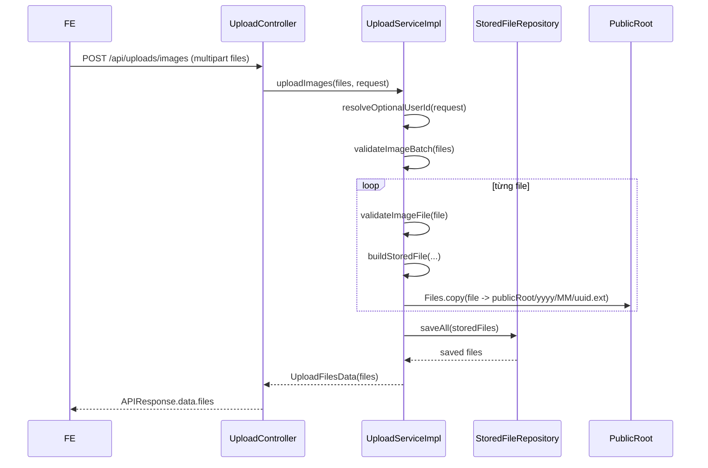
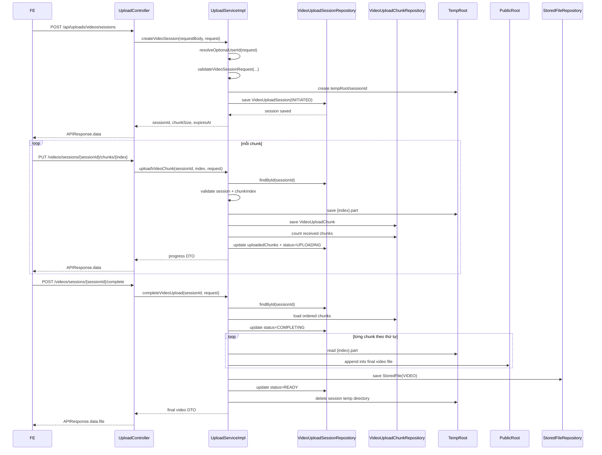

# Upload Service Internal Flow

Tài liệu này mô tả lại cách `upload-service` đang chạy theo **đúng code hiện tại** trong repo. Mục tiêu là giúp người đọc lần được luồng xử lý từ cấu hình, entity, controller, service, DB đến file system và response thực tế.

Đây là tài liệu nội bộ để ngẫm kiến trúc, không phải tài liệu public API chính thức.

---

## 1. Tổng quan

`upload-service` hiện có 2 flow chính:

1. **Upload ảnh batch**
   - endpoint: `POST /api/uploads/images`
   - nhận tối đa 5 file trong một request
   - upload xong trả ngay `data.files`

2. **Upload video lớn theo session/chunk**
   - `POST /api/uploads/videos/sessions`
   - `PUT /api/uploads/videos/sessions/{sessionId}/chunks/{index}`
   - `GET /api/uploads/videos/sessions/{sessionId}`
   - `POST /api/uploads/videos/sessions/{sessionId}/complete`

Điểm quan trọng của phiên bản hiện tại:

- Upload API là **public**, không bắt buộc token.
- Nếu request có `X-User-ID` hợp lệ từ upstream đáng tin cậy thì hệ thống lưu lại `ownerUserId`.
- Nếu không có `X-User-ID` thì upload vẫn chạy bình thường và `ownerUserId = null`.
- File public được phục vụ qua URL `/media/**`.

---

## 2. Thành phần nền

## 2.1. Config chi phối luồng

Các cấu hình chính nằm trong:

- [UploadProperties.java](C:/hoctap/Study/KLTN/CinemaStar/cinema-microservices/upload-service/upload-service/src/main/java/com/cinema/upload_service/config/UploadProperties.java)
- [application.yaml](C:/hoctap/Study/KLTN/CinemaStar/cinema-microservices/upload-service/upload-service/src/main/resources/application.yaml)

Những giá trị đang chi phối hệ thống:

- `upload.public-root`
  - thư mục gốc chứa file public
  - mặc định: `/data/uploads/public`

- `upload.temp-root`
  - thư mục gốc chứa chunk tạm của video
  - mặc định: `/data/uploads/tmp/video-sessions`

- `upload.image-max-file-count`
  - tối đa số ảnh trong 1 request
  - hiện tại: `5`

- `upload.image-max-size`
  - kích thước tối đa cho từng file ảnh
  - hiện tại: `10MB`

- `upload.video-max-size`
  - kích thước tối đa cho 1 file video
  - hiện tại: `10GB`

- `upload.video-chunk-size`
  - kích thước chunk video
  - hiện tại: **`20MB` = `20971520 bytes`**

- `upload.video-session-ttl-minutes`
  - thời gian sống của video session
  - hiện tại: `120` phút

- `upload.cleanup-cron`
  - lịch cleanup session video hết hạn
  - hiện tại: `0 */15 * * * *`

- `upload.allowed-image-content-types`
  - whitelist MIME type của ảnh

- `upload.allowed-video-content-types`
  - whitelist MIME type của video

Ngoài ra, Spring multipart còn bị giới hạn bởi:

- `spring.servlet.multipart.max-file-size`
- `spring.servlet.multipart.max-request-size`

Đây là lớp chặn ở mức servlet trước khi vào business validation sâu hơn.

---

## 2.2. Public file serving qua `/media/**`

Phần map URL public nằm trong:

- [UploadWebConfig.java](C:/hoctap/Study/KLTN/CinemaStar/cinema-microservices/upload-service/upload-service/src/main/java/com/cinema/upload_service/config/UploadWebConfig.java)

`UploadWebConfig` đăng ký:

- mọi request `GET /media/**`
- sẽ được Spring map vào thư mục vật lý là `upload.public-root`

Nghĩa là nếu service lưu file ở:

```text
/data/uploads/public/2026/06/abc.jpg
```

thì URL public tương ứng sẽ là:

```text
/media/2026/06/abc.jpg
```

Điểm này giúp backend có thể:

- lưu file ở local disk
- nhưng vẫn trả URL public ngay cho FE
- mà không cần đặt nginx mới chạy được

---

## 2.3. Entity và vai trò

### `StoredFile`

File:

- [StoredFile.java](C:/hoctap/Study/KLTN/CinemaStar/cinema-microservices/upload-service/upload-service/src/main/java/com/cinema/upload_service/entity/StoredFile.java)

Vai trò:

- lưu metadata của file public cuối cùng
- áp dụng cho cả ảnh và video sau khi hoàn tất

Các field quan trọng:

- `id`
- `ownerUserId`
- `originalFileName`
- `contentType`
- `mediaType`
- `extension`
- `size`
- `absolutePath`
- `objectKey`
- `publicUrl`
- `status`
- `createdAt`

Điểm cần nhớ:

- `ownerUserId` là **nullable**
- nếu request có `X-User-ID` hợp lệ thì lưu
- nếu không có thì để `null`

### `VideoUploadSession`

File:

- [VideoUploadSession.java](C:/hoctap/Study/KLTN/CinemaStar/cinema-microservices/upload-service/upload-service/src/main/java/com/cinema/upload_service/entity/VideoUploadSession.java)

Vai trò:

- đại diện cho một phiên upload của **một file video**
- 1 video = 1 session

Các field quan trọng:

- `id`
- `ownerUserId`
- `originalFileName`
- `contentType`
- `declaredSize`
- `chunkSize`
- `totalChunks`
- `uploadedChunks`
- `tempDir`
- `status`
- `expiresAt`
- `createdAt`

Trạng thái session dùng enum `VideoUploadSessionStatus`:

- `INITIATED`
- `UPLOADING`
- `COMPLETING`
- `READY`
- `FAILED`
- `EXPIRED`

### `VideoUploadChunk`

File:

- [VideoUploadChunk.java](C:/hoctap/Study/KLTN/CinemaStar/cinema-microservices/upload-service/upload-service/src/main/java/com/cinema/upload_service/entity/VideoUploadChunk.java)

Vai trò:

- lưu metadata của từng chunk đã nhận
- không phải file cuối cùng
- chỉ phục vụ resume/complete

Các field chính:

- `sessionId`
- `chunkIndex`
- `chunkSize`
- `received`
- `receivedAt`

---

## 2.4. Controller và service entrypoint

Controller:

- [UploadController.java](C:/hoctap/Study/KLTN/CinemaStar/cinema-microservices/upload-service/upload-service/src/main/java/com/cinema/upload_service/controller/UploadController.java)

Service interface:

- [UploadService.java](C:/hoctap/Study/KLTN/CinemaStar/cinema-microservices/upload-service/upload-service/src/main/java/com/cinema/upload_service/service/UploadService.java)

Service implementation:

- [UploadServiceImpl.java](C:/hoctap/Study/KLTN/CinemaStar/cinema-microservices/upload-service/upload-service/src/main/java/com/cinema/upload_service/service/impl/UploadServiceImpl.java)

Luồng chung là:

1. request vào `UploadController`
2. controller gọi method tương ứng ở `UploadService`
3. `UploadServiceImpl`:
   - validate business
   - đọc/ghi DB
   - đọc/ghi local disk
   - build response DTO
4. `BaseController.ok(...)` đóng gói thành `APIResponse`

---

## 2.5. Trace owner tùy chọn

Phần lấy user từ request nằm trong:

- [RequestAuthUtils.java](C:/hoctap/Study/KLTN/CinemaStar/cinema-microservices/common-lib/src/main/java/com/cinema/http/RequestAuthUtils.java)

Method dùng là:

```java
RequestAuthUtils.resolveOptionalUserId(request)
```

Luồng của helper này:

1. đọc header `X-User-ID`
2. nếu không có thì trả `null`
3. nếu có nhưng không parse được UUID thì cũng trả `null`
4. nếu parse được thì trả `UUID`
5. kết quả được cache trong request attribute để tránh parse lặp

Vì vậy upload-service hiện tại:

- **không cần auth**
- nhưng vẫn giữ trace owner nếu request có mang theo `X-User-ID`

---

## 3. Luồng `POST /api/uploads/images`

## 3.1. Mục đích

Upload batch ảnh trong một request và trả ngay danh sách URL public.

Áp dụng cho:

- avatar
- poster
- gallery ảnh
- các ảnh nhỏ/trung bình

## 3.2. Input

- Content-Type: `multipart/form-data`
- field bắt buộc: `files`
- tối đa `5` file mỗi request

## 3.3. Controller

Trong `UploadController`:

```java
@PostMapping(value = "/images", consumes = MediaType.MULTIPART_FORM_DATA_VALUE)
public ResponseEntity<APIResponse<UploadFilesData>> uploadImages(
        @RequestParam("files") MultipartFile[] files,
        HttpServletRequest request)
```

Controller chỉ làm 2 việc:

1. nhận `MultipartFile[] files`
2. gọi `uploadService.uploadImages(files, request)`

## 3.4. Service

Trong `UploadServiceImpl.uploadImages(...)`, luồng chạy là:

1. gọi `RequestAuthUtils.resolveOptionalUserId(request)`
   - có thể ra `UUID`
   - hoặc `null`

2. gọi `validateImageBatch(files)`
   - reject nếu `files == null`
   - reject nếu mảng rỗng
   - reject nếu số file > `imageMaxFileCount`

3. bảo đảm thư mục `publicRoot` tồn tại bằng `ensureDirectory(...)`

4. lặp qua từng file:
   - `validateImageFile(file)`
   - kiểm tra file không rỗng
   - kiểm tra MIME type nằm trong whitelist
   - kiểm tra size không vượt `imageMaxSize`
   - kiểm tra extension nằm trong whitelist ảnh

5. với mỗi file hợp lệ:
   - gọi `buildStoredFile(...)`
   - sinh `UUID` cho file
   - sinh `objectKey` dạng `yyyy/MM/uuid.ext`
   - build `absolutePath`
   - build `publicUrl`
   - tạo entity `StoredFile`

6. ghi bytes file xuống disk bằng:

```java
Files.copy(inputStream, targetPath, StandardCopyOption.REPLACE_EXISTING)
```

7. sau khi ghi xong tất cả file:
   - `storedFileRepository.saveAll(storedFiles)`
   - map kết quả sang `UploadFileResponse`

8. trả:
   - `UploadFilesData`
   - bên trong có `files`

## 3.5. DB / Entity

Entity được ghi:

- `StoredFile`

Repository dùng:

- `StoredFileRepository.saveAll(...)`

## 3.6. File system

Ảnh được lưu thẳng vào vùng public:

```text
{publicRoot}/{yyyy}/{MM}/{uuid}.{ext}
```

Ví dụ:

```text
/data/uploads/public/2026/06/550e8400-e29b-41d4-a716-446655440000.jpg
```

## 3.7. Response

Shape response thật sự:

```json
{
  "success": true,
  "code": "SUCCESS",
  "message": "Upload files successfully",
  "path": "/api/uploads/images",
  "timestamp": "...",
  "data": {
    "files": [
      {
        "fileId": "uuid",
        "originalFileName": "poster.jpg",
        "contentType": "image/jpeg",
        "mediaType": "IMAGE",
        "size": 1843221,
        "url": "/media/2026/06/uuid.jpg"
      }
    ]
  }
}
```

## 3.8. Failure cases

Các lỗi chính:

- `EMPTY_FILE`
- `TOO_MANY_FILES`
- `UNSUPPORTED_MEDIA_TYPE_UPLOAD`
- `FILE_TOO_LARGE`
- `UPLOAD_FAILED`

Điểm quan trọng:

- flow ảnh là **atomic batch**
- nếu đang ghi dở mà lỗi giữa chừng, service sẽ gọi `cleanupFiles(...)`
- các file vừa ghi dở sẽ bị xóa

## 3.9. Sequence diagram



---

## 4. Luồng `POST /api/uploads/videos/sessions`

## 4.1. Mục đích

Tạo một session upload cho **một file video**.

Session này là điểm neo để FE:

- biết `sessionId`
- biết `chunkSize`
- biết `expiresAt`
- dùng cho các bước upload chunk và complete phía sau

## 4.2. Input

Request body:

```json
{
  "originalFileName": "movie.mp4",
  "contentType": "video/mp4",
  "size": 482211230
}
```

DTO nhận vào:

- [CreateVideoUploadSessionRequest.java](C:/hoctap/Study/KLTN/CinemaStar/cinema-microservices/upload-service/upload-service/src/main/java/com/cinema/upload_service/dto/request/CreateVideoUploadSessionRequest.java)

Validate ở DTO:

- `originalFileName` bắt buộc
- `contentType` bắt buộc
- `size` bắt buộc và > 0

## 4.3. Controller

Controller nhận JSON body và gọi:

```java
uploadService.createVideoSession(requestBody, request)
```

## 4.4. Service

Luồng trong `createVideoSession(...)`:

1. resolve optional owner từ request
2. `validateVideoSessionRequest(requestBody)`
   - MIME type video phải nằm trong whitelist
   - size không vượt `videoMaxSize`
   - extension phải hợp lệ cho video

3. sinh `sessionId = UUID.randomUUID()`

4. tạo thư mục temp cho session:

```text
{tempRoot}/{sessionId}
```

5. đọc `chunkSize` từ config
   - hiện tại = `20MB`

6. tính:

```text
totalChunks = ceil(size / chunkSize)
```

7. tạo entity `VideoUploadSession`:
   - status = `INITIATED`
   - uploadedChunks = `0`
   - expiresAt = `now + videoSessionTtlMinutes`

8. lưu session vào DB

9. trả response chứa:
   - `sessionId`
   - `chunkSize`
   - `expiresAt`

## 4.5. DB / Entity

Entity được ghi:

- `VideoUploadSession`

Repository dùng:

- `VideoUploadSessionRepository.save(...)`

## 4.6. File system

Tại bước này **chưa có file video cuối cùng**.

Chỉ có thư mục temp session:

```text
{tempRoot}/{sessionId}
```

## 4.7. Response

Ví dụ:

```json
{
  "success": true,
  "code": "SUCCESS",
  "message": "Video upload session created",
  "data": {
    "sessionId": "session-uuid",
    "chunkSize": 20971520,
    "expiresAt": "2026-06-09T13:00:00"
  }
}
```

## 4.8. Failure cases

- `UNSUPPORTED_MEDIA_TYPE_UPLOAD`
- `FILE_TOO_LARGE`
- `UPLOAD_FAILED`

---

## 5. Luồng `PUT /api/uploads/videos/sessions/{sessionId}/chunks/{index}`

## 5.1. Mục đích

Nhận một chunk raw bytes của video và ghi nó vào vùng temp của session.

## 5.2. Input

- URL path có:
  - `sessionId`
  - `index`
- Content-Type:
  - `application/octet-stream`
- Body:
  - raw bytes của chunk

## 5.3. Controller

Controller nhận:

- `@PathVariable UUID sessionId`
- `@PathVariable int index`
- `HttpServletRequest request`

Rồi gọi:

```java
uploadService.uploadVideoChunk(sessionId, index, request)
```

## 5.4. Service

Luồng trong `uploadVideoChunk(...)`:

1. `requireVideoSession(sessionId)`
   - tìm session theo ID
   - không có thì ném `VIDEO_UPLOAD_SESSION_NOT_FOUND`

2. `validateVideoSessionActive(session)`
   - nếu quá hạn:
     - set status = `EXPIRED`
     - save DB
     - ném `VIDEO_UPLOAD_SESSION_EXPIRED`
   - nếu session đang `READY`, `COMPLETING`, `EXPIRED`
     - ném `VIDEO_UPLOAD_SESSION_INVALID_STATE`

3. `validateChunkIndex(session, chunkIndex)`
   - index phải nằm trong `0..totalChunks-1`

4. đọc `contentLength` của request
   - nếu > `maxChunkSize` thì reject

5. chuẩn bị file temp:

```text
{session.tempDir}/{chunkIndex}.part
```

6. đọc raw stream từ request:

```java
request.getInputStream()
```

7. ghi chunk xuống disk:

```java
Files.copy(inputStream, chunkPath, REPLACE_EXISTING)
```

8. nếu copied bytes <= 0:
   - ném `EMPTY_FILE`

9. nếu copied bytes > maxChunkSize:
   - xóa chunk vừa ghi
   - ném `FILE_TOO_LARGE`

10. tạo hoặc overwrite metadata chunk:
   - `VideoUploadChunk`
   - `received = true`
   - `receivedAt = now`

11. đếm lại số chunk đã nhận:

```java
countBySessionIdAndReceivedTrue(sessionId)
```

12. cập nhật session:
   - `uploadedChunks = count`
   - `status = UPLOADING`

13. trả progress DTO

## 5.5. DB / Entity

Entity đọc/ghi:

- đọc `VideoUploadSession`
- ghi `VideoUploadChunk`
- update lại `VideoUploadSession`

Repository dùng:

- `VideoUploadSessionRepository.findById(...)`
- `VideoUploadChunkRepository.save(...)`
- `VideoUploadChunkRepository.countBySessionIdAndReceivedTrue(...)`
- `VideoUploadSessionRepository.save(...)`

## 5.6. File system

Mỗi chunk được lưu riêng:

```text
{tempRoot}/{sessionId}/{chunkIndex}.part
```

Ví dụ:

```text
/data/uploads/tmp/video-sessions/abc-session/0.part
/data/uploads/tmp/video-sessions/abc-session/1.part
```

## 5.7. Response

Ví dụ:

```json
{
  "success": true,
  "code": "SUCCESS",
  "message": "Video chunk uploaded successfully",
  "data": {
    "sessionId": "session-uuid",
    "chunkIndex": 0,
    "chunkSize": 20971520,
    "uploadedChunks": 1,
    "totalChunks": 24,
    "progressPercent": 4.17
  }
}
```

## 5.8. Failure cases

- `VIDEO_UPLOAD_SESSION_NOT_FOUND`
- `VIDEO_UPLOAD_SESSION_EXPIRED`
- `VIDEO_UPLOAD_SESSION_INVALID_STATE`
- `VIDEO_UPLOAD_CHUNK_OUT_OF_RANGE`
- `EMPTY_FILE`
- `FILE_TOO_LARGE`
- `UPLOAD_FAILED`

---

## 6. Luồng `GET /api/uploads/videos/sessions/{sessionId}`

## 6.1. Mục đích

Trả trạng thái session video để FE biết:

- đã upload được bao nhiêu chunk
- chunk nào đã nhận
- session còn hạn không

Đây là nền tảng cho chức năng resume.

## 6.2. Input

- chỉ cần `sessionId`

## 6.3. Controller

Controller gọi:

```java
uploadService.getVideoSessionStatus(sessionId, request)
```

## 6.4. Service

Luồng trong `getVideoSessionStatus(...)`:

1. `requireVideoSession(sessionId)`
2. đọc toàn bộ chunk của session theo thứ tự tăng dần
3. lọc những chunk có `received = true`
4. map ra danh sách `receivedChunks`
5. trả DTO status

Điểm cần lưu ý:

- method này **không tự expire session**
- nó chỉ phản ánh status hiện có trong DB
- logic hết hạn được enforce mạnh hơn ở bước upload chunk và complete

## 6.5. DB / Entity

Entity đọc:

- `VideoUploadSession`
- `VideoUploadChunk`

Repository dùng:

- `VideoUploadSessionRepository.findById(...)`
- `VideoUploadChunkRepository.findBySessionIdOrderByChunkIndexAsc(...)`

## 6.6. File system

- không tạo file mới
- chỉ đọc metadata từ DB

## 6.7. Response

Ví dụ:

```json
{
  "success": true,
  "code": "SUCCESS",
  "message": "Video upload session status fetched successfully",
  "data": {
    "sessionId": "session-uuid",
    "status": "UPLOADING",
    "uploadedChunks": 12,
    "totalChunks": 24,
    "receivedChunks": [0,1,2,3,4,5,6,7,8,9,10,11],
    "expiresAt": "2026-06-09T13:00:00"
  }
}
```

## 6.8. Failure cases

- `VIDEO_UPLOAD_SESSION_NOT_FOUND`

---

## 7. Luồng `POST /api/uploads/videos/sessions/{sessionId}/complete`

## 7.1. Mục đích

Ghép toàn bộ chunk thành **một file video hoàn chỉnh**, lưu ra vùng public và trả URL cuối cùng.

## 7.2. Input

- chỉ cần `sessionId`
- không cần request body

## 7.3. Controller

Controller gọi:

```java
uploadService.completeVideoUpload(sessionId, request)
```

## 7.4. Service

Luồng trong `completeVideoUpload(...)`:

1. `requireVideoSession(sessionId)`
2. `validateVideoSessionActive(session)`

3. đọc toàn bộ `VideoUploadChunk` theo thứ tự tăng dần

4. nếu số chunk trong DB khác `session.totalChunks`
   - ném `VIDEO_UPLOAD_INCOMPLETE`

5. set session status = `COMPLETING`
6. save session

7. bảo đảm `publicRoot` tồn tại

8. lấy extension từ tên file gốc
9. sinh `objectKey`
10. xác định `finalPath`

11. mở `OutputStream` cho file đích

12. lặp từ `0` đến `totalChunks - 1`
   - kiểm tra chunk metadata đúng index và `received = true`
   - kiểm tra file `.part` có thật trên disk
   - copy từng chunk `.part` vào `outputStream`

13. sau khi merge xong:
   - so sánh `mergedSize` với `declaredSize`
   - nếu lệch:
     - xóa file đích
     - set session = `FAILED`
     - save DB
     - ném `UPLOAD_FAILED`

14. nếu hợp lệ:
   - tạo `StoredFile`
   - `ownerUserId = session.ownerUserId`
   - mediaType = `VIDEO`
   - status = `READY`
   - createdAt = now

15. save `StoredFile`

16. set session status = `READY`
17. save session

18. xóa toàn bộ thư mục temp session bằng `deleteDirectoryQuietly(...)`

19. trả `UploadVideoCompleteData`

## 7.5. DB / Entity

Entity đọc/ghi:

- đọc `VideoUploadSession`
- đọc `VideoUploadChunk`
- ghi `StoredFile`
- update `VideoUploadSession`

Repository dùng:

- `VideoUploadSessionRepository.findById(...)`
- `VideoUploadChunkRepository.findBySessionIdOrderByChunkIndexAsc(...)`
- `StoredFileRepository.save(...)`
- `VideoUploadSessionRepository.save(...)`

## 7.6. File system

### Trong lúc complete

Đọc từ:

```text
{tempRoot}/{sessionId}/{index}.part
```

Ghi ra file video cuối cùng:

```text
{publicRoot}/{yyyy}/{MM}/{uuid}.mp4
```

### Sau khi complete thành công

- thư mục temp session bị xóa
- chỉ còn lại file video hoàn chỉnh ở public root

## 7.7. Response

Ví dụ:

```json
{
  "success": true,
  "code": "SUCCESS",
  "message": "Video uploaded successfully",
  "data": {
    "file": {
      "fileId": "uuid",
      "originalFileName": "movie.mp4",
      "contentType": "video/mp4",
      "mediaType": "VIDEO",
      "size": 482211230,
      "url": "/media/2026/06/uuid.mp4"
    }
  }
}
```

## 7.8. Failure cases

- `VIDEO_UPLOAD_SESSION_NOT_FOUND`
- `VIDEO_UPLOAD_SESSION_EXPIRED`
- `VIDEO_UPLOAD_SESSION_INVALID_STATE`
- `VIDEO_UPLOAD_INCOMPLETE`
- `UPLOAD_FAILED`

Điểm rất quan trọng:

- backend **không giữ video lâu dài dưới dạng nhiều đoạn**
- chunk chỉ là file tạm trong lúc upload
- sau `complete`, backend giữ **1 file video hoàn chỉnh**

## 7.9. Sequence diagram



---

## 8. Luồng `GET /media/**`

## 8.1. Mục đích

Cho phép truy cập trực tiếp file public đã upload.

## 8.2. Luồng chạy

1. client gọi URL `/media/...`
2. `UploadWebConfig` đã đăng ký resource handler cho pattern này
3. Spring map URL sang file vật lý trong `publicRoot`
4. nếu file tồn tại thì stream file về
5. nếu file không tồn tại thì trả `404`

## 8.3. Điểm quan trọng

- đây là static file serving qua Spring MVC
- không đi qua `UploadController`
- không gọi `UploadServiceImpl`
- không truy vấn DB

## 8.4. Ví dụ

Nếu `StoredFile.objectKey` là:

```text
2026/06/abc.jpg
```

thì URL public sẽ là:

```text
/media/2026/06/abc.jpg
```

và Spring sẽ map nó vào:

```text
{publicRoot}/2026/06/abc.jpg
```

---

## 9. Cleanup session video hết hạn

Phần này không phải API, nhưng là một luồng nền quan trọng.

Class:

- [VideoUploadCleanupScheduler.java](C:/hoctap/Study/KLTN/CinemaStar/cinema-microservices/upload-service/upload-service/src/main/java/com/cinema/upload_service/scheduler/VideoUploadCleanupScheduler.java)

Luồng:

1. scheduler chạy theo cron `upload.cleanup-cron`
2. gọi `uploadService.cleanupExpiredVideoSessions()`
3. service tìm các session:
   - `INITIATED`
   - `UPLOADING`
   - `FAILED`
   - `EXPIRED`
   mà đã quá `expiresAt`
4. xóa thư mục temp tương ứng
5. set status = `EXPIRED`
6. save lại DB

Mục tiêu:

- dọn rác temp chunk
- tránh session cũ tồn tại mãi

---

## 10. Luồng tổng hợp từ đầu đến cuối

## 10.1. Ảnh

1. FE gửi `multipart/form-data` với field `files`
2. Controller nhận request
3. Service validate số lượng file
4. Service validate từng file
5. Service sinh object key + đường dẫn đích
6. Service ghi file vào `publicRoot`
7. Service lưu metadata vào `StoredFile`
8. Service trả `data.files`
9. FE dùng `url` để preview/render ngay

## 10.2. Video

1. FE gọi create session
2. Service tạo `VideoUploadSession`
3. FE nhận `sessionId` và `chunkSize = 20MB`
4. FE cắt file thành nhiều chunk
5. FE upload từng chunk
6. Service ghi từng chunk thành `.part`
7. Service lưu metadata chunk + cập nhật progress session
8. Nếu cần resume, FE gọi status để biết chunk nào đã nhận
9. FE gọi `complete`
10. Service đọc tất cả chunk `.part`
11. Service merge thành **1 file video hoàn chỉnh**
12. Service lưu metadata vào `StoredFile`
13. Service xóa thư mục temp session
14. Service trả `data.file`

### Kết luận của flow video

- chunk **không phải** dạng lưu trữ cuối cùng
- chunk chỉ là file tạm trong lúc upload
- kết quả cuối cùng luôn là **1 file video hoàn chỉnh**

---

## 11. Các điểm đáng chú ý / giới hạn hiện tại

- Upload API hiện là **public**
- `ownerUserId` chỉ là trace tùy chọn
- Chưa có:
  - transcode video
  - thumbnail video
  - virus scan
  - rate limiting
  - captcha
  - object storage kiểu S3/MinIO

- Session status hiện tại:
  - bước `GET session status` chủ yếu đọc từ DB
  - không tự ép expire mạnh như upload chunk/complete

- URL public hiện được serve trực tiếp qua Spring resource handler
  - đủ để chạy ngay
  - sau này có thể đặt nginx/CDN phía trước mà không cần đổi contract API

